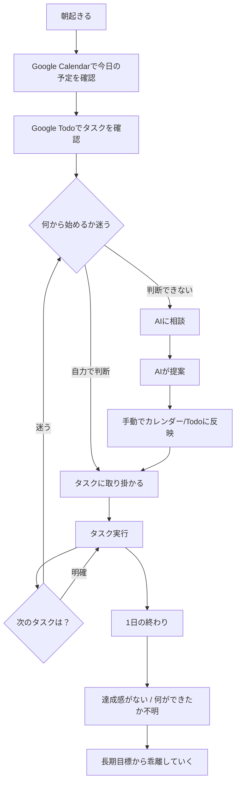
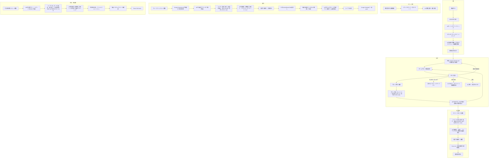

# 業務理解ドキュメント
## プロジェクト名: ARDORS（アーダース）

---

### 1. ビジネス背景

#### 1.1 現状の課題

| # | 課題 | 詳細 | 頻度 | 深刻度 |
|---|------|------|------|--------|
| 1 | 情報の分散 | タスク・予定・目標・習慣・記録が複数ツール（Google Calendar, Google Todo等）に散在しており、一か所に集中していない。管理がめんどくさい | 毎日 | 高 |
| 2 | 一覧性の欠如による迷いと時間浪費 | 多数のプロジェクト（就活、学業、筋トレ・ランニング等の運動、開発・起業、個人案件、趣味、友人との活動、休息）、多数の期限、多数の進捗管理を抱えたときに一覧性がなく、迷いが生まれて時間が浪費される | 毎日 | 高 |
| 3 | 長期目標との乖離 | 目標からそれていき、ただ目先のタスクをちょいとこなすだけで、余った時間は無駄になり、成長につながっていない（長期的なゴールに向かって作業できていない） | 慢性的 | 高 |
| 4 | スケジュール設計の認知負荷が高すぎる | 自分で週何時間ぶんのスケジュールをこのプロジェクトに割けばいいか...みたいに思考するのがだるい。大変すぎてできない。自分で決めるとスケジュールに無理が生まれる | 毎週 | 高 |
| 5 | 達成感の欠如 | 毎日何ができたか、みたいな達成感がない | 毎日 | 中 |
| 6 | 積極的な自己管理の負担 | 自分で積極的にタスク・予定を管理しないといけない。AIに音声入力して、AIが提案、自分が承認してプロジェクトの進捗を更新してタスク化・カレンダー化してくれたらいいのに | 毎日 | 高 |
| 7 | 探索・成長機会の喪失 | 新しい可能性を発見する時間がない。タスクに埋もれて、小さいまま時間だけ経過してしまう恐れ | 慢性的 | 高 |
| 8 | 移動等の現実的制約の未考慮 | AIに何をすべきか相談しても、カレンダーに「移動」などを入れなければならず、そうした考慮がされていない | 予定作成時 | 中 |

#### 1.2 現在の対処方法

- **Google Calendar**: 予定管理（美容院の予約、invitation等の外部予定も反映される）
- **Google Todo**: タスク管理
- **AIとの相談**: これから何をしたらよくて、何をいつやればいいのかをAIとよく相談している
- **課題**: 上記が連携されておらず、管理コストが高い。AIへの相談結果もカレンダーやタスクに自動反映されない

---

### 2. プロジェクト目的

#### 2.1 ゴール（優先順位付き）

| 優先度 | ゴール | 成功指標（KPI） | 詳細 |
|--------|--------|----------------|------|
| P0 | プロジェクトをガンガン前に進める | プロジェクト完了数・マイルストーン達成率の向上 | 多数のプロジェクトが着実に前進する状態 |
| P0 | サボり・不注意・時間の浪費を減らし将来に向けた成長につなげる | 時間浪費の削減、長期目標への時間配分増加 | 目先のタスクだけでなく、長期ゴールに向かって作業できている |
| P0 | 毎日ARDORSだけ開けば1日が回る | 他ツールへの切り替え頻度最小化 | Notionのような汎用ツールの代替ではなく、「1日の活動の司令塔」としての役割 |
| P0 | 管理コストを最小化する | スケジュール設計にかかる時間の削減 | AIが提案し、ユーザーが承認するだけで予定・タスクが組まれる |
| P1 | 目標を見失わず、予定が狂わない | 週次ゴール達成率、スケジュール遵守率 | 自分で決めるとスケジュールに無理が生まれるので、AIが現実的な計画を組む |
| P1 | 着実にゴールに向かって前に進む達成感を得る | デイリー/ウィークリーの達成感スコア | Done List、ストリーク、成長可視化による達成感の演出 |
| P1 | 探索的活動で人生の可能性や幅を拡大する | 探索時間の確保率（週あたり） | 新しい可能性の発見、セレンディピティの機会創出 |

#### 2.2 リリース計画

- **希望時期**: 特になし（趣味の開発。ただし完成度高く一気に作り上げる方針）
- **開発方針**: MVPではなく、完成度の高いものを一気に作る。AI時代の開発スタイルとして
- **予算感**: 個人開発（自分のために作る → SaaS公開も視野）

---

### 3. スコープ

#### 3.1 対象範囲（In Scope）

**コア機能群**

| ID | 機能カテゴリ | 機能名 | 概要 |
|----|------------|--------|------|
| A | AI中枢 | AIパートナー | 音声（STT→テキスト送信）/テキストでAIと対話。タスク登録・予定作成・進捗更新。AIが「次に何をすべきか」を提案し、ユーザーが承認。返信はテキスト |
| B | 計画・管理 | プロジェクト・目標管理 | 複数PJ（就活、学業、運動、開発・起業、個人案件、趣味、友人、休息）を一覧で俯瞰。各PJにゴール・進捗・期限。長期目標 → 週次ゴール → 日のタスクの階層 |
| C | 計画・管理 | スケジュール・タイムボクシング | 1週間単位でタイムボクシングレベルのスケジュールをAIが組む（ユーザー承認）。移動時間等の現実的制約も考慮。タイムライン形式のVisualization |
| D | 習慣 | 習慣エンジン | cue付き習慣定義、最小行動、if-then plan、実行ログ、復帰支援（004リサーチ準拠） |
| E | 振り返り | 振り返り・内省 | デイリークローズ（今日の勝ち・詰まり・明日の一手）、ウィークリーレビュー（AIがパターンを要約・下書き）、達成感の可視化（Done List） |
| F | 可視化 | ダッシュボード | 今日やること・進行中PJ・習慣の状態・長期ゴールが一画面で見える。「ARDORSだけ開けば1日が回る」のホーム画面 |
| G | 探索・成長 | ナレッジ・気づきキャプチャ | 日常の気づき・アイデア・学びを素早くメモ（音声入力でも可）。AIが既存PJや過去の気づきとの関連を提示。Zettelkasten的なセレンディピティ・マシン。要詳細詰め |
| H | 体調・リズム | エネルギー・コンディション管理 | 1日2-3回の軽量チェックイン（mood/energy/focus、各1タップ）。自己申告のみ（外部ツール連携なし）。AIがスケジュール提案時に体調を考慮。タイムログ的にデータ蓄積し、AIが分析・助言・言葉をかける |
| I | 可視化 | 時間の使い方の可視化・分析 | PJごとの時間配分を自動集計。理想 vs 実際のギャップ可視化。円グラフ/棒グラフ。要詳細詰め |
| J | 通知 | 通知・リマインド・ナッジ | タイムボクシングの開始/終了通知。「次のブロックです」「デイリークローズまだです」。サボり防止のやさしいナッジ（AIのトーンで） |
| K | AI中枢 | ブレインダンプ | 音声/テキストでバーっと話す → AIが内容を自動判別して構造化。タスク的な内容はPJ振り分け・タスク抽出・期限検出、ビジョン的な内容は展望の構造化・目標との接続・新規PJ候補として整理。混在しても同時処理。ユーザーは「何を話すか」だけ考えればよく、どう整理するかはAIの仕事。確認・承認後にタスク化・カレンダー化 |
| L | 計画・管理 | 新規プロジェクト作成 | AIとの対話から自然にPJが生まれる。ゴール、マイルストーン、初期タスクをAIが提案 |
| M | 基盤 | 認証・オンボーディング | Google OAuth / メアド+パスワード / パスワードリセット。簡単なオンボーディング（使い方ガイド、初期PJ設定、AIとの初回対話） |
| N | 基盤 | LP（ランディングページ） | シンプルなプロダクト紹介 + 登録導線。SaaS公開用 |

**AI強化機能群**

| ID | 機能カテゴリ | 機能名 | 概要 |
|----|------------|--------|------|
| O | AI体験 | AIモーニングブリーフィング | 受動的なダッシュボード表示ではなく、AIが能動的に話しかける。「おはようございます。今日は14時に面接があります。移動を考えると13:15出発。午前は開発のX機能に集中するのがおすすめです。昨日の振り返りで『APIの設計に詰まった』と書いていたので、まずそこから再開しましょうか？」何から着手したらいいか見えるとタスクの開始がスムーズになる |
| P | AI体験 | ブロック間トランジション | ブロック終了時に「このブロックどうでした？」（1タップ: 集中できた/まあまあ/だめだった）。次のブロックの内容と「前回どこまでやったか」をAI提示。さらに「なんでサボってしまった？なんで進捗がうまく進まなかった？」「どこまでできたか」をAIにテキスト/音声で入力できる。コンテキストスイッチコスト削減 |
| Q | AI体験 | パニック/オーバーフローモード | 締切が集中したときにAIが自動検知。「今週は締切が5件重なっています。全部は無理なので、優先度を一緒に決めましょう」。締切がやばいときにこそパートナー感が出る |
| R | AI体験 | 移動時間のインテリジェンス | 予定に場所情報があれば、前後に移動時間を自動で確保。Google Calendarから場所をpullして活用 |
| S | AI体験 | プロジェクト再開時のコンテキスト復元 | 数日間触ってなかったPJを再開するとき、AIが前回の作業内容・次のアクションを提示。「どこまでやったっけ」がゼロになる |
| T | AI体験 | 探索タイム自動組込 | AIがスケジュール作成時に、自動で探索の時間を組み込む。ユーザーが自発的に入れないと消えるので、AIが守護する |
| U | 振り返り | 月次・四半期レビュー | 月1、3ヶ月に1回のペースでレビュー実施。AIがPJ全体の進捗サマリー、時間配分トレンド、目標の見直し提案。「このPJ、2ヶ月間Warmのまま動いてません。Coldにしますか？」。中期・中短期計画としてダッシュボードに表示 |
| V | 可視化 | 達成の可視化・お祝い | ストリーク表示（連続X日習慣達成）。PJ完了時の振り返りサマリー自動生成。「今月はXXX時間を成長に使いました」的な統計。マイルストーン達成時のお祝い |

**インテリジェンス機能群**

| ID | 機能カテゴリ | 機能名 | 概要 |
|----|------------|--------|------|
| W | AI分析 | 適応型負荷調整（Adaptive Load） | タスク完了率が3日連続50%以下 → AIが翌日の予定を自動で軽くする。逆に高完了率の週は少しストレッチ提案。リサーチの「危険信号ルール」をAIが自動監視。自分で組むと無理が生まれるのをAIが客観的に調整 |
| X | AI分析 | 意思決定コスト最小化（Decision Minimizer） | AIは「何をしたいですか？」ではなく「Xをやりましょう。OK？」と提案。選択肢は最大2-3択、AIの推奨に印。優柔不断への直接的対策。選ぶのではなく承認するだけ |
| Y | AI分析 | 先読みアラート（Proactive Conflict Detection） | 1週間先の締切・予定を常にスキャンし衝突を事前検知。「来週木曜に論文締切と面接が重なっています。今週中に論文を8割終わらせる必要があります」。パニックモードになる前に手を打てる |
| Z | 可視化 | 成長トラジェクトリー（Growth Trajectory） | 月次・四半期で「3ヶ月前のあなた vs 今のあなた」を可視化。「開発スキルへの投資時間: 1月 5h/週 → 3月 15h/週」。PJ完了数、習慣定着率、スキルの成長曲線 |
| AA | AI分析 | 学習パターンの自動発見 | 「火曜の午前に最も集中できています」「締切3日前からパフォーマンスが上がる傾向」「ランニングした翌日は深い仕事の完了率が20%高い」。自分では気づけない相関をAIが発見しスケジュール最適化に反映 |
| AB | 可視化 | ゴール・ジャーニーマップ（Goal Journey Map） | ダッシュボードに常に表示される目標の階層ツリー。長期ゴール → 中期目標 → 今週のゴール → 今日のタスクが線で繋がって見える。今日のタスクをこなすと中期目標のプログレスバーが進む → 長期ゴールへの貢献が直感的にわかる。過去の積み上げ（完了マイルストーン）もタイムライン上に残る。AIが「この作業はXというゴールの達成に繋がっています」とコンテキストを添える。今まで何を積み上げてきて、これから何を積み上げるべきで、その結果どんな未来が見えるのかを直感的に見れる |
| AC | 可視化 | ライフバランスレーダー | 人生の領域（キャリア、学業、健康、人間関係、趣味、成長、休息...）をレーダーチャートで常時表示。時間配分とチェックインデータから自動算出。偏りが出たらAIが気づく |
| AD | 未来接続 | 未来の自分との対話（Future Self Letter） | 月1回、AIが「3ヶ月後の自分に手紙を書いてみましょう」とプロンプト。3ヶ月後にその手紙が届く。AIが「3ヶ月前のあなたはこう書いていました。実際にはこうなりました」と比較 |
| AE | 探索・成長 | セレンディピティ・エンジン | ナレッジキャプチャ（G）に溜まったメモをAIが定期スキャン。無関係に見える2つのメモの接点を提示:「3月に書いた『教育に興味ある』と、先週の『UIデザインが楽しい』、教育×UIで何か始めてみませんか？」。週次レビューの探索タイムに候補表示 |
| AF | AI体験 | コンテキストアウェアなAIトーン | エネルギー高い日:「今日は攻めましょう」。低い日:「無理しなくていいです」。締切直前:「あと2日。集中モードに入ります」。連続達成中:「5日連続達成！この調子！」。サボり後:「久しぶりですね。まず1つだけ」。パートナー感の核 |
| AG | 習慣 | リチュアル・デザイナー（儀式の設計） | 朝の開始儀式、ブロック間の切り替え儀式、デイリークローズの儀式をカスタマイズ可能。例: 朝は「今日の意図を1行書く」、クローズは「感謝を1つ書く」。AIが実行を見守り、スキップ続くと優しくナッジ。要詳細詰め |
| AH | 可視化 | プロジェクト・ヘルススコア | 各PJに自動でヘルススコア（健全度）を付与。算出要素: 最終作業日からの経過日数、タスク消化率、期限との距離、ブロッカーの有無。ダッシュボードで赤/黄/緑で一覧表示 |
| AI-F | AI体験 | AIコーチモード（週次レビュー時） | 週次レビューではAIのトーンが切り替わる。「サポーター」から「コーチ」へ。データに基づいた率直なフィードバック。「就活のタスクを3回先延ばしにしました。本当に優先度が高いですか？」「探索時間を0分にしました。3ヶ月続くとローカルマキシマムに入ります」。批判ではなく問いかけの形。人間の道が誤っていたら正す。厳しさレベル設定可能（コーチ/メンター/フレンド）。**重要: ユーザーが自分の意向・考え・感想を音声/テキストで入力し、AIがそれを目的や未来に向かって建設的・客観的に分析する双方向対話を含む。AIは人間を満足させるような言葉ばかりではなく、目的達成に向けて本質的なフィードバックを行う** |
| AJ | 未来接続 | ゴール・シミュレーション | 今のペースで進んだ場合の3ヶ月後・半年後・1年後をAIが予測。「今のペースで開発を続けると、8月にはv1が完成」。ペースが落ちたら予測が動的に変わる。タイムライン形式のビジュアル |
| AK | 未来接続 | マイルストーン・タイムカプセル | PJの大きなマイルストーン達成時に自動で「記録」生成。その時の感情、学び、次への意気込みをAIが聞き取って保存。「自分の成長の物語」として振り返れるタイムライン。Future Self Letterと合わせて 過去←今→未来 が1本の線で繋がる |

※ 旧AL（展望・現状の整理）はK（ブレインダンプ）に統合済み。ユーザーが話す内容をAIが自動判別して振り分けるため、機能を分ける必要がないと判断。

#### 3.2 設計原則

**原則1: 入力コスト最小化（Input Minimum Principle）**

ARDORSの原点は「管理がめんどくさい」の解消である。ARDORSが既存ツールより管理コストが高くなったら本末転倒。全ての入力ポイントに以下を適用する:

| 入力ポイント | 最小コスト（これだけでOK） | フルコスト（時間があれば） | スキップ時のフォールバック |
|------------|------------------------|------------------------|------------------------|
| 朝: エネルギーチェックイン | 1タップ（3段階） | 1タップ + 一言メモ | 前日のデータを引き継ぎ、AIが推定 |
| 日中: ブロック間トランジション | 1タップ（集中度3段階） | 1タップ + 音声/テキストで振り返り | 自動で「未記録」として処理、次ブロックに進む |
| 日中: ナレッジキャプチャ | 音声で一言 | 音声/テキスト + タグ付け | 任意。やらなくても何も壊れない |
| 夕方: デイリークローズ | 完全スキップ可 | まとめて音声/テキスト入力 + AI対話 | AIが行動ログから自動でDone List生成 |
| 週次: ウィークリーレビュー | AIサマリーを眺めるだけ | まとめて入力 + AI対話 + 計画承認 | AIが前週ベースで来週計画を自動生成（要承認） |
| 月次: 月次レビュー | AIレポートを読むだけ | まとめて入力 + AI対話 + 目標見直し | AIレポートのみ保存 |

**設計哲学: 最小1タップ、最大は深い対話。どこでもスキップ可能で、アプリが壊れない。**

**原則2: AI非依存の基盤保証（AI-Independent Baseline）**

全機能がAIに依存すると、APIダウン時にアプリ全体が使えなくなる。また、AIに頼らず設計で解決できる部分はAPIコスト削減にもなる。

| レイヤー | AI不要で動く機能 | AIがあると強化される機能 |
|---------|----------------|----------------------|
| 基盤 | カレンダー表示、タスク一覧・手動CRUD、PJ一覧・進捗表示、習慣チェックリスト、タイマー/通知、Google Calendar同期 | - |
| 強化 | ダッシュボード（データ表示のみ） | モーニングブリーフィング、コンテキスト復元、パターン分析 |
| AI必須 | - | ブレインダンプ構造化、スケジュール自動生成、コーチモード、セレンディピティ・エンジン |

**設計哲学: AIがなくても「高機能なタスク・PJ管理ツール」として使える。AIがあると「パートナー」になる。**

**原則3: 建設的AIの原則（Constructive AI Principle）**

全てのAI対話に適用するシステム原則。週次レビューのコーチモードだけでなく、モーニングブリーフィング、デイリークローズ、パニックモード等、全てのAI応答に通底する。

- AIはユーザーを満足させるための言葉を吐かない
- 目的達成・未来に向かって建設的で客観的な視点を提供する
- 批判ではなく問いかけの形でフィードバックする
- データに基づいた根拠のある指摘を行う
- ユーザーの意向を聞き、それを尊重した上で客観分析を加える
- 厳しさレベルはユーザーが設定可能（コーチ / メンター / フレンド）

**原則4: コールドスタート設計（Cold Start Design）**

AIはデータがないと機能しない。利用開始時にユーザー情報を効率的に収集し、早期にAIを「使えるレベル」にする。

| フェーズ | 期間 | AIの状態 | 収集方法 |
|---------|------|---------|---------|
| オンボーディング | 初回利用時 | 基本情報のみ | テキスト/音声でまとめて入力: 現在のPJ一覧、生活リズム、目標、優先事項 |
| 学習期 | 1-2週目 | 基本的な提案が可能 | 日々の入力データの蓄積。AIは控えめに提案し、ユーザーの修正から学ぶ |
| 成熟期 | 3週目以降 | パターン認識・高精度な提案 | 十分な行動データ。学習パターン発見、適応型負荷調整が機能し始める |

**設計哲学: 初日からAIなしの基盤機能で価値を提供し、データが溜まるにつれてAI機能が段階的に解放される。**

**原則5: プラットフォーム戦略**

- **Webファースト**: 初期リリースはWebアプリケーション（レスポンシブ対応）
- **モバイル対応（将来）**: 他ユーザーへの展開時にネイティブアプリ化を検討
- **通知**: Web通知（Push API）で対応。モバイル化時にネイティブ通知に拡張
- **音声入力**: ブラウザのWeb Speech API or 外部STT APIで対応

#### 3.3 対象外（Out of Scope）

| # | 除外項目 | 理由 |
|---|---------|------|
| 1 | チーム機能 | 現時点では個人利用が主目的 |
| 2 | 課金・決済 | SaaSとしての公開は視野にあるが、課金は現時点では対象外 |
| 3 | 他ユーザーとのデータ共有 | 個人利用が前提 |
| 4 | SNS的な要素 | 不要 |
| 5 | 外部ヘルスケアツール連携（Apple Health, Google Fit, Oura Ring等） | エネルギー管理は自己申告のみで十分と判断 |
| 6 | Notionの代替 | 役割が異なる。ARDORSは「1日の活動の司令塔」 |
| 7 | モバイルネイティブアプリ | 初期はWebファースト。将来拡張で対応 |

#### 3.4 将来拡張構想

| # | 構想 | 優先度 |
|---|------|--------|
| 1 | カレンダーを公開して空き時間を友達に公開、予約可能にする | 低（最優先ではない） |
| 2 | 課金機能の追加（SaaS本格運用時） | 未定 |
| 3 | モバイルネイティブアプリ（iOS/Android） | 他ユーザー展開時 |
| 4 | アカウント削除機能 | SaaS公開時に必須 |
| 5 | データエクスポート（ポータビリティ） | SaaS公開時に推奨 |
| 6 | プライバシーポリシー・利用規約 | SaaS公開時に必須 |
| 7 | ユーザー設定画面（通知頻度、AIの厳しさレベル、表示カスタマイズ等） | 初期リリースで最低限は必要、段階的に拡充 |

---

### 4. 業務フロー

#### 4.1 As-Is（現状）フロー

**現状の問題点:**
- ツール間の切り替えが多く、認知コストが高い
- AIへの相談結果を手動でカレンダー・Todoに反映する必要がある
- 移動時間などの現実的制約が考慮されない
- 振り返りの仕組みがなく、達成感が得られない
- 長期目標との接続が断絶している
- スケジュール設計を自分でやると無理が生まれる

#### 4.2 To-Be（ARDORS導入後）フロー

---

### 5. 外部連携

| 連携先 | 連携方法 | 目的 | 方向 | 必須/任意 |
|--------|---------|------|------|----------|
| Google Calendar | API（OAuth） | 予定の読み取り（invitationや美容院の予約等）。場所情報の取得（移動時間算出用） | Google → ARDORS（手動pull。ボタンタップで最新をpull） | 必須 |
| Google Calendar | API（OAuth） | タイムボクシングで組んだスケジュールの一括反映 | ARDORS → Google（「Google Calendarに反映」ボタンで一括push） | 必須 |
| Google OAuth | OAuth 2.0 | ユーザー認証（利用登録・ログイン） | - | 必須 |
| STT（Speech-to-Text） | API | 音声入力のテキスト変換 | - | 必須 |
| LLM（大規模言語モデル） | API | AIパートナーの中枢エンジン | - | 必須 |

---

### 6. エビデンスベース（リサーチとの接続）

本プロジェクトの機能設計は、以下のリサーチ知見に基づいている。

| リサーチ | 主要知見 | 対応機能 |
|---------|---------|---------|
| 001_research: Exploit/Explore二重OS | 時間的に分離して交互に行うtemporal ambidexterityが最善 | 探索タイム自動組込(T), AIコーチモード(AI-F) |
| 001_research: ウルトラディアンリズム | 90分集中+15-20分休憩。深い仕事の上限は約4時間/日 | タイムボクシング(C), 適応型負荷調整(W) |
| 001_research: コンテキストスイッチング | 中断後の復帰に平均23分 | ブロック間トランジション(P), コンテキスト復元(S) |
| 002_research: カンバン/WIP制限 | 進行中作業量が低いほどリードタイム短縮 | PJ管理のActive/Warm/Cold(B) |
| 002_research: DMN/インキュベーション | 休息時にデフォルトモードネットワークが創造的結合を促進 | エネルギー管理(H), リチュアル・デザイナー(AG) |
| 002_research: セレンディピティ工学 | 偶然の幸運は意図的に引き寄せられる | セレンディピティ・エンジン(AE) |
| 003_research: Active/Warm/Cold | 案件を3層に分けてActive 2-3件に制限 | PJ・目標管理(B) |
| 003_research: 週の主要成果3つ | 具体的で難しめの目標 + implementation intentions | 週次ゴール, AIコーチモード(AI-F) |
| 003_research: 回復はサボりではなく生産性の一部 | マイクロブレイク、心理的距離、終了儀式 | リチュアル・デザイナー(AG), デイリークローズ(E) |
| 004_research: 習慣エンジン | Habit Loop, Tiny Habits, if-then plan, 復帰支援 | 習慣エンジン(D) |
| 004_research: 内省エンジン | チェックイン、ジャーナリング、AIパターン抽出 | 振り返り・内省(E), 学習パターン自動発見(AA) |

---

文書バージョン: 1.0
作成日: 2026-04-01
最終更新日: 2026-04-01
