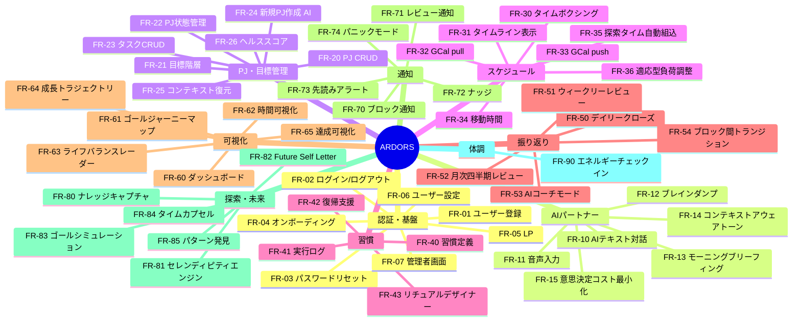

# 機能一覧
## プロジェクト名: ARDORS（アーダース）

---

### 1. 機能概要マップ

---

### 2. 機能一覧表

#### 2.1 認証・基盤

| 機能ID | 機能名 | 説明 | 優先度 | 対象ユーザー |
|--------|--------|------|--------|-------------|
| FR-01 | ユーザー登録 | Google OAuth またはメールアドレス+パスワードで新規アカウントを作成する | P0 | 全ユーザー |
| FR-02 | ログイン / ログアウト | 登録済みアカウントでの認証。セッション管理 | P0 | 全ユーザー |
| FR-03 | パスワードリセット | メールアドレスを入力し、パスワードリセットリンクを送信する | P0 | U-01, U-02 |
| FR-04 | オンボーディング | 初回利用時に、PJ一覧・生活リズム・目標・優先事項をまとめて入力。AIのコールドスタートを解消する | P0 | U-01 |
| FR-05 | LP（ランディングページ） | プロダクト紹介と登録導線を提供するSaaS公開用ページ | P0 | 未登録ユーザー |
| FR-06 | ユーザー設定 | 通知頻度、AIの厳しさレベル（コーチ/メンター/フレンド）、表示カスタマイズ等 | P1 | U-01, U-02 |
| FR-07 | 管理者画面 | ユーザーアカウント管理（一覧・検索・停止・削除）、利用状況ダッシュボード、将来のプラン管理 | P1 | U-02 |

#### 2.2 AIパートナー

| 機能ID | 機能名 | 説明 | 優先度 | 対象ユーザー |
|--------|--------|------|--------|-------------|
| FR-10 | AIテキスト対話 | テキストでAIと対話し、タスク登録・予定作成・進捗更新・次の行動提案を行う。建設的AIの原則に従う | P0 | U-01 |
| FR-11 | 音声入力（STT） | 音声をSTTでテキスト変換し、AIに送信する。返信はテキスト | P0 | U-01 |
| FR-12 | ブレインダンプ | 音声/テキストで自由に話す → AIが内容を自動判別（タスク/ビジョン/混在）し構造化。PJ振り分け、タスク抽出、期限検出、展望整理、新規PJ候補。確認・承認後にタスク化・カレンダー化 | P0 | U-01 |
| FR-13 | AIモーニングブリーフィング | 朝、AIが能動的に今日の予定・最重要タスク・昨日の続き・体調考慮の提案を話しかける形で提示 | P0 | U-01 |
| FR-14 | コンテキストアウェアなAIトーン | エネルギー状態・締切状況・達成状況に応じてAIのトーンが自動変化する | P1 | U-01 |
| FR-15 | 意思決定コスト最小化 | AIは「Xをやりましょう。OK？」と推奨付きで提案。選択肢は最大2-3択 | P1 | U-01 |

#### 2.3 プロジェクト・目標管理

| 機能ID | 機能名 | 説明 | 優先度 | 対象ユーザー |
|--------|--------|------|--------|-------------|
| FR-20 | プロジェクトCRUD | PJの作成・読取・更新・削除。名前、説明、ゴール、期限、カテゴリ（就活/学業/運動/開発等） | P0 | U-01 |
| FR-21 | 目標階層 | 長期ゴール → 中期目標 → 週次ゴール → 日のタスクの階層構造。上位目標との紐付け | P0 | U-01 |
| FR-22 | PJ状態管理 | Active（今週前進）/ Warm（止めないが本格着手しない）/ Cold（明確に保留）の3状態 | P0 | U-01 |
| FR-23 | タスクCRUD | タスクの作成・読取・更新・削除・完了。PJへの紐付け、期限、優先度、見積もり時間 | P0 | U-01 |
| FR-24 | 新規PJ作成（AI対話） | AIとの対話から自然にPJが生まれる。AIがゴール、マイルストーン、初期タスクを提案 | P0 | U-01 |
| FR-25 | コンテキスト復元 | 数日間触ってなかったPJを再開時、AIが前回の作業内容・次のアクションを提示 | P1 | U-01 |
| FR-26 | プロジェクト・ヘルススコア | 最終作業日、タスク消化率、期限との距離、ブロッカーの有無から自動算出。赤/黄/緑で表示 | P1 | U-01 |

#### 2.4 スケジュール・タイムボクシング

| 機能ID | 機能名 | 説明 | 優先度 | 対象ユーザー |
|--------|--------|------|--------|-------------|
| FR-30 | 週間タイムボクシング | 1週間単位でAIがタイムボクシングレベルのスケジュールを生成。ユーザーが承認・修正。移動時間等の現実的制約を考慮 | P0 | U-01 |
| FR-31 | タイムライン形式のVisualization | 1日/1週間のスケジュールをタイムライン（時間軸）形式で表示 | P0 | U-01 |
| FR-32 | Google Calendar pull | ボタンタップでGoogle Calendarの最新予定をARDORSに取得。場所情報も取得（移動時間算出用） | P0 | U-01 |
| FR-33 | Google Calendar push | タイムボクシングで組んだスケジュールを「Google Calendarに反映」ボタンで一括反映 | P0 | U-01 |
| FR-34 | 移動時間のインテリジェンス | 予定に場所情報があれば、前後に移動時間を自動で確保 | P2 | U-01 |
| FR-35 | 探索タイム自動組込 | AIがスケジュール作成時に、自動で探索の時間を組み込む | P1 | U-01 |
| FR-36 | 適応型負荷調整 | タスク完了率に応じてAIが翌日/翌週の予定の負荷を自動調整。危険信号ルールの自動監視 | P2 | U-01 |

#### 2.5 習慣エンジン

| 機能ID | 機能名 | 説明 | 優先度 | 対象ユーザー |
|--------|--------|------|--------|-------------|
| FR-40 | 習慣定義 | cue（きっかけ）、最小行動、if-then plan、頻度を設定して習慣を定義する | P0 | U-01 |
| FR-41 | 習慣実行ログ | 習慣の実行をチェック（1タップ）。実行履歴を記録 | P0 | U-01 |
| FR-42 | 習慣復帰支援 | 習慣が途切れた時にAIが優しくナッジ。復帰プランを提案 | P1 | U-01 |
| FR-43 | リチュアル・デザイナー | 朝の開始儀式、ブロック間の切り替え儀式、デイリークローズの儀式をカスタマイズ | P2 | U-01 |

#### 2.6 振り返り・内省

| 機能ID | 機能名 | 説明 | 優先度 | 対象ユーザー |
|--------|--------|------|--------|-------------|
| FR-50 | デイリークローズ | 1日の終わりに振り返り。ユーザーがまとめて音声/テキスト入力 → AIが構造化・分析・フィードバック → 対話で深掘り。Done List生成。スキップ時はAIが行動ログから自動生成 | P0 | U-01 |
| FR-51 | ウィークリーレビュー | AIが先週サマリーを提示 → ユーザーがまとめて入力 → AIが建設的に分析 → 対話で方向修正 → PJ見直し → 週次ゴール決定 → タイムボクシング生成 → 承認 → GCal push | P0 | U-01 |
| FR-52 | 月次・四半期レビュー | AIが中期レポートをまとめて提示 → ユーザーがまとめて入力 → 双方向で今後のプランニング → 目標見直し・ゴールシミュレーション → 成長トラジェクトリー確認 | P0 | U-01 |
| FR-53 | AIコーチモード | 週次レビュー時にAIのトーンが「コーチ」に切り替わる。データに基づいた率直・建設的なフィードバック。問いかけ形式。ユーザーの意向を聞いた上で客観分析。厳しさレベル設定可能 | P0 | U-01 |
| FR-54 | ブロック間トランジション | ブロック終了時に1タップ振り返り（集中度3段階）。任意で音声/テキスト入力（サボり原因、進捗詳細）。AIが次ブロックの内容と前回状態を提示 | P1 | U-01 |

#### 2.7 ダッシュボード・可視化

| 機能ID | 機能名 | 説明 | 優先度 | 対象ユーザー |
|--------|--------|------|--------|-------------|
| FR-60 | ダッシュボード | 今日のスケジュール、進行中PJ（ヘルススコア付き）、習慣チェックリスト、長期ゴール、AIブリーフィングが一画面で見えるホーム画面 | P0 | U-01 |
| FR-61 | ゴール・ジャーニーマップ | 長期ゴール → 中期目標 → 週次ゴール → 今日のタスクが線で繋がる階層ツリー。プログレスバー付き。過去の積み上げもタイムライン上に表示。AIがコンテキストを添える | P0 | U-01 |
| FR-62 | 時間の使い方の可視化 | PJごとの時間配分を自動集計（タイムボクシングデータから）。理想の配分 vs 実際の配分のギャップ。円グラフ/棒グラフ | P0 | U-01 |
| FR-63 | ライフバランスレーダー | 人生の領域（キャリア、学業、健康、人間関係、趣味、成長、休息）をレーダーチャート表示。時間配分+チェックインから自動算出。偏りをAIが通知 | P2 | U-01 |
| FR-64 | 成長トラジェクトリー | 月次・四半期で「3ヶ月前 vs 今」を可視化。PJ別投資時間推移、完了数、習慣定着率 | P2 | U-01 |
| FR-65 | 達成の可視化・お祝い | ストリーク表示、PJ完了時の振り返りサマリー自動生成、統計、マイルストーン達成時のお祝い演出 | P1 | U-01 |

#### 2.8 通知・ナッジ

| 機能ID | 機能名 | 説明 | 優先度 | 対象ユーザー |
|--------|--------|------|--------|-------------|
| FR-70 | タイムブロック開始/終了通知 | タイムボクシングに沿ったブロックの開始・終了をWeb通知 | P0 | U-01 |
| FR-71 | レビュー通知 | デイリークローズ、ウィークリーレビュー、月次レビューの時間になったら通知 | P0 | U-01 |
| FR-72 | サボり防止ナッジ | AIのトーンで優しくリマインド。スキップし続けても攻撃的にならない | P1 | U-01 |
| FR-73 | 先読みアラート | 1週間先の締切・予定をスキャンし、衝突を事前検知して通知 | P1 | U-01 |
| FR-74 | パニック/オーバーフローモード | 締切が集中したときにAIが自動検知し、優先度整理の対話を開始 | P2 | U-01 |

#### 2.9 探索・成長・未来接続

| 機能ID | 機能名 | 説明 | 優先度 | 対象ユーザー |
|--------|--------|------|--------|-------------|
| FR-80 | ナレッジ・気づきキャプチャ | 音声/テキストで気づき・アイデア・学びを素早くメモ。AIが既存PJや過去の気づきとの関連を提示 | P1 | U-01 |
| FR-81 | セレンディピティ・エンジン | ナレッジキャプチャに溜まったメモをAIが定期スキャン。無関係に見えるメモ間の接点を提示 | P2 | U-01 |
| FR-82 | 未来の自分との対話 | 月1回、AIがFuture Self Letterを促す。3ヶ月後に届き、AIが当時vs現在を比較 | P2 | U-01 |
| FR-83 | ゴール・シミュレーション | 現ペースでの3ヶ月後/半年後/1年後をAIが予測。ペース変化で動的に更新。タイムライン形式 | P2 | U-01 |
| FR-84 | マイルストーン・タイムカプセル | 大マイルストーン達成時に自動で記録生成。感情・学び・意気込みをAIが聞き取り保存。成長の物語タイムライン | P2 | U-01 |
| FR-85 | 学習パターンの自動発見 | 集中しやすい曜日・時間帯、運動と生産性の相関等をAIが自動発見しスケジュール最適化に反映 | P2 | U-01 |

#### 2.10 体調・リズム

| 機能ID | 機能名 | 説明 | 優先度 | 対象ユーザー |
|--------|--------|------|--------|-------------|
| FR-90 | エネルギーチェックイン | 1日2-3回、mood/energy/focusを各1タップで記録。自己申告のみ。AIがスケジュール提案に反映。蓄積データからAIが分析・助言 | P1 | U-01 |

---

### 3. 機能詳細（P0機能）

#### FR-01: ユーザー登録

- **説明**: 新規ユーザーがアカウントを作成する
- **アクター**: 未登録ユーザー
- **入力データ**:
  - Google OAuth: Googleアカウント認証情報（Google側で処理）
  - メアド+パスワード: メールアドレス（string、有効なメール形式）、パスワード（string、8文字以上、英字+数字を含む）
- **出力/結果**:
  - 正常系: アカウント作成完了 → オンボーディング画面(FR-04)に遷移
  - 異常系: エラーメッセージ表示（重複メール、パスワード要件未達等）
- **ビジネスルール**:
  - BR-01-01: 同一メールアドレスでの重複登録は不可
  - BR-01-02: Google OAuthで登録した場合、同じメールアドレスでのメアド+パスワード登録は不可（逆も同様）。ただしアカウント連携は将来検討
  - BR-01-03: メアド+パスワード登録時、確認メールを送信し、メール内リンクのクリックで本登録完了
- **エラーケース**:
  - 重複メールアドレス → 「このメールアドレスは既に使用されています」
  - パスワード要件未達 → 具体的な不足要件を表示
  - Google OAuth失敗 → 「Googleアカウントとの連携に失敗しました。再度お試しください」

#### FR-02: ログイン / ログアウト

- **説明**: 登録済みアカウントで認証し、セッションを管理する
- **アクター**: 登録済みユーザー
- **入力データ**:
  - Google OAuth: Googleアカウント認証情報
  - メアド+パスワード: メールアドレス、パスワード
- **出力/結果**:
  - 正常系: ダッシュボード(FR-60)に遷移
  - 異常系: エラーメッセージ表示
- **ビジネスルール**:
  - BR-02-01: ログイン状態はセッションで管理。セッション有効期限は30日（自動延長あり）
  - BR-02-02: ログアウト時、セッションを破棄しログイン画面に遷移
- **エラーケース**:
  - メールアドレスまたはパスワードが不正 → 「メールアドレスまたはパスワードが正しくありません」（どちらが間違いかは明示しない）
  - メール未確認アカウント → 「メールアドレスの確認が完了していません。確認メールを再送しますか？」

#### FR-03: パスワードリセット

- **説明**: パスワードを忘れた場合にリセットする
- **アクター**: 登録済みユーザー（メアド+パスワード登録者）
- **入力データ**: メールアドレス（string）
- **出力/結果**:
  - 正常系: 「パスワードリセットリンクを送信しました」メッセージ表示。メール内リンクから新パスワード設定画面に遷移
  - 異常系: 未登録メールアドレスでも同じメッセージを表示（セキュリティ上、存在の有無を漏洩しない）
- **ビジネスルール**:
  - BR-03-01: リセットリンクの有効期限は24時間
  - BR-03-02: リセット完了後、既存セッションを全て無効化
  - BR-03-03: 新パスワードは現在のパスワードと同一不可

#### FR-04: オンボーディング

- **説明**: 初回利用時にユーザー情報を収集し、AIのコールドスタートを解消する
- **アクター**: 新規登録ユーザー（U-01）
- **入力データ**:
  - 現在のプロジェクト一覧（テキスト/音声で自由入力 → AI構造化）
  - 生活リズム（起床時間、就寝時間、仕事/学校の時間帯）
  - 目標・優先事項（テキスト/音声で自由入力 → AI構造化）
  - Google Calendar連携の許可（任意）
- **出力/結果**:
  - AI が入力を構造化し、PJ一覧・目標階層の初期データを生成
  - ユーザーが確認・修正・承認
  - ダッシュボードに遷移
- **ビジネスルール**:
  - BR-04-01: オンボーディングはスキップ可能（後から設定画面でも入力可能）
  - BR-04-02: スキップした場合、AIは基本機能のみ提供（パターン分析等は無効）
  - BR-04-03: 入力形式は音声/テキストいずれでも可。AIがまとめて構造化する

#### FR-05: LP（ランディングページ）

- **説明**: SaaS公開用のプロダクト紹介ページ
- **アクター**: 未登録ユーザー
- **入力データ**: なし
- **出力/結果**: プロダクト紹介コンテンツの表示、登録画面への導線
- **ビジネスルール**:
  - BR-05-01: 認証不要でアクセス可能
  - BR-05-02: 登録ボタンからFR-01（ユーザー登録）に遷移

#### FR-10: AIテキスト対話

- **説明**: テキストでAIと対話し、タスク登録・予定作成・進捗更新・次の行動提案を行う
- **アクター**: U-01
- **入力データ**: テキストメッセージ（string、上限10,000文字）
- **出力/結果**:
  - AIのテキスト応答
  - 副作用: AIの提案を承認した場合、タスク/予定/PJの作成・更新が実行される
- **ビジネスルール**:
  - BR-10-01: 建設的AIの原則に従う（満足させる言葉ではなく、目的達成に向けた客観的視点を提供）
  - BR-10-02: AIの提案でデータが変更される場合、必ずユーザーの承認を経る（自動で勝手に変更しない）
  - BR-10-03: 対話履歴は保存され、コンテキストとして利用される
  - BR-10-04: AI非依存の基盤保証: APIダウン時は「現在AIが利用できません。手動で操作してください」と表示し、手動CRUD機能にフォールバック
- **エラーケース**:
  - LLM API障害 → フォールバックメッセージ表示 + 手動操作への誘導
  - 入力が10,000文字超 → 「入力が長すぎます。分割して送信してください」

#### FR-11: 音声入力（STT）

- **説明**: 音声をSTTでテキスト変換し、AIに送信する
- **アクター**: U-01
- **入力データ**: 音声（マイク入力）
- **出力/結果**:
  - STTでテキスト変換 → テキストとしてAI対話(FR-10)に送信
  - 変換されたテキストはユーザーに表示（送信前に確認・修正可能）
- **ビジネスルール**:
  - BR-11-01: 音声録音の最大長は5分
  - BR-11-02: テキスト変換後、送信前にユーザーが内容を確認・修正できる
  - BR-11-03: STT API障害時は「音声入力が利用できません。テキストで入力してください」と表示
- **エラーケース**:
  - マイク権限なし → ブラウザの権限リクエストを促す
  - STT変換失敗 → 「音声を認識できませんでした。再度お試しください」

#### FR-12: ブレインダンプ

- **説明**: 音声/テキストで自由に話し、AIが内容を自動判別して構造化する
- **アクター**: U-01
- **入力データ**: テキストまたは音声（FR-11経由）。内容は自由形式
- **出力/結果**:
  - AIが入力を分析し、以下に振り分けた構造化結果を提示:
    - タスク的な内容 → PJ振り分け、タスク抽出（タイトル・期限・優先度）、新規タスク候補
    - ビジョン的な内容 → 展望の構造化、既存目標との接続、新規PJ候補
    - 混在 → 上記を同時処理
  - ユーザーが確認・修正・承認 → 承認された項目がタスク/PJ/カレンダーに反映
- **ビジネスルール**:
  - BR-12-01: AIが構造化した結果は、ユーザーが承認するまでデータに反映されない
  - BR-12-02: 構造化結果の各項目は個別に承認/却下/修正できる
  - BR-12-03: 新規PJ候補が検出された場合、FR-24（新規PJ作成）のフローに接続

#### FR-13: AIモーニングブリーフィング

- **説明**: 朝、AIが能動的に今日の情報をまとめて話しかける
- **アクター**: U-01
- **入力データ**: なし（AIが自動生成）
- **出力/結果**:
  - 今日のスケジュール概要
  - 最重要タスクの提案（理由付き）
  - 昨日の振り返りからの接続（「昨日『Xに詰まった』と書いていたので...」）
  - 直近の締切アラート（あれば）
  - エネルギーチェックイン(FR-90)の結果がある場合、体調を考慮した提案
- **ビジネスルール**:
  - BR-13-01: ダッシュボード(FR-60)を開いた際に自動表示（1日1回、初回アクセス時）
  - BR-13-02: コールドスタート期間（データ不足時）は基本的なスケジュール概要のみ
  - BR-13-03: AI非依存フォールバック: API障害時はダッシュボードのデータ表示のみ（ブリーフィングなし）
  - BR-13-04: 建設的AIの原則に従い、無意味な励ましではなく行動につながる情報を提供

#### FR-20: プロジェクトCRUD

- **説明**: プロジェクトの作成・読取・更新・削除を行う
- **アクター**: U-01
- **入力データ**:
  - 作成/更新: PJ名（string、1-100文字）、説明（string、任意、上限2000文字）、カテゴリ（就活/学業/運動/開発・起業/個人案件/趣味/友人/休息/その他 から選択、複数可）、期限（date、任意）、ゴール（string、任意）
  - 削除: PJ ID
- **出力/結果**:
  - 作成: PJが作成され、PJ一覧に追加。状態は「Active」がデフォルト
  - 読取: PJ詳細画面（タスク一覧、進捗、ヘルススコア、目標階層）
  - 更新: 指定フィールドが更新
  - 削除: PJとその配下のタスクが論理削除（30日後に物理削除）
- **ビジネスルール**:
  - BR-20-01: PJ名は必須。空文字不可
  - BR-20-02: 削除は論理削除。30日以内であれば復元可能
  - BR-20-03: PJ削除時、配下のタスクも連動して論理削除
  - BR-20-04: AI対話(FR-10)やブレインダンプ(FR-12)からも作成可能

#### FR-21: 目標階層

- **説明**: 長期ゴール → 中期目標 → 週次ゴール → 日のタスクの階層構造を管理する
- **アクター**: U-01
- **入力データ**:
  - 長期ゴール: タイトル（string）、期限（date、任意）、説明（string、任意）
  - 中期目標: タイトル、期限、親（長期ゴール）への紐付け
  - 週次ゴール: タイトル、対象週、親（中期目標）への紐付け
  - タスク: FR-23で管理。親（週次ゴール or 中期目標 or 長期ゴール）への紐付け
- **出力/結果**:
  - 階層ツリーの表示（FR-61 ゴール・ジャーニーマップで可視化）
  - 下位の完了に応じて上位の進捗率が自動計算
- **ビジネスルール**:
  - BR-21-01: 階層は最大4層（長期ゴール → 中期目標 → 週次ゴール → タスク）
  - BR-21-02: タスクは必ずしも週次ゴールに紐付ける必要はない（PJ直下のタスクも可）
  - BR-21-03: 進捗率は配下の完了率から自動算出（タスク完了数 / 総タスク数）
  - BR-21-04: 週次ゴールは週次レビュー(FR-51)で設定。AIが提案、ユーザーが承認

#### FR-22: PJ状態管理

- **説明**: PJをActive / Warm / Coldの3状態で管理し、同時進行数を制御する
- **アクター**: U-01
- **入力データ**: PJ ID、変更先の状態（Active / Warm / Cold）
- **出力/結果**: PJの状態が更新。ダッシュボードの表示が連動
- **ビジネスルール**:
  - BR-22-01: Active（今週前進させる）: 推奨上限2-3件。上限超過時にAIが警告
  - BR-22-02: Warm（止めないが本格着手しない）: 推奨上限3-5件
  - BR-22-03: Cold（明確に保留）: 上限なし
  - BR-22-04: 状態変更は週次レビュー(FR-51)で行うことを推奨。日中でも変更可能
  - BR-22-05: AIがタイムボクシング(FR-30)を生成する際、Active PJのタスクを優先配置

#### FR-23: タスクCRUD

- **説明**: タスクの作成・読取・更新・削除・完了を行う
- **アクター**: U-01
- **入力データ**:
  - 作成/更新: タスク名（string、1-200文字）、説明（string、任意）、PJ紐付け（PJ ID）、期限（datetime、任意）、優先度（高/中/低）、見積もり時間（分単位、任意）、目標紐付け（週次ゴール or 中期目標 or 長期ゴール、任意）
  - 完了: タスクID
  - 削除: タスクID
- **出力/結果**:
  - 作成: タスクが作成され、PJのタスク一覧に追加
  - 完了: タスクが完了状態になり、上位目標の進捗率が更新
  - 削除: 論理削除
- **ビジネスルール**:
  - BR-23-01: タスク名は必須
  - BR-23-02: PJ紐付けは必須（PJ未指定の場合「未分類」PJに自動配置）
  - BR-23-03: 完了したタスクは「完了」状態に変わり、Done Listに表示
  - BR-23-04: AI対話(FR-10)、ブレインダンプ(FR-12)、ウィークリーレビュー(FR-51)からも作成可能

#### FR-24: 新規PJ作成（AI対話）

- **説明**: AIとの対話から自然にPJが生まれる
- **アクター**: U-01
- **入力データ**: AIとの対話テキスト（FR-10/FR-12経由）
- **出力/結果**:
  - AIが対話内容から新規PJ候補を検出
  - PJ名、ゴール、マイルストーン、初期タスクをAIが提案
  - ユーザーが確認・修正・承認 → PJが作成され、タスクも連動生成
- **ビジネスルール**:
  - BR-24-01: AIが提案した内容は全てユーザー承認が必要
  - BR-24-02: 新規PJの初期状態はActive（ユーザーが変更可能）
  - BR-24-03: マイルストーンは中期目標として目標階層(FR-21)に接続

#### FR-30: 週間タイムボクシング

- **説明**: 1週間単位でAIがタイムボクシングレベルのスケジュールを生成する
- **アクター**: U-01
- **入力データ**:
  - Active PJのタスク一覧（自動取得）
  - Google Calendarの予定（FR-32でpull済み）
  - 習慣のスケジュール（FR-40）
  - ユーザーの生活リズム（オンボーディングで設定）
  - エネルギーチェックイン履歴（FR-90、あれば）
- **出力/結果**:
  - 1週間分のタイムブロック（各ブロック: 開始時刻、終了時刻、内容、紐付くPJ/タスク）
  - タイムライン形式で表示(FR-31)
  - ユーザーが確認・修正・承認
- **ビジネスルール**:
  - BR-30-01: AIは深い仕事ブロック（60-90分）と浅い仕事ブロック、休憩を適切に配置
  - BR-30-02: Google Calendarの既存予定と重複しないように配置
  - BR-30-03: 探索タイムを自動で組み込む(FR-35)
  - BR-30-04: ユーザーはブロックのドラッグ&ドロップで手動調整可能
  - BR-30-05: AI非依存フォールバック: API障害時は手動でブロックを作成できるUI
  - BR-30-06: 承認後、Google Calendarにpush(FR-33)を促す

#### FR-31: タイムライン形式のVisualization

- **説明**: 1日/1週間のスケジュールをタイムライン（時間軸）形式で表示する
- **アクター**: U-01
- **入力データ**: タイムボクシングデータ（FR-30）、Google Calendar予定（FR-32）
- **出力/結果**: 時間軸上にブロックが並んだビジュアル表示。日表示/週表示の切り替え
- **ビジネスルール**:
  - BR-31-01: Google Calendarの予定とARDORSのタイムブロックを色分けして表示
  - BR-31-02: ブロックをタップで詳細表示（紐付くタスク、PJ、目標）
  - BR-31-03: 現在時刻を示すラインを表示

#### FR-32: Google Calendar pull

- **説明**: ボタンタップでGoogle Calendarの最新予定をARDORSに取得する
- **アクター**: U-01
- **入力データ**: Google Calendar APIへの認証情報（OAuth、初回設定済み）
- **出力/結果**:
  - Google Calendarの予定一覧を取得し、ARDORS内に表示
  - 場所情報があれば取得（移動時間算出用）
  - タイムライン(FR-31)に反映
- **ビジネスルール**:
  - BR-32-01: pull対象は今日から4週間先までの予定
  - BR-32-02: pullはユーザーの手動操作（ボタンタップ）で実行
  - BR-32-03: pull時、既存のARDORS予定は上書きしない（Google Calendar予定は別レイヤーで表示）
  - BR-32-04: Google API障害時 → 「Google Calendarとの通信に失敗しました。再度お試しください」

#### FR-33: Google Calendar push

- **説明**: タイムボクシングで組んだスケジュールをGoogle Calendarに一括反映する
- **アクター**: U-01
- **入力データ**: 承認済みタイムボクシングデータ
- **出力/結果**:
  - タイムブロックがGoogle Calendarのイベントとして作成される
  - 「Google Calendarに反映しました」メッセージ表示
- **ビジネスルール**:
  - BR-33-01: pushはユーザーの手動操作（「Google Calendarに反映」ボタン）で実行
  - BR-33-02: push対象はARDORSで作成したタイムブロックのみ（Google Calendar由来の予定はpushしない）
  - BR-33-03: 既にpush済みのブロックが修正された場合、再push時に更新（上書き）
  - BR-33-04: push先のカレンダーはユーザーが設定で指定可能（デフォルト: メインカレンダー）

#### FR-40: 習慣定義

- **説明**: 新しい習慣を定義する
- **アクター**: U-01
- **入力データ**:
  - 習慣名（string、1-100文字）
  - cue/きっかけ（string、例:「朝食後」「PCを開いたら」）
  - 最小行動（string、例:「腕立て1回」「本を1ページ読む」）
  - if-then plan（string、例:「もし朝食後なら、腕立てを1回する」）
  - 頻度（毎日 / 平日のみ / 週N回 / カスタム）
  - 紐付くPJ（任意）
- **出力/結果**: 習慣が作成され、ダッシュボードの習慣チェックリストに表示
- **ビジネスルール**:
  - BR-40-01: 習慣名とcueは必須
  - BR-40-02: 最小行動は「2分以内で完了できるレベル」を推奨（UIでガイド表示）
  - BR-40-03: AI対話からも習慣を作成可能

#### FR-41: 習慣実行ログ

- **説明**: 習慣の実行を記録する
- **アクター**: U-01
- **入力データ**: 習慣ID（1タップでチェック）
- **出力/結果**: 実行記録が保存。ストリークカウントが更新。ダッシュボードに反映
- **ビジネスルール**:
  - BR-41-01: チェックは1タップで完了（入力コスト最小化）
  - BR-41-02: チェック取り消しも可能（当日中のみ）
  - BR-41-03: 実行履歴はカレンダーヒートマップ形式で表示可能

#### FR-50: デイリークローズ

- **説明**: 1日の終わりに振り返りを行う
- **アクター**: U-01
- **入力データ**:
  - まとめて音声/テキスト入力（今日の振り返り・明日の考え）
  - または完全スキップ
- **出力/結果**:
  - AIが入力を構造化・分析し、フィードバックと明日の提案を提示
  - 対話で深掘り・調整
  - Done List（今日完了したタスク一覧）の自動生成
  - 習慣達成状況の表示
- **ビジネスルール**:
  - BR-50-01: スキップ可能。スキップ時はAIが行動ログ（タスク完了、ブロック実績等）からDone Listを自動生成
  - BR-50-02: 通知時刻はユーザー設定(FR-06)で変更可能
  - BR-50-03: 建設的AIの原則に従う
  - BR-50-04: デイリークローズの内容は翌朝のモーニングブリーフィング(FR-13)に引き継がれる

#### FR-51: ウィークリーレビュー

- **説明**: 週1回の振り返り・方向修正・来週計画を行う
- **アクター**: U-01
- **入力データ**:
  - AIが生成した先週のサマリー（自動）
  - Google Calendarから来週の予定をpull（FR-32）
  - ユーザーの振り返り・来週の意向（まとめて音声/テキスト入力）
- **出力/結果**:
  - AIが建設的・客観的に分析し、コーチモード(FR-53)でフィードバック
  - 対話で深掘り・方向修正
  - PJのActive/Warm/Cold見直し
  - 来週の週次ゴール決定
  - AIがタイムボクシング(FR-30)を生成（探索タイム自動組込）
  - ユーザー承認 → Google Calendar push(FR-33)
- **ビジネスルール**:
  - BR-51-01: 推奨実施タイミングは日曜夕方 or 月曜早朝（ユーザー設定で変更可能）
  - BR-51-02: スキップ可能。スキップ時はAIが前週ベースで来週計画を自動生成（要承認）
  - BR-51-03: AIサマリーには以下を含む: 時間配分実績、タスク完了率、習慣達成率、PJヘルススコア変動
  - BR-51-04: 週次ゴールはAIが提案（最大3つ）し、ユーザーが承認・修正

#### FR-52: 月次・四半期レビュー

- **説明**: 月1回/3ヶ月に1回の中期振り返り・方向修正を行う
- **アクター**: U-01
- **入力データ**:
  - AIが生成した中期レポート（自動）
  - ユーザーの振り返り・今後の意向（まとめて音声/テキスト入力）
- **出力/結果**:
  - AIが建設的・客観的に分析し、双方向で今後のプランニング
  - 目標の見直し（長期ゴール、中期目標の修正・追加・削除）
  - 成長トラジェクトリーの確認
  - Future Self Letter(FR-82)の促し（該当月の場合）
- **ビジネスルール**:
  - BR-52-01: 月次レビューは毎月最終週、四半期レビューは3ヶ月ごとに通知
  - BR-52-02: AIレポートには以下を含む: PJ全体の進捗、時間配分トレンド（前月/前四半期比）、目標達成度、長期停滞PJの指摘
  - BR-52-03: 「このPJ、Xヶ月間Warmのまま動いていません。Coldにしますか？」のような具体的な提案を含む

#### FR-53: AIコーチモード

- **説明**: 週次レビュー時にAIのトーンが「コーチ」に切り替わり、建設的なフィードバックを行う
- **アクター**: U-01
- **入力データ**: 週次/月次のデータ（自動取得）、ユーザーの音声/テキスト入力
- **出力/結果**: データに基づいた率直・建設的なフィードバック。問いかけ形式
- **ビジネスルール**:
  - BR-53-01: ユーザーの意向を聞いた上で（まとめて入力→）客観分析する順序
  - BR-53-02: フィードバック例: 先延ばしパターンの指摘、探索時間ゼロへの警告、睡眠不足とパフォーマンスの相関提示
  - BR-53-03: 批判ではなく問いかけの形（「なぜだと思いますか？」「本当に優先度が高いですか？」）
  - BR-53-04: 厳しさレベルはユーザー設定(FR-06)で変更可能（コーチ/メンター/フレンド）
  - BR-53-05: 人間の道が誤っていたら正す。目的や未来に向かって建設的である

#### FR-60: ダッシュボード

- **説明**: ARDORSのホーム画面。「これだけ開けば1日が回る」
- **アクター**: U-01
- **入力データ**: なし（各機能のデータを集約表示）
- **出力/結果**: 以下を一画面で表示:
  - AIモーニングブリーフィング(FR-13)
  - 今日のタイムライン(FR-31)
  - 進行中PJ一覧（ヘルススコア付き）
  - 習慣チェックリスト
  - 長期ゴール表示
  - 週次ゴール
  - Done List（今日の完了タスク）
- **ビジネスルール**:
  - BR-60-01: ログイン後のデフォルト遷移先
  - BR-60-02: レスポンシブ対応（PC/スマホ両対応）
  - BR-60-03: AI非依存: AIブリーフィングが生成できない場合も、データ表示部分は正常に動作
  - BR-60-04: 情報の優先順位: 今日のスケジュール > PJ状態 > 習慣 > 長期ゴール

#### FR-61: ゴール・ジャーニーマップ

- **説明**: 目標の階層ツリーとプログレスを可視化する
- **アクター**: U-01
- **入力データ**: 目標階層データ(FR-21)、タスク完了データ(FR-23)
- **出力/結果**:
  - 長期ゴール → 中期目標 → 週次ゴール → 今日のタスクが線で繋がるツリー表示
  - 各ノードにプログレスバー（配下の完了率）
  - 過去の完了マイルストーンがタイムライン上に表示
  - AIが「この作業はXというゴールの達成に繋がっています」とコンテキストを添える
- **ビジネスルール**:
  - BR-61-01: ダッシュボードからアクセス可能
  - BR-61-02: 今まで何を積み上げてきて、これから何を積み上げるべきで、その結果どんな未来が見えるのかを直感的に表示
  - BR-61-03: ノードをタップで詳細展開（配下のタスク一覧、進捗詳細）
  - BR-61-04: AI非依存: ツリーとプログレスバーはAIなしで表示可能。AIコンテキスト添付はAI依存

#### FR-62: 時間の使い方の可視化

- **説明**: PJごとの時間配分を可視化する
- **アクター**: U-01
- **入力データ**: タイムボクシングの実績データ(FR-30)
- **出力/結果**:
  - PJ別の時間配分（円グラフ/棒グラフ）
  - 理想の配分 vs 実際の配分のギャップ表示
  - 日/週/月単位で切り替え可能
- **ビジネスルール**:
  - BR-62-01: タイムボクシングのブロック実績から自動集計（手動入力不要）
  - BR-62-02: 「理想の配分」はユーザーが設定（例: 開発40%、就活30%、運動10%等）
  - BR-62-03: ギャップが大きい場合、AIが週次レビューで指摘

---

### 4. 優先度サマリー

| 優先度 | 機能数 | 主要機能 |
|--------|--------|---------|
| P0（MUST） | 24件 | 認証基盤(FR-01~05)、AI対話・音声・ブレインダンプ(FR-10~13)、PJ・タスク・目標管理(FR-20~24)、タイムボクシング・GCal連携(FR-30~33)、習慣定義・ログ(FR-40~41)、振り返り全般(FR-50~53)、ダッシュボード・可視化(FR-60~62)、通知(FR-70~71) |
| P1（SHOULD） | 13件 | ユーザー設定(FR-06)、管理者画面(FR-07)、AIトーン・意思決定最小化(FR-14~15)、コンテキスト復元・ヘルススコア(FR-25~26)、探索タイム(FR-35)、習慣復帰(FR-42)、ブロック間トランジション(FR-54)、達成可視化(FR-65)、ナッジ・先読みアラート(FR-72~73)、ナレッジキャプチャ(FR-80)、エネルギーチェックイン(FR-90) |
| P2（COULD） | 11件 | 移動時間(FR-34)、適応型負荷(FR-36)、リチュアル(FR-43)、ライフバランスレーダー(FR-63)、成長トラジェクトリー(FR-64)、パニックモード(FR-74)、セレンディピティ(FR-81)、Future Self Letter(FR-82)、ゴールシミュレーション(FR-83)、タイムカプセル(FR-84)、パターン発見(FR-85) |

---

文書バージョン: 1.0
作成日: 2026-04-03
最終更新日: 2026-04-03
