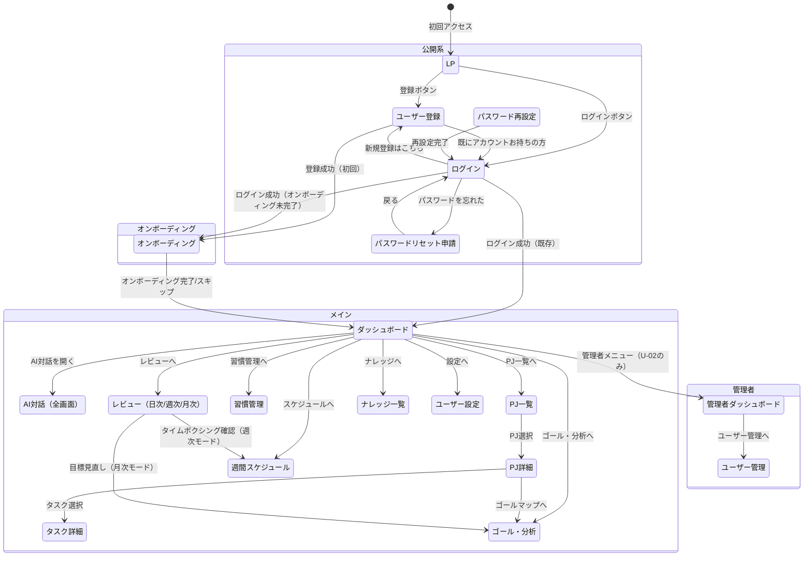
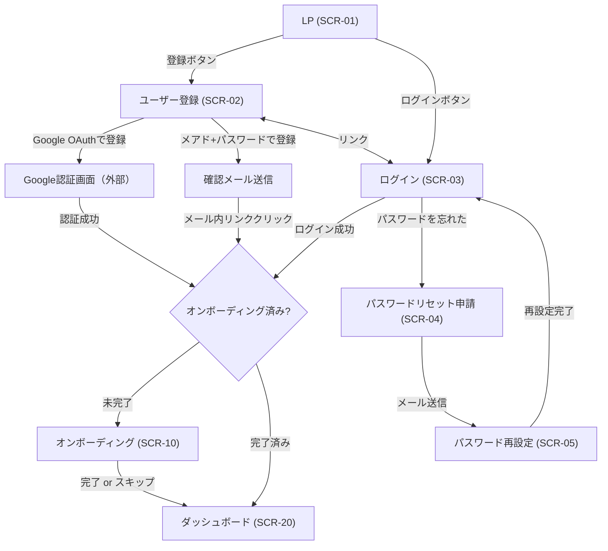
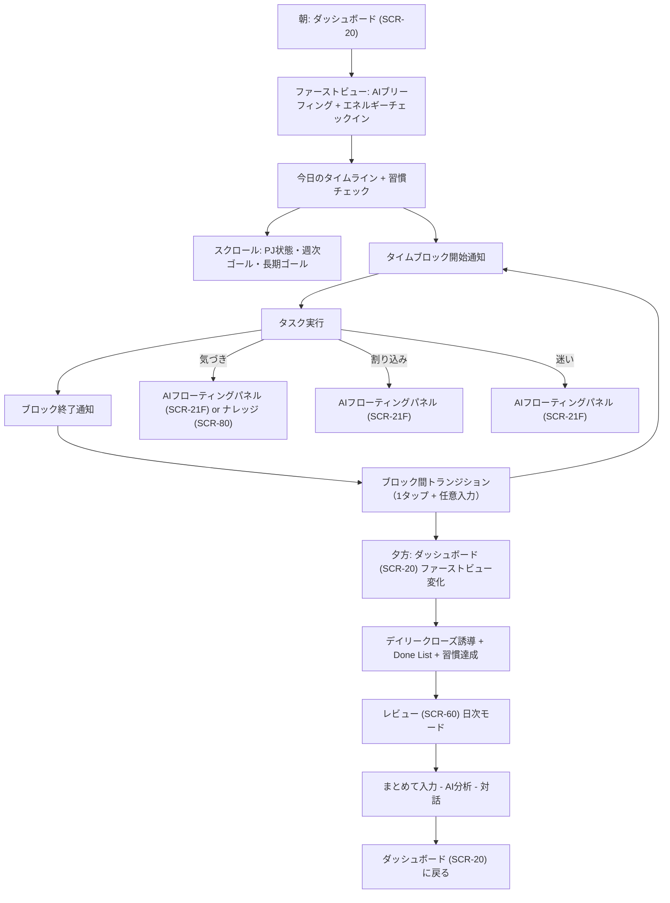
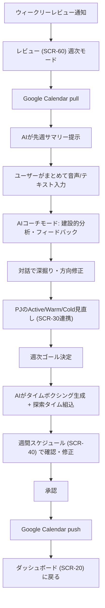
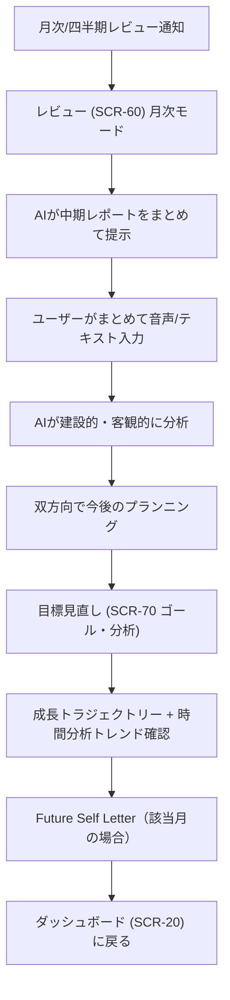

# 画面遷移図
## プロジェクト名: ARDORS（アーダース）

---

### 1. 画面一覧

#### 1.1 公開系（認証不要）

| 画面ID | 画面名 | URL（案） | 概要 | 対象ユーザー | 認証要否 |
|--------|--------|----------|------|-------------|---------|
| SCR-01 | LP（ランディングページ） | / | プロダクト紹介 + 登録導線 | 全員 | 不要 |
| SCR-02 | ユーザー登録 | /signup | Google OAuth or メアド+パスワードで登録 | 未登録ユーザー | 不要 |
| SCR-03 | ログイン | /login | Google OAuth or メアド+パスワードでログイン | 登録済みユーザー | 不要 |
| SCR-04 | パスワードリセット申請 | /reset-password | メールアドレスを入力してリセットリンク送信 | 登録済みユーザー | 不要 |
| SCR-05 | パスワード再設定 | /reset-password/:token | リセットリンク先。新パスワードを設定 | 登録済みユーザー | 不要（トークン認証） |

#### 1.2 オンボーディング（認証後・初回のみ）

| 画面ID | 画面名 | URL（案） | 概要 | 対象ユーザー | 認証要否 |
|--------|--------|----------|------|-------------|---------|
| SCR-10 | オンボーディング | /onboarding | PJ一覧・生活リズム・目標を音声/テキストで入力。AI構造化 → 確認・承認 | U-01 | 必要 |

#### 1.3 メイン（認証後）

| 画面ID | 画面名 | URL（案） | 概要 | 対象ユーザー | 認証要否 |
|--------|--------|----------|------|-------------|---------|
| SCR-20 | ダッシュボード（ホーム） | /dashboard | 時間帯適応型の表示。ファーストビューに「今この瞬間に必要な情報」、スクロール下部にPJ・目標・週次ゴール等 | U-01 | 必要 |
| SCR-21 | AI対話（全画面） | /chat | AIとの全画面チャット。テキスト/音声入力。ブレインダンプもここで実行 | U-01 | 必要 |
| SCR-21F | AI対話（フローティングパネル） | - （全画面に常駐） | どの画面からでもアクセスできるサイドパネル/ポップアップ。クイックな対話用 | U-01 | 必要 |
| SCR-30 | プロジェクト一覧 | /projects | 全PJをActive/Warm/Cold別に表示。ヘルススコア、進捗率 | U-01 | 必要 |
| SCR-31 | プロジェクト詳細 | /projects/:id | PJのゴール、タスク一覧、目標階層、進捗、アクティビティログ | U-01 | 必要 |
| SCR-32 | タスク詳細 | /projects/:id/tasks/:taskId | タスクの詳細情報、紐付くPJ・目標、編集 | U-01 | 必要 |
| SCR-40 | 週間スケジュール | /schedule | 1週間のタイムボクシング表示（タイムライン形式）。AIによる生成・手動調整。GCal pull/push | U-01 | 必要 |
| SCR-50 | 習慣管理 | /habits | 習慣リスト、ストリーク表示、カレンダーヒートマップ、習慣の作成/編集/削除。※日常の1タップチェックはダッシュボード(SCR-20)上で完結 | U-01 | 必要 |
| SCR-60 | レビュー | /review | 日次/週次/月次のモード切替タブ。共通パターン: AIサマリー → まとめて入力 → AI分析 → 対話。通知からアクセス時は該当モードが自動選択 | U-01 | 必要 |
| SCR-70 | ゴール・分析 | /goals | タブ切替: ゴールジャーニーマップ / 時間分析。目標階層ツリー + プログレス + PJ別時間配分 | U-01 | 必要 |
| SCR-80 | ナレッジ・気づき一覧 | /notes | 気づき・アイデアの一覧。検索、フィルタ。AIによる関連提示 | U-01 | 必要 |
| SCR-90 | ユーザー設定 | /settings | 通知頻度、AIの厳しさレベル、生活リズム、GCal連携設定、プロフィール編集 | U-01, U-02 | 必要 |

#### 1.4 管理者（認証後・管理者のみ）

| 画面ID | 画面名 | URL（案） | 概要 | 対象ユーザー | 認証要否 |
|--------|--------|----------|------|-------------|---------|
| SCR-A1 | 管理者ダッシュボード | /admin | ユーザー数、アクティブ率、システム状態の概要 | U-02 | 必要（管理者権限） |
| SCR-A2 | ユーザー管理 | /admin/users | ユーザー一覧、検索、アカウント停止/削除 | U-02 | 必要（管理者権限） |

#### 1.5 変更サマリー（旧構成からの改善点）

| 変更 | 旧 | 新 | 理由 |
|------|----|----|------|
| ダッシュボード適応型化 | 全情報を一画面に常時表示 | 時間帯に応じてファーストビューが変化。PJ・目標はスクロール下部 | 情報過多による認知負荷を軽減。「今この瞬間に必要な情報」に集中 |
| レビュー画面統合 | SCR-60(日次) + SCR-61(週次) + SCR-62(月次) の3画面 | SCR-60 レビュー画面1つにモード切替タブ | 同じパターンの画面を統合。「振り返りはここ」で覚えやすい |
| ゴール・分析統合 | SCR-70(ゴール) + SCR-71(時間分析) の2画面 | SCR-70 ゴール・分析画面1つにタブ切替 | 成長の目標と時間の使い方は表裏一体。1箇所で見える |
| 習慣をナビから外す | グローバルナビに「習慣」 | 日常チェックはダッシュボード。管理はSCR-50（設定等からアクセス） | 主要操作（1タップチェック）はダッシュボードで完結。管理は低頻度 |
| ナビを5項目に | 6項目 | 5項目（ホーム/スケジュール/プロジェクト/ゴール・分析/レビュー） | モバイル底部ナビの理想数。AIはフローティングで常駐 |

---

### 2. 画面遷移図（全体）

※ AIフローティングパネル(SCR-21F)は全メイン画面に常駐し、どこからでもAI対話を開始可能

---

### 3. 画面遷移図（機能別）

#### 3.1 認証フロー

#### 3.2 日次フロー（朝〜夜）

#### 3.3 週次フロー

#### 3.4 月次・四半期フロー

---

### 4. 各画面の概要

#### SCR-01: LP（ランディングページ）
- **URL**: /
- **主要要素**: プロダクト紹介（キャッチコピー、機能ハイライト、スクリーンショット）、登録ボタン、ログインリンク
- **遷移元**: 直接アクセス
- **遷移先**: SCR-02（登録）、SCR-03（ログイン）
- **関連機能**: FR-05

#### SCR-02: ユーザー登録
- **URL**: /signup
- **主要要素**: Google OAuthボタン、メールアドレス入力、パスワード入力（強度バー付き）、登録ボタン、ログインリンク
- **遷移元**: SCR-01、SCR-03
- **遷移先**: SCR-10（登録成功→オンボーディング）、SCR-03（既存アカウント）
- **関連機能**: FR-01

#### SCR-03: ログイン
- **URL**: /login
- **主要要素**: Google OAuthボタン、メールアドレス入力、パスワード入力、ログインボタン、「パスワードを忘れた」リンク、登録リンク
- **遷移元**: SCR-01、SCR-02、SCR-05、認証切れ時の全画面
- **遷移先**: SCR-20（ログイン成功）、SCR-10（オンボーディング未完了）、SCR-04（パスワードリセット）、SCR-02（新規登録）
- **関連機能**: FR-02

#### SCR-04: パスワードリセット申請
- **URL**: /reset-password
- **主要要素**: メールアドレス入力、送信ボタン、戻るリンク
- **遷移元**: SCR-03
- **遷移先**: SCR-03（送信完了メッセージ後）
- **関連機能**: FR-03

#### SCR-05: パスワード再設定
- **URL**: /reset-password/:token
- **主要要素**: 新パスワード入力（強度バー付き）、確認入力、設定ボタン
- **遷移元**: パスワードリセットメール内リンク
- **遷移先**: SCR-03（再設定完了後）
- **関連機能**: FR-03

#### SCR-10: オンボーディング
- **URL**: /onboarding
- **主要要素**: ステップ形式のウィザード（PJ入力 → 生活リズム → 目標）。各ステップで音声/テキスト入力可。AI構造化結果の確認・修正・承認。スキップ可能
- **遷移元**: SCR-02（登録完了後）、SCR-03（オンボーディング未完了時）
- **遷移先**: SCR-20（完了 or スキップ）
- **関連機能**: FR-04

#### SCR-20: ダッシュボード（ホーム）
- **URL**: /dashboard
- **設計原則**: 時間帯適応型表示。「今この瞬間に必要な情報」をファーストビューに。それ以外はスクロール下部
- **ファーストビュー（時間帯適応型）**:

| 時間帯 | ファーストビュー | 理由 |
|--------|----------------|------|
| 朝（起床〜午前） | AIブリーフィング + エネルギーチェックイン + 今日のタイムライン + 習慣チェック | 1日の開始に必要な情報。何から着手するかを明確にする |
| 日中 | 現在のブロック + 次のブロック + クイックAIアクセス + タイムライン残り | 作業中は「今と次」だけわかればいい。余計な情報で気を散らさない |
| 夕方〜夜 | デイリークローズ誘導 + Done List + 習慣達成状況 + 明日のプレビュー | 1日を締めくくり、達成感を得る。レビュー画面への導線 |

- **スクロール下部（常時アクセス可能）**:
  - 進行中PJ一覧（ヘルススコア色分け）
  - 週次ゴール
  - 長期ゴール表示
  - AIフローティングボタン（SCR-21Fを開く）
- **遷移元**: SCR-10、SCR-03、グローバルナビ
- **遷移先**: SCR-21、SCR-30、SCR-40、SCR-50、SCR-60、SCR-70、SCR-80、SCR-90、SCR-A1（管理者のみ）
- **関連機能**: FR-60, FR-13, FR-31, FR-90, FR-26, FR-41

#### SCR-21: AI対話（全画面）
- **URL**: /chat
- **主要要素**: チャットインターフェース（メッセージ履歴、テキスト入力、音声入力ボタン）。AIの応答にアクション提案（タスク作成、PJ作成、スケジュール変更等）。承認/却下ボタン
- **遷移元**: SCR-20、グローバルナビ（AIフローティングの「全画面で開く」）
- **遷移先**: SCR-20（戻る）、各画面（AI提案の承認結果に応じて）
- **関連機能**: FR-10, FR-11, FR-12, FR-15, FR-24

#### SCR-21F: AI対話（フローティングパネル）
- **URL**: なし（全画面に常駐するオーバーレイ）
- **主要要素**: フローティングボタン（画面右下等）→ クリックでサイドパネル or ポップアップが開く。テキスト入力、音声入力ボタン。簡易チャット。「全画面で開く」リンクでSCR-21に遷移
- **遷移元**: 全画面のフローティングボタン
- **遷移先**: SCR-21（全画面表示）
- **関連機能**: FR-10, FR-11, FR-12

#### SCR-30: プロジェクト一覧
- **URL**: /projects
- **主要要素**: PJリスト（Active/Warm/Cold別のセクション or タブ）。各PJカード: 名前、カテゴリ、ヘルススコア（色）、進捗率、期限。新規PJ作成ボタン。状態変更（ドラッグ or ボタン）
- **遷移元**: SCR-20、グローバルナビ
- **遷移先**: SCR-31（PJ選択）
- **関連機能**: FR-20, FR-22, FR-26

#### SCR-31: プロジェクト詳細
- **URL**: /projects/:id
- **主要要素**: PJ情報（名前、ゴール、状態、期限、進捗率）。タスク一覧（フィルタ: 未完了/完了/全て）。目標階層表示（このPJに紐づく部分）。コンテキスト復元メッセージ（久しぶりのアクセス時）。アクティビティログ。編集/削除ボタン
- **遷移元**: SCR-30
- **遷移先**: SCR-32（タスク選択）、SCR-70（ゴール・分析）
- **関連機能**: FR-20, FR-21, FR-23, FR-25

#### SCR-32: タスク詳細
- **URL**: /projects/:id/tasks/:taskId
- **主要要素**: タスク情報（名前、説明、期限、優先度、見積もり時間）。紐付くPJ・目標の表示。完了/未完了トグル。編集/削除ボタン
- **遷移元**: SCR-31、SCR-20（Done List）、SCR-40（タイムブロック内）
- **遷移先**: SCR-31（戻る）
- **関連機能**: FR-23

#### SCR-40: 週間スケジュール
- **URL**: /schedule
- **主要要素**: タイムライン表示（日表示/週表示切替）。タイムブロック（色分け: PJ別 + GCal予定）。ブロックのドラッグ&ドロップ編集。AIによるスケジュール生成ボタン。Google Calendar pullボタン。Google Calendar pushボタン。探索タイムの明示表示
- **遷移元**: SCR-20、SCR-60（週次レビューからのタイムボクシング確認）、グローバルナビ
- **遷移先**: SCR-32（ブロック内タスク選択）
- **関連機能**: FR-30, FR-31, FR-32, FR-33, FR-35

#### SCR-50: 習慣管理
- **URL**: /habits
- **主要要素**: 習慣リスト（各習慣: 名前、cue、ストリーク）。カレンダーヒートマップ。習慣の作成/編集/削除。if-then plan設定。※ 日常の1タップチェックはダッシュボード(SCR-20)上で完結するため、この画面は管理・分析用
- **遷移元**: SCR-20（習慣管理リンク）、SCR-90（設定から）
- **遷移先**: SCR-20（戻る）
- **関連機能**: FR-40, FR-41, FR-42

#### SCR-60: レビュー
- **URL**: /review（クエリパラメータでモード指定: /review?mode=daily, /review?mode=weekly, /review?mode=monthly）
- **設計原則**: 3つのレビュー（日次/週次/月次）を1画面にモード切替タブで統合。共通パターン: AIサマリー → まとめて入力 → AI分析 → 対話
- **モード切替タブ**: 日次 / 週次 / 月次
- **主要要素（共通）**: AIサマリー/レポート表示エリア。まとめて入力エリア（テキスト + 音声入力ボタン）。AI分析結果表示。対話エリア
- **日次モード固有要素**: Done List（自動生成）。習慣達成状況。ブロック間トランジション履歴の要約。明日の一手提案
- **週次モード固有要素**: GCal pullボタン。AIサマリー（時間配分、完了率、習慣達成率、ヘルススコア変動）。AIコーチモードのフィードバック。PJ状態変更UI。週次ゴール設定（AIが3つ提案、修正可能）。タイムボクシング生成・確認。承認 + GCal pushボタン
- **月次モード固有要素**: AIレポート（PJ進捗、時間配分トレンド、目標達成度、停滞PJ指摘）。目標見直しUI（長期ゴール・中期目標の追加/修正/削除）。成長トラジェクトリー表示。Future Self Letterプロンプト（該当月）
- **遷移元**: SCR-20、通知から直接（該当モード自動選択）、グローバルナビ
- **遷移先**: SCR-40（週次モードでタイムボクシング確認）、SCR-70（月次モードで目標見直し）、SCR-20（完了後）
- **関連機能**: FR-50, FR-51, FR-52, FR-53, FR-54

#### SCR-70: ゴール・分析
- **URL**: /goals（タブ切替: /goals?tab=journey, /goals?tab=time）
- **設計原則**: ゴールジャーニーマップと時間分析をタブで統合。「自分の成長と時間の使い方」を1箇所で見れる
- **タブ: ゴールジャーニーマップ**:
  - 階層ツリー（長期ゴール → 中期目標 → 週次ゴール → タスク）
  - 各ノードにプログレスバー
  - ノードをタップで展開/詳細
  - 過去の完了マイルストーンのタイムライン表示
  - AIコンテキスト（「この作業はXに繋がっています」）
  - 目標の追加/編集/削除
- **タブ: 時間分析**:
  - PJ別時間配分（円グラフ/棒グラフ）
  - 理想の配分設定UI
  - 理想 vs 実際のギャップ表示
  - 期間切替（日/週/月）
  - トレンド表示
- **遷移元**: SCR-20、SCR-31、SCR-60（月次モード）、グローバルナビ
- **遷移先**: SCR-31（PJ詳細）、SCR-32（タスク詳細）
- **関連機能**: FR-61, FR-21, FR-62

#### SCR-80: ナレッジ・気づき一覧
- **URL**: /notes
- **主要要素**: メモ一覧（時系列）。検索・フィルタ。新規メモ作成（テキスト + 音声入力）。AIによる関連メモ提示
- **遷移元**: SCR-20、グローバルナビ（将来: ナビに追加検討）
- **遷移先**: メモ詳細（モーダル or インライン展開）
- **関連機能**: FR-80

#### SCR-90: ユーザー設定
- **URL**: /settings
- **主要要素**: プロフィール編集（名前、メールアドレス）。通知設定（頻度、時刻、ON/OFF）。AI設定（厳しさレベル: コーチ/メンター/フレンド）。生活リズム設定（起床・就寝時間、仕事時間帯）。Google Calendar連携設定（接続/切断、push先カレンダー選択）。時間配分の理想値設定。習慣管理へのリンク。ログアウトボタン
- **遷移元**: SCR-20、グローバルナビ（設定アイコン or プロフィールメニュー）
- **遷移先**: SCR-20（戻る）、SCR-50（習慣管理）
- **関連機能**: FR-06

#### SCR-A1: 管理者ダッシュボード
- **URL**: /admin
- **主要要素**: 登録ユーザー数、アクティブユーザー数（日/週/月）、システム状態概要
- **遷移元**: SCR-20（管理者メニュー）
- **遷移先**: SCR-A2（ユーザー管理）
- **関連機能**: FR-07

#### SCR-A2: ユーザー管理
- **URL**: /admin/users
- **主要要素**: ユーザー一覧テーブル（名前、メール、登録日、最終ログイン、ステータス）。検索・フィルタ。アカウント停止/復帰/削除ボタン
- **遷移元**: SCR-A1
- **遷移先**: SCR-A1（戻る）
- **関連機能**: FR-07

---

### 5. グローバルナビゲーション

全メイン画面に共通で表示されるナビゲーション（5項目 + AIフローティング）:

| ナビ項目 | 遷移先 | アイコン案 | 備考 |
|---------|--------|-----------|------|
| ホーム | SCR-20 ダッシュボード | ホームアイコン | 毎日のホーム画面 |
| スケジュール | SCR-40 週間スケジュール | カレンダーアイコン | タイムボクシング・GCal連携 |
| プロジェクト | SCR-30 PJ一覧 | フォルダアイコン | PJ管理 |
| ゴール・分析 | SCR-70 ゴール・分析 | フラッグアイコン | 目標階層 + 時間分析 |
| レビュー | SCR-60 レビュー | 振り返りアイコン | 日次/週次/月次の統合レビュー |

**AIフローティングボタン**: ナビとは別に全画面に常駐。タップでSCR-21F（フローティングパネル）が開く。全画面チャット(SCR-21)への導線も提供

**ナビに含めないがアクセス可能な画面**:
- SCR-50 習慣管理: ダッシュボードの習慣セクション or 設定画面からアクセス
- SCR-80 ナレッジ: ダッシュボード or AI対話からアクセス（P1機能のため、将来的にナビ追加を検討）
- SCR-90 設定: プロフィールアイコン or ハンバーガーメニューからアクセス

---

文書バージョン: 2.0
作成日: 2026-04-03
最終更新日: 2026-04-03
