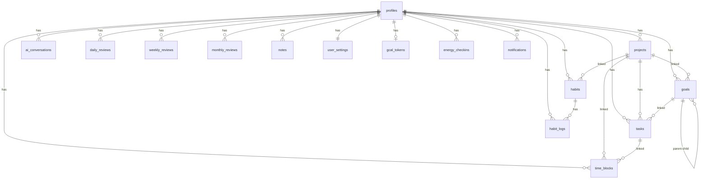

# DB設計
## プロジェクト名: ARDORS（アーダース）

---

## 1. 概要

### 1.1 使用DB

| 項目 | 内容 |
|------|------|
| DB | PostgreSQL（Supabase 管理） |
| バージョン | PostgreSQL 15.x |
| 文字コード | UTF-8 |
| スキーマ | `public`（デフォルト）+ Supabase管理の `auth` スキーマ |
| ユーザー分離 | Row Level Security（RLS）による `auth.uid() = user_id` 分離 |

### 1.2 共通設計方針

- 全テーブルに `id UUID PRIMARY KEY DEFAULT gen_random_uuid()` を持つ
- 全テーブルに `created_at TIMESTAMPTZ NOT NULL DEFAULT now()` を持つ
- 更新可能な全テーブルに `updated_at TIMESTAMPTZ NOT NULL DEFAULT now()` を持つ
- ユーザーデータを持つ全テーブルに RLS を有効化し `auth.uid() = user_id` ポリシーを適用
- 論理削除が必要なテーブルは `deleted_at TIMESTAMPTZ` を持ち、通常クエリでは `deleted_at IS NULL` でフィルタ
- `auth.users` はSupabaseが管理。`profiles` テーブルはトリガーで自動作成

---

## 2. ER図



---

## 3. テーブル定義

### 3.1 profiles

`auth.users` の拡張。ユーザー登録時にトリガーで自動作成される。

```sql
CREATE TABLE profiles (
  id              UUID PRIMARY KEY REFERENCES auth.users(id) ON DELETE CASCADE,
  email           TEXT NOT NULL,
  display_name    TEXT NOT NULL CHECK (char_length(display_name) BETWEEN 1 AND 50),
  avatar_url      TEXT,
  role            TEXT NOT NULL DEFAULT 'user' CHECK (role IN ('user', 'admin')),
  onboarding_completed BOOLEAN NOT NULL DEFAULT false,
  onboarding_data JSONB,
  -- 生活リズム設定（JSONBで柔軟に保持）
  -- 例: {"wakeTime":"07:00","sleepTime":"23:00","workStartTime":"09:00","workEndTime":"18:00","lunchStart":"12:00","lunchEnd":"13:00"}
  life_rhythm     JSONB NOT NULL DEFAULT '{}',
  ai_tone_level   TEXT NOT NULL DEFAULT 'mentor' CHECK (ai_tone_level IN ('coach', 'mentor', 'friend')),
  timezone        TEXT NOT NULL DEFAULT 'Asia/Tokyo',
  created_at      TIMESTAMPTZ NOT NULL DEFAULT now(),
  updated_at      TIMESTAMPTZ NOT NULL DEFAULT now()
);

-- インデックス
CREATE INDEX idx_profiles_email ON profiles(email);
CREATE INDEX idx_profiles_role ON profiles(role);

-- RLS
ALTER TABLE profiles ENABLE ROW LEVEL SECURITY;

CREATE POLICY "profiles_select_own" ON profiles
  FOR SELECT USING (auth.uid() = id);

CREATE POLICY "profiles_update_own" ON profiles
  FOR UPDATE USING (auth.uid() = id);

-- admin は全ユーザーのプロフィールを参照可能
CREATE POLICY "profiles_select_admin" ON profiles
  FOR SELECT USING (
    EXISTS (SELECT 1 FROM profiles WHERE id = auth.uid() AND role = 'admin')
  );
```

**備考**: INSERT は `handle_new_user` トリガー経由のみ（直接挿入不可）

---

### 3.2 user_settings

ユーザーごとのアプリ設定。`profiles` と 1:1。

```sql
CREATE TABLE user_settings (
  id                      UUID PRIMARY KEY DEFAULT gen_random_uuid(),
  user_id                 UUID NOT NULL UNIQUE REFERENCES profiles(id) ON DELETE CASCADE,
  daily_close_time        TIME NOT NULL DEFAULT '21:00',
  weekly_review_day       SMALLINT NOT NULL DEFAULT 0 CHECK (weekly_review_day BETWEEN 0 AND 6),
  -- 0=日曜, 1=月曜, ..., 6=土曜
  weekly_review_time      TIME NOT NULL DEFAULT '20:00',
  morning_briefing_time   TIME NOT NULL DEFAULT '07:00',
  notification_enabled    BOOLEAN NOT NULL DEFAULT true,
  gcal_push_calendar_id   TEXT,
  -- 理想の時間配分: { "project_id": 割合(%) } の JSON
  -- 例: {"uuid-1": 40, "uuid-2": 30, "uuid-3": 20}
  ideal_time_allocation   JSONB NOT NULL DEFAULT '{}',
  created_at              TIMESTAMPTZ NOT NULL DEFAULT now(),
  updated_at              TIMESTAMPTZ NOT NULL DEFAULT now()
);

-- インデックス
CREATE UNIQUE INDEX idx_user_settings_user_id ON user_settings(user_id);

-- RLS
ALTER TABLE user_settings ENABLE ROW LEVEL SECURITY;

CREATE POLICY "user_settings_own" ON user_settings
  FOR ALL USING (auth.uid() = user_id);
```

---

### 3.3 projects

ユーザーのプロジェクト。Active / Warm / Cold の3状態を持つ。

```sql
CREATE TABLE projects (
  id                  UUID PRIMARY KEY DEFAULT gen_random_uuid(),
  user_id             UUID NOT NULL REFERENCES profiles(id) ON DELETE CASCADE,
  name                TEXT NOT NULL CHECK (char_length(name) BETWEEN 1 AND 100),
  description         TEXT,
  goal                TEXT,
  status              TEXT NOT NULL DEFAULT 'active'
                        CHECK (status IN ('active', 'warm', 'cold', 'completed', 'archived')),
  category            TEXT,
  -- 例: '就活', '学業', '運動', '開発', '個人案件', '趣味', '友人', '休息', 'その他'
  deadline            DATE,
  ideal_weekly_hours  NUMERIC(4,1) CHECK (ideal_weekly_hours >= 0),
  color               TEXT CHECK (color ~ '^#[0-9A-Fa-f]{6}$'),
  sort_order          INTEGER NOT NULL DEFAULT 0,
  deleted_at          TIMESTAMPTZ,
  created_at          TIMESTAMPTZ NOT NULL DEFAULT now(),
  updated_at          TIMESTAMPTZ NOT NULL DEFAULT now()
);

-- インデックス
CREATE INDEX idx_projects_user_id ON projects(user_id);
CREATE INDEX idx_projects_user_status ON projects(user_id, status) WHERE deleted_at IS NULL;
CREATE INDEX idx_projects_deleted_at ON projects(deleted_at) WHERE deleted_at IS NOT NULL;

-- RLS
ALTER TABLE projects ENABLE ROW LEVEL SECURITY;

CREATE POLICY "projects_own" ON projects
  FOR ALL USING (auth.uid() = user_id);
```

---

### 3.4 goals

目標の階層構造（長期ゴール → 中期目標 → 週次ゴール）。

```sql
CREATE TABLE goals (
  id              UUID PRIMARY KEY DEFAULT gen_random_uuid(),
  user_id         UUID NOT NULL REFERENCES profiles(id) ON DELETE CASCADE,
  project_id      UUID REFERENCES projects(id) ON DELETE SET NULL,
  parent_goal_id  UUID REFERENCES goals(id) ON DELETE CASCADE,
  title           TEXT NOT NULL CHECK (char_length(title) BETWEEN 1 AND 200),
  description     TEXT,
  level           TEXT NOT NULL CHECK (level IN ('long_term', 'mid_term', 'weekly')),
  target_date     DATE,
  status          TEXT NOT NULL DEFAULT 'active'
                    CHECK (status IN ('active', 'completed', 'archived')),
  progress_pct    NUMERIC(5,2) NOT NULL DEFAULT 0
                    CHECK (progress_pct >= 0 AND progress_pct <= 100),
  sort_order      INTEGER NOT NULL DEFAULT 0,
  deleted_at      TIMESTAMPTZ,
  created_at      TIMESTAMPTZ NOT NULL DEFAULT now(),
  updated_at      TIMESTAMPTZ NOT NULL DEFAULT now()
);

-- インデックス
CREATE INDEX idx_goals_user_id ON goals(user_id);
CREATE INDEX idx_goals_project_id ON goals(project_id) WHERE project_id IS NOT NULL;
CREATE INDEX idx_goals_parent_id ON goals(parent_goal_id) WHERE parent_goal_id IS NOT NULL;
CREATE INDEX idx_goals_user_level ON goals(user_id, level) WHERE deleted_at IS NULL;

-- RLS
ALTER TABLE goals ENABLE ROW LEVEL SECURITY;

CREATE POLICY "goals_own" ON goals
  FOR ALL USING (auth.uid() = user_id);
```

---

### 3.5 tasks

タスク。プロジェクトに必須紐付け。

```sql
CREATE TABLE tasks (
  id                UUID PRIMARY KEY DEFAULT gen_random_uuid(),
  user_id           UUID NOT NULL REFERENCES profiles(id) ON DELETE CASCADE,
  project_id        UUID NOT NULL REFERENCES projects(id) ON DELETE CASCADE,
  goal_id           UUID REFERENCES goals(id) ON DELETE SET NULL,
  title             TEXT NOT NULL CHECK (char_length(title) BETWEEN 1 AND 200),
  description       TEXT,
  status            TEXT NOT NULL DEFAULT 'todo'
                      CHECK (status IN ('todo', 'in_progress', 'done', 'cancelled')),
  priority          TEXT NOT NULL DEFAULT 'medium'
                      CHECK (priority IN ('high', 'medium', 'low')),
  estimated_minutes INTEGER CHECK (estimated_minutes > 0),
  actual_minutes    INTEGER CHECK (actual_minutes >= 0),
  due_date          DATE,
  completed_at      TIMESTAMPTZ,
  sort_order        INTEGER NOT NULL DEFAULT 0,
  deleted_at        TIMESTAMPTZ,
  created_at        TIMESTAMPTZ NOT NULL DEFAULT now(),
  updated_at        TIMESTAMPTZ NOT NULL DEFAULT now()
);

-- インデックス
CREATE INDEX idx_tasks_user_id ON tasks(user_id);
CREATE INDEX idx_tasks_project_id ON tasks(project_id) WHERE deleted_at IS NULL;
CREATE INDEX idx_tasks_goal_id ON tasks(goal_id) WHERE goal_id IS NOT NULL;
CREATE INDEX idx_tasks_status ON tasks(user_id, status) WHERE deleted_at IS NULL;
CREATE INDEX idx_tasks_due_date ON tasks(user_id, due_date) WHERE due_date IS NOT NULL AND deleted_at IS NULL;

-- RLS
ALTER TABLE tasks ENABLE ROW LEVEL SECURITY;

CREATE POLICY "tasks_own" ON tasks
  FOR ALL USING (auth.uid() = user_id);
```

---

### 3.6 habits

習慣定義。cue + 最小行動 + if-then plan のセット。

```sql
CREATE TABLE habits (
  id              UUID PRIMARY KEY DEFAULT gen_random_uuid(),
  user_id         UUID NOT NULL REFERENCES profiles(id) ON DELETE CASCADE,
  project_id      UUID REFERENCES projects(id) ON DELETE SET NULL,
  name            TEXT NOT NULL CHECK (char_length(name) BETWEEN 1 AND 100),
  cue             TEXT NOT NULL,
  minimum_action  TEXT NOT NULL,
  if_then_plan    TEXT,
  frequency_type  TEXT NOT NULL DEFAULT 'daily'
                    CHECK (frequency_type IN ('daily', 'weekdays', 'weekly_n', 'custom')),
  -- frequency_type='weekly_n' → 週N回 (N=frequency_days[0])
  -- frequency_type='custom'  → 曜日指定 (0=日曜〜6=土曜 の配列)
  frequency_days  INTEGER[],
  is_active       BOOLEAN NOT NULL DEFAULT true,
  sort_order      INTEGER NOT NULL DEFAULT 0,
  deleted_at      TIMESTAMPTZ,
  created_at      TIMESTAMPTZ NOT NULL DEFAULT now(),
  updated_at      TIMESTAMPTZ NOT NULL DEFAULT now()
);

-- インデックス
CREATE INDEX idx_habits_user_id ON habits(user_id);
CREATE INDEX idx_habits_user_active ON habits(user_id, is_active) WHERE deleted_at IS NULL;

-- RLS
ALTER TABLE habits ENABLE ROW LEVEL SECURITY;

CREATE POLICY "habits_own" ON habits
  FOR ALL USING (auth.uid() = user_id);
```

---

### 3.7 habit_logs

習慣の実行ログ。1習慣×1日で1レコード（UPSERT設計）。

```sql
CREATE TABLE habit_logs (
  id           UUID PRIMARY KEY DEFAULT gen_random_uuid(),
  user_id      UUID NOT NULL REFERENCES profiles(id) ON DELETE CASCADE,
  habit_id     UUID NOT NULL REFERENCES habits(id) ON DELETE CASCADE,
  logged_date  DATE NOT NULL,
  completed    BOOLEAN NOT NULL DEFAULT true,
  note         TEXT,
  created_at   TIMESTAMPTZ NOT NULL DEFAULT now(),
  updated_at   TIMESTAMPTZ NOT NULL DEFAULT now(),
  UNIQUE (habit_id, logged_date)
);

-- インデックス
CREATE INDEX idx_habit_logs_user_id ON habit_logs(user_id);
CREATE INDEX idx_habit_logs_habit_date ON habit_logs(habit_id, logged_date);
CREATE INDEX idx_habit_logs_user_date ON habit_logs(user_id, logged_date);

-- RLS
ALTER TABLE habit_logs ENABLE ROW LEVEL SECURITY;

CREATE POLICY "habit_logs_own" ON habit_logs
  FOR ALL USING (auth.uid() = user_id);
```

---

### 3.8 time_blocks

タイムボクシングのブロック。ARDORS生成分とGCal取得分を共存させる。

```sql
CREATE TABLE time_blocks (
  id              UUID PRIMARY KEY DEFAULT gen_random_uuid(),
  user_id         UUID NOT NULL REFERENCES profiles(id) ON DELETE CASCADE,
  project_id      UUID REFERENCES projects(id) ON DELETE SET NULL,
  task_id         UUID REFERENCES tasks(id) ON DELETE SET NULL,
  title           TEXT NOT NULL,
  start_at        TIMESTAMPTZ NOT NULL,
  end_at          TIMESTAMPTZ NOT NULL,
  block_type      TEXT NOT NULL DEFAULT 'work'
                    CHECK (block_type IN ('work', 'break', 'commute', 'personal', 'gcal_event')),
  source          TEXT NOT NULL DEFAULT 'ardors'
                    CHECK (source IN ('ardors', 'gcal')),
  gcal_event_id   TEXT,
  gcal_pushed_at  TIMESTAMPTZ,
  location        TEXT,
  focus_rating    SMALLINT CHECK (focus_rating BETWEEN 1 AND 3),
  -- 1=集中できなかった, 2=まあまあ, 3=集中できた
  transition_note TEXT,
  is_approved     BOOLEAN NOT NULL DEFAULT false,
  deleted_at      TIMESTAMPTZ,
  created_at      TIMESTAMPTZ NOT NULL DEFAULT now(),
  updated_at      TIMESTAMPTZ NOT NULL DEFAULT now(),
  CONSTRAINT time_blocks_end_after_start CHECK (end_at > start_at)
);

-- インデックス
CREATE INDEX idx_time_blocks_user_id ON time_blocks(user_id);
CREATE INDEX idx_time_blocks_user_range ON time_blocks(user_id, start_at, end_at) WHERE deleted_at IS NULL;
CREATE INDEX idx_time_blocks_gcal ON time_blocks(gcal_event_id) WHERE gcal_event_id IS NOT NULL;
CREATE INDEX idx_time_blocks_project ON time_blocks(project_id) WHERE project_id IS NOT NULL;

-- RLS
ALTER TABLE time_blocks ENABLE ROW LEVEL SECURITY;

CREATE POLICY "time_blocks_own" ON time_blocks
  FOR ALL USING (auth.uid() = user_id);
```

---

### 3.9 ai_conversations

AI対話の全履歴。セッション単位でグルーピング。

```sql
CREATE TABLE ai_conversations (
  id            UUID PRIMARY KEY DEFAULT gen_random_uuid(),
  user_id       UUID NOT NULL REFERENCES profiles(id) ON DELETE CASCADE,
  session_id    UUID NOT NULL DEFAULT gen_random_uuid(),
  role          TEXT NOT NULL CHECK (role IN ('user', 'assistant')),
  content       TEXT NOT NULL,
  context_type  TEXT NOT NULL DEFAULT 'chat'
                  CHECK (context_type IN (
                    'chat', 'braindump', 'morning_briefing',
                    'daily_close', 'weekly_review', 'monthly_review', 'onboarding'
                  )),
  model_used    TEXT,
  input_tokens  INTEGER CHECK (input_tokens >= 0),
  output_tokens INTEGER CHECK (output_tokens >= 0),
  -- AIが抽出した構造化データ（タスク候補、承認待ちアイテム等）
  metadata      JSONB NOT NULL DEFAULT '{}',
  created_at    TIMESTAMPTZ NOT NULL DEFAULT now()
);

-- インデックス
CREATE INDEX idx_ai_conv_user_id ON ai_conversations(user_id);
CREATE INDEX idx_ai_conv_session ON ai_conversations(session_id);
CREATE INDEX idx_ai_conv_user_context ON ai_conversations(user_id, context_type, created_at DESC);

-- RLS
ALTER TABLE ai_conversations ENABLE ROW LEVEL SECURITY;

CREATE POLICY "ai_conversations_own" ON ai_conversations
  FOR ALL USING (auth.uid() = user_id);
```

---

### 3.10 daily_reviews

デイリークローズの記録。1ユーザー×1日で1レコード。

```sql
CREATE TABLE daily_reviews (
  id                      UUID PRIMARY KEY DEFAULT gen_random_uuid(),
  user_id                 UUID NOT NULL REFERENCES profiles(id) ON DELETE CASCADE,
  review_date             DATE NOT NULL,
  user_input              TEXT,
  -- AIが構造化したデータ: { "wins": [...], "struggles": [...], "tomorrow_plan": [...] }
  ai_structured           JSONB NOT NULL DEFAULT '{}',
  -- 今日完了したタスクの一覧: [{ "task_id": "...", "title": "...", "project": "..." }]
  done_list               JSONB NOT NULL DEFAULT '[]',
  -- 習慣達成サマリー: { "completed": [...], "missed": [...] }
  habit_summary           JSONB NOT NULL DEFAULT '{}',
  ai_feedback             TEXT,
  conversation_session_id UUID,
  skipped                 BOOLEAN NOT NULL DEFAULT false,
  created_at              TIMESTAMPTZ NOT NULL DEFAULT now(),
  updated_at              TIMESTAMPTZ NOT NULL DEFAULT now(),
  UNIQUE (user_id, review_date)
);

-- インデックス
CREATE INDEX idx_daily_reviews_user_date ON daily_reviews(user_id, review_date DESC);

-- RLS
ALTER TABLE daily_reviews ENABLE ROW LEVEL SECURITY;

CREATE POLICY "daily_reviews_own" ON daily_reviews
  FOR ALL USING (auth.uid() = user_id);
```

---

### 3.11 weekly_reviews

ウィークリーレビューの記録。1ユーザー×週で1レコード。

```sql
CREATE TABLE weekly_reviews (
  id                      UUID PRIMARY KEY DEFAULT gen_random_uuid(),
  user_id                 UUID NOT NULL REFERENCES profiles(id) ON DELETE CASCADE,
  week_start              DATE NOT NULL,
  -- 例: 2026-04-07 (月曜日)
  user_input              TEXT,
  -- AIサマリー: { "time_distribution": {...}, "task_completion_rate": 0.8, "habit_rate": 0.7, "pj_health_changes": [...] }
  ai_summary              JSONB NOT NULL DEFAULT '{}',
  ai_feedback             TEXT,
  -- 来週の週次ゴール（最大3つ）: [{ "title": "...", "project_id": "..." }]
  weekly_goals            JSONB NOT NULL DEFAULT '[]',
  timeboxing_approved     BOOLEAN NOT NULL DEFAULT false,
  conversation_session_id UUID,
  skipped                 BOOLEAN NOT NULL DEFAULT false,
  created_at              TIMESTAMPTZ NOT NULL DEFAULT now(),
  updated_at              TIMESTAMPTZ NOT NULL DEFAULT now(),
  UNIQUE (user_id, week_start)
);

-- インデックス
CREATE INDEX idx_weekly_reviews_user_date ON weekly_reviews(user_id, week_start DESC);

-- RLS
ALTER TABLE weekly_reviews ENABLE ROW LEVEL SECURITY;

CREATE POLICY "weekly_reviews_own" ON weekly_reviews
  FOR ALL USING (auth.uid() = user_id);
```

---

### 3.12 monthly_reviews

月次・四半期レビューの記録。

```sql
CREATE TABLE monthly_reviews (
  id                      UUID PRIMARY KEY DEFAULT gen_random_uuid(),
  user_id                 UUID NOT NULL REFERENCES profiles(id) ON DELETE CASCADE,
  month_start             DATE NOT NULL,
  -- 例: 2026-04-01
  review_type             TEXT NOT NULL DEFAULT 'monthly'
                            CHECK (review_type IN ('monthly', 'quarterly')),
  user_input              TEXT,
  -- AIレポート: { "pj_progress": [...], "time_trend": {...}, "goal_achievement": {...}, "stagnant_pjs": [...] }
  ai_report               JSONB NOT NULL DEFAULT '{}',
  ai_feedback             TEXT,
  goal_adjustments        JSONB NOT NULL DEFAULT '{}',
  conversation_session_id UUID,
  skipped                 BOOLEAN NOT NULL DEFAULT false,
  created_at              TIMESTAMPTZ NOT NULL DEFAULT now(),
  updated_at              TIMESTAMPTZ NOT NULL DEFAULT now(),
  UNIQUE (user_id, month_start)
);

-- インデックス
CREATE INDEX idx_monthly_reviews_user_date ON monthly_reviews(user_id, month_start DESC);

-- RLS
ALTER TABLE monthly_reviews ENABLE ROW LEVEL SECURITY;

CREATE POLICY "monthly_reviews_own" ON monthly_reviews
  FOR ALL USING (auth.uid() = user_id);
```

---

### 3.13 notes

ナレッジキャプチャ・気づきメモ。

```sql
CREATE TABLE notes (
  id                   UUID PRIMARY KEY DEFAULT gen_random_uuid(),
  user_id              UUID NOT NULL REFERENCES profiles(id) ON DELETE CASCADE,
  title                TEXT,
  content              TEXT NOT NULL CHECK (char_length(content) BETWEEN 1 AND 10000),
  source               TEXT NOT NULL DEFAULT 'manual'
                         CHECK (source IN ('manual', 'braindump', 'ai_chat', 'voice')),
  tags                 TEXT[] NOT NULL DEFAULT '{}',
  related_project_ids  UUID[] NOT NULL DEFAULT '{}',
  -- AIが提案した関連ノート・PJ: { "related_notes": [...], "related_projects": [...] }
  ai_relations         JSONB NOT NULL DEFAULT '{}',
  deleted_at           TIMESTAMPTZ,
  created_at           TIMESTAMPTZ NOT NULL DEFAULT now(),
  updated_at           TIMESTAMPTZ NOT NULL DEFAULT now()
);

-- インデックス
CREATE INDEX idx_notes_user_id ON notes(user_id) WHERE deleted_at IS NULL;
CREATE INDEX idx_notes_tags ON notes USING GIN(tags);
CREATE INDEX idx_notes_related_pjs ON notes USING GIN(related_project_ids);
-- 全文検索インデックス（タイトル・本文）
CREATE INDEX idx_notes_fts ON notes
  USING GIN(to_tsvector('japanese', coalesce(title, '') || ' ' || content))
  WHERE deleted_at IS NULL;

-- RLS
ALTER TABLE notes ENABLE ROW LEVEL SECURITY;

CREATE POLICY "notes_own" ON notes
  FOR ALL USING (auth.uid() = user_id);
```

---

### 3.14 gcal_tokens

Google Calendar OAuth トークン。1ユーザー×1レコード。

```sql
CREATE TABLE gcal_tokens (
  id             UUID PRIMARY KEY DEFAULT gen_random_uuid(),
  user_id        UUID NOT NULL UNIQUE REFERENCES profiles(id) ON DELETE CASCADE,
  access_token   TEXT NOT NULL,
  -- 本番では Supabase Vault または AES-256 で暗号化して保存
  refresh_token  TEXT NOT NULL,
  token_expiry   TIMESTAMPTZ NOT NULL,
  scope          TEXT,
  last_synced_at TIMESTAMPTZ,
  created_at     TIMESTAMPTZ NOT NULL DEFAULT now(),
  updated_at     TIMESTAMPTZ NOT NULL DEFAULT now()
);

-- インデックス
CREATE UNIQUE INDEX idx_gcal_tokens_user_id ON gcal_tokens(user_id);

-- RLS
ALTER TABLE gcal_tokens ENABLE ROW LEVEL SECURITY;

CREATE POLICY "gcal_tokens_own" ON gcal_tokens
  FOR ALL USING (auth.uid() = user_id);
```

---

### 3.15 energy_checkins

エネルギー・コンディションチェックイン。

```sql
CREATE TABLE energy_checkins (
  id            UUID PRIMARY KEY DEFAULT gen_random_uuid(),
  user_id       UUID NOT NULL REFERENCES profiles(id) ON DELETE CASCADE,
  checked_at    TIMESTAMPTZ NOT NULL DEFAULT now(),
  energy_level  SMALLINT NOT NULL CHECK (energy_level BETWEEN 1 AND 5),
  mood_level    SMALLINT NOT NULL CHECK (mood_level BETWEEN 1 AND 5),
  focus_level   SMALLINT NOT NULL CHECK (focus_level BETWEEN 1 AND 5),
  note          TEXT,
  created_at    TIMESTAMPTZ NOT NULL DEFAULT now()
);

-- インデックス
CREATE INDEX idx_energy_checkins_user_date ON energy_checkins(user_id, checked_at DESC);

-- RLS
ALTER TABLE energy_checkins ENABLE ROW LEVEL SECURITY;

CREATE POLICY "energy_checkins_own" ON energy_checkins
  FOR ALL USING (auth.uid() = user_id);
```

---

### 3.16 notifications

通知レコード。スケジュール通知・リマインダー。

```sql
CREATE TABLE notifications (
  id           UUID PRIMARY KEY DEFAULT gen_random_uuid(),
  user_id      UUID NOT NULL REFERENCES profiles(id) ON DELETE CASCADE,
  type         TEXT NOT NULL CHECK (type IN (
                 'block_start', 'block_end', 'daily_close',
                 'weekly_review', 'habit_nudge', 'review_reminder'
               )),
  title        TEXT NOT NULL,
  body         TEXT,
  scheduled_at TIMESTAMPTZ NOT NULL,
  sent_at      TIMESTAMPTZ,
  read_at      TIMESTAMPTZ,
  -- 関連エンティティのID等: { "block_id": "...", "habit_id": "..." }
  metadata     JSONB NOT NULL DEFAULT '{}',
  created_at   TIMESTAMPTZ NOT NULL DEFAULT now()
);

-- インデックス
CREATE INDEX idx_notifications_user_id ON notifications(user_id);
CREATE INDEX idx_notifications_scheduled ON notifications(user_id, scheduled_at) WHERE sent_at IS NULL;
CREATE INDEX idx_notifications_unread ON notifications(user_id, read_at) WHERE read_at IS NULL;

-- RLS
ALTER TABLE notifications ENABLE ROW LEVEL SECURITY;

CREATE POLICY "notifications_own" ON notifications
  FOR ALL USING (auth.uid() = user_id);
```

---

## 4. トリガー定義

### 4.1 新規ユーザー登録トリガー

`auth.users` への INSERT 時に `profiles` と `user_settings` を自動作成。

```sql
CREATE OR REPLACE FUNCTION handle_new_user()
RETURNS TRIGGER AS $$
BEGIN
  -- profiles を作成
  INSERT INTO public.profiles (id, email, display_name, avatar_url)
  VALUES (
    NEW.id,
    NEW.email,
    COALESCE(NEW.raw_user_meta_data->>'full_name', split_part(NEW.email, '@', 1)),
    NEW.raw_user_meta_data->>'avatar_url'
  );

  -- user_settings を作成（デフォルト値で）
  INSERT INTO public.user_settings (user_id)
  VALUES (NEW.id);

  RETURN NEW;
END;
$$ LANGUAGE plpgsql SECURITY DEFINER;

CREATE TRIGGER on_auth_user_created
  AFTER INSERT ON auth.users
  FOR EACH ROW EXECUTE FUNCTION handle_new_user();
```

### 4.2 updated_at 自動更新トリガー

全テーブルの `updated_at` を自動更新。

```sql
CREATE OR REPLACE FUNCTION update_updated_at()
RETURNS TRIGGER AS $$
BEGIN
  NEW.updated_at = now();
  RETURN NEW;
END;
$$ LANGUAGE plpgsql;

-- 各テーブルに適用（以下はまとめて記述）
DO $$
DECLARE
  t TEXT;
BEGIN
  FOREACH t IN ARRAY ARRAY[
    'profiles', 'user_settings', 'projects', 'goals', 'tasks',
    'habits', 'habit_logs', 'time_blocks', 'daily_reviews',
    'weekly_reviews', 'monthly_reviews', 'notes', 'gcal_tokens'
  ] LOOP
    EXECUTE format(
      'CREATE TRIGGER update_%s_updated_at
       BEFORE UPDATE ON %s
       FOR EACH ROW EXECUTE FUNCTION update_updated_at()',
      t, t
    );
  END LOOP;
END $$;
```

---

## 5. インデックス設計サマリー

| テーブル | インデックス | 用途 |
|---------|------------|------|
| profiles | email | メールアドレス検索 |
| profiles | role | 管理者判定 |
| projects | user_id + status | ユーザーのPJ一覧（状態フィルタ付き） |
| tasks | project_id | PJ配下タスク一覧 |
| tasks | user_id + status | 未完了タスク一覧 |
| tasks | user_id + due_date | 期限順タスク一覧 |
| habits | user_id + is_active | アクティブ習慣一覧 |
| habit_logs | habit_id + logged_date | 習慣の日別ログ（UNIQUE対応） |
| habit_logs | user_id + logged_date | 今日の習慣チェック一覧 |
| time_blocks | user_id + start_at + end_at | 週間スケジュール取得 |
| time_blocks | gcal_event_id | GCal同期判定 |
| ai_conversations | session_id | セッション別会話履歴 |
| ai_conversations | user_id + context_type | レビュー種別で会話履歴取得 |
| daily_reviews | user_id + review_date | 日付指定でレビュー取得 |
| weekly_reviews | user_id + week_start | 週指定でレビュー取得 |
| notes | tags (GIN) | タグ検索 |
| notes | FTS (GIN) | 全文検索 |
| notifications | user_id + scheduled_at | 未送信通知の取得 |
| notifications | user_id + read_at | 未読通知の取得 |

---

## 6. ENUM定数（CHECK制約）一覧

| テーブル | カラム | 許容値 |
|---------|-------|------|
| profiles | role | `user`, `admin` |
| profiles | ai_tone_level | `coach`, `mentor`, `friend` |
| projects | status | `active`, `warm`, `cold`, `completed`, `archived` |
| goals | level | `long_term`, `mid_term`, `weekly` |
| goals | status | `active`, `completed`, `archived` |
| tasks | status | `todo`, `in_progress`, `done`, `cancelled` |
| tasks | priority | `high`, `medium`, `low` |
| habits | frequency_type | `daily`, `weekdays`, `weekly_n`, `custom` |
| time_blocks | block_type | `work`, `break`, `commute`, `personal`, `gcal_event` |
| time_blocks | source | `ardors`, `gcal` |
| time_blocks | focus_rating | 1〜3（SMALLINT） |
| ai_conversations | role | `user`, `assistant` |
| ai_conversations | context_type | `chat`, `braindump`, `morning_briefing`, `daily_close`, `weekly_review`, `monthly_review`, `onboarding` |
| monthly_reviews | review_type | `monthly`, `quarterly` |
| notes | source | `manual`, `braindump`, `ai_chat`, `voice` |
| notifications | type | `block_start`, `block_end`, `daily_close`, `weekly_review`, `habit_nudge`, `review_reminder` |

---

## 7. JSONB フィールド定義

各テーブルの JSONB フィールドの内部構造を明確にする。

### profiles.life_rhythm
```json
{
  "wakeTime": "07:00",
  "sleepTime": "23:00",
  "workStartTime": "09:00",
  "workEndTime": "18:00",
  "lunchStart": "12:00",
  "lunchEnd": "13:00"
}
```

### daily_reviews.ai_structured
```json
{
  "wins": ["今日の成果1", "今日の成果2"],
  "struggles": ["詰まったこと1"],
  "tomorrow_plan": ["明日やること1", "明日やること2"],
  "mood": "positive"
}
```

### weekly_reviews.ai_summary
```json
{
  "time_distribution": {
    "project_id_1": { "name": "開発", "hours": 12.5, "target": 15 },
    "project_id_2": { "name": "就活", "hours": 8, "target": 10 }
  },
  "task_completion_rate": 0.78,
  "habit_rate": 0.85,
  "pj_health_changes": [
    { "project_id": "...", "from": "active", "to": "active", "trend": "improving" }
  ],
  "key_achievements": ["...", "..."],
  "blockers": ["..."]
}
```

### monthly_reviews.ai_report
```json
{
  "pj_progress": [
    { "project_id": "...", "name": "開発", "progress_delta": 15, "health": "green" }
  ],
  "time_trend": {
    "current_month": { "total_hours": 120 },
    "prev_month": { "total_hours": 100 }
  },
  "goal_achievement": {
    "long_term": 0.3,
    "mid_term": 0.6
  },
  "stagnant_pjs": [
    { "project_id": "...", "name": "趣味PJ", "months_stagnant": 2 }
  ]
}
```

### time_blocks.metadata (AI生成ブロックの場合)
```json
{
  "ai_generated": true,
  "generation_session_id": "uuid",
  "reasoning": "開発PJの見積もり残時間から算出"
}
```

---

## 8. データ量試算（1ユーザー・月間）

| テーブル | 想定レコード数/月 | 1レコード平均サイズ | 月間増加量 |
|---------|---------------|----------------|----------|
| tasks | ~100件 | ~500B | ~50KB |
| habit_logs | ~30習慣 × 30日 = 900件 | ~200B | ~180KB |
| time_blocks | ~150件 | ~800B | ~120KB |
| ai_conversations | ~500件 | ~2KB | ~1MB |
| daily_reviews | ~30件 | ~3KB | ~90KB |
| weekly_reviews | ~4件 | ~5KB | ~20KB |
| energy_checkins | ~90件 | ~300B | ~27KB |
| notes | ~50件 | ~1KB | ~50KB |
| **合計** | | | **~1.5MB/月** |

Supabase Free tier（500MB DB）で約 **300ヶ月分（25年分）** のデータを保存可能。

---

## 9. マイグレーション管理方針

- Supabase CLI の `supabase/migrations/` を使用
- ファイル命名: `YYYYMMDDHHMMSS_<説明>.sql`
- ロールバック手順もコメントで記載
- 本番適用前にステージング環境で検証

```bash
# ローカルでの適用
supabase db push

# マイグレーションファイル作成
supabase migration new create_initial_schema
```

---

文書バージョン: 1.0
作成日: 2026-04-09
最終更新日: 2026-04-09
