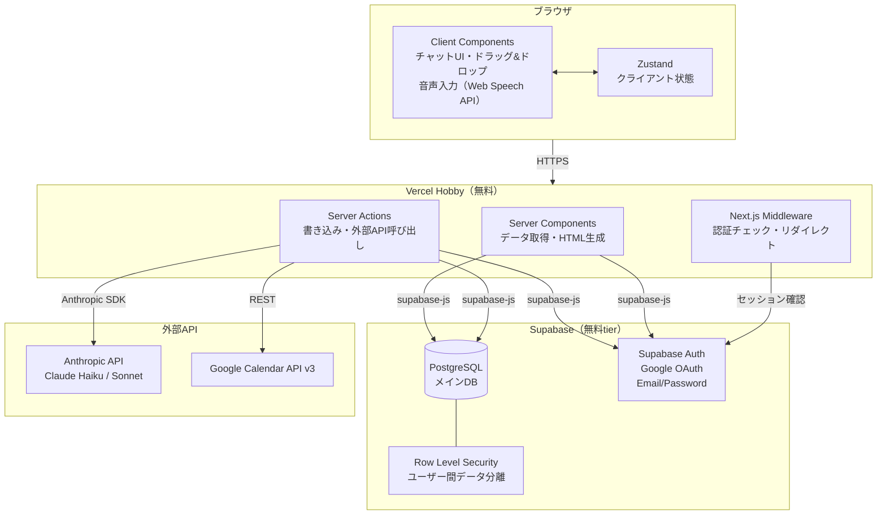
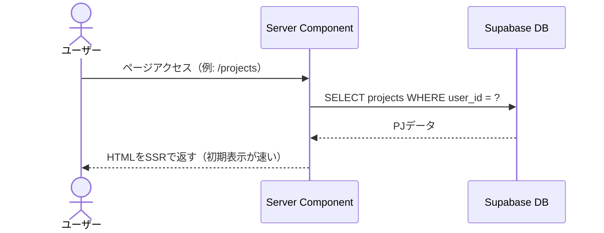
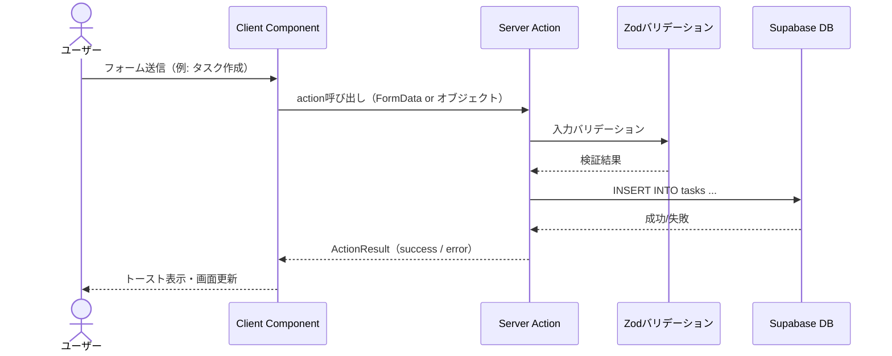
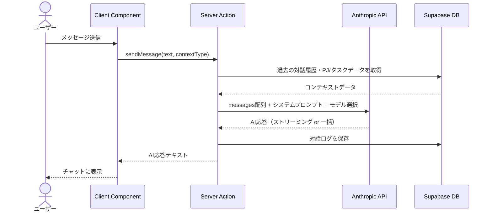

# アーキテクチャ設計書
## プロジェクト名: ARDORS（アーダース）

---

## 1. アーキテクチャ概要

- **パターン**: モノリシック（Next.js App Router + Supabase）
- **選定理由**:
  - 個人開発・趣味プロジェクトのため、開発速度と運用コストを最優先
  - React / TypeScript の既存スキルを最大活用
  - Supabase が認証・DB・RLSを一括担うため、別途バックエンドサーバーが不要
  - Vercel Hobby（無料）でフルスタックアプリが動作する
  - Server Actions により、AIAPIプロキシ・GCal連携等のサーバー処理がNext.js内に収まる

---

## 2. システム構成図



---

## 3. 技術スタック詳細

### 3.1 フロントエンド

| 技術 | バージョン | 用途 | 選定理由 |
|------|-----------|------|---------|
| Next.js App Router | 15.x | フルスタックフレームワーク | Server Components / Server Actions / Vercel最適化 |
| React | 19.x | UIライブラリ | 既経験あり |
| TypeScript | 5.x | 言語 | 型安全・補完が強力 |
| Tailwind CSS | 4.x | スタイリング | ユーティリティファースト・高速UI構築 |
| shadcn/ui | latest | UIコンポーネント | コピペ型・デザインシステム不要・高品質 |
| Zustand | 5.x | クライアント状態管理 | 軽量・シンプル・DevTools対応 |
| React Hook Form | 7.x | フォーム | パフォーマンス良好・Zod統合 |
| Zod | 3.x | バリデーション | TypeScript型と一体。Server Actions入力検証にも使用 |
| TanStack Query | 5.x | サーバー状態管理 | キャッシュ・再フェッチ・楽観的更新 |

### 3.2 バックエンド / インフラ

| 技術 | バージョン | 用途 | 選定理由 |
|------|-----------|------|---------|
| Supabase | latest | DB / Auth / RLS | 既経験あり・無料tier十分・Auth込み |
| PostgreSQL | 15.x（Supabase管理） | メインDB | Supabase内包 |
| Next.js Server Actions | - | サーバー処理 | AIプロキシ・GCal連携・DB書き込みを安全に処理 |
| Supabase SSR (@supabase/ssr) | latest | セッション管理 | Cookie-basedセッション・Middleware対応 |
| Vercel | Hobby | ホスティング | 無料・Next.js最適化 |

### 3.3 外部API・サービス

| 技術 | 用途 | 認証方式 | 料金 |
|------|------|---------|------|
| Anthropic API (Claude Haiku 4.5) | 日常AI対話・ブレインダンプ | APIキー（サーバーサイドのみ） | ~$0.80/1M tokens |
| Anthropic API (Claude Sonnet 4.6) | 週次/月次レビュー・コーチモード | APIキー（サーバーサイドのみ） | ~$3/1M tokens |
| Web Speech API | 音声→テキスト変換（STT） | 不要（ブラウザ標準） | 無料 |
| Google Calendar API v3 | GCal pull / push | OAuth2（ユーザートークン） | 無料（上限内） |

### 3.4 開発・品質

| 技術 | 用途 |
|------|------|
| Vitest | ユニットテスト・Server Actionsテスト |
| Testing Library | コンポーネントテスト |
| Playwright | E2Eテスト（主要フロー） |
| ESLint | コード品質 |
| Prettier | フォーマット統一 |
| GitHub Actions | CI（lint + test） / CD（Vercelへ自動デプロイ） |

---

## 4. レイヤー構成

```
┌─────────────────────────────────────────────────────────────┐
│  プレゼンテーション層                                         │
│  Server Components（ページ・レイアウト・データ取得）           │
│  Client Components（インタラクション・リアルタイムUI）         │
├─────────────────────────────────────────────────────────────┤
│  アプリケーション層                                           │
│  Server Actions（書き込み・外部API呼び出し・バリデーション）   │
│  Custom Hooks（クライアント状態・非同期処理）                  │
├─────────────────────────────────────────────────────────────┤
│  ドメイン層                                                   │
│  型定義（TypeScript interfaces）                              │
│  Zodスキーマ（バリデーションルール）                           │
│  ビジネスロジック（純粋関数）                                  │
├─────────────────────────────────────────────────────────────┤
│  インフラ層                                                   │
│  Supabase Client（DB・Auth）                                  │
│  Anthropic Client（AI API）                                   │
│  Google Calendar Client（GCal API）                           │
│  ユーティリティ関数                                            │
└─────────────────────────────────────────────────────────────┘
```

---

## 5. データフロー

### 5.1 通常のデータ取得（Server Component）



### 5.2 データ書き込み（Server Action）



### 5.3 AI対話フロー（Server Action経由）



---

## 6. 認証・認可の概要

```mermaid
flowchart LR
  R[リクエスト] --> MW[Next.js Middleware]
  MW -->|認証済み| Protected[protected ルート]
  MW -->|未認証| Auth[/login にリダイレクト]
  Protected --> RLS[Supabase RLS]
  RLS -->|本人データのみ| DB[(PostgreSQL)]
```

- **Next.js Middleware**: 全リクエストで`supabase.auth.getUser()`を呼び、未認証ならリダイレクト
- **Supabase RLS**: DB レベルで `auth.uid() = user_id` を強制。Server Actionsを回避しても他人のデータは取れない（多重防衛）
- **APIキーはサーバーのみ**: `ANTHROPIC_API_KEY` / `GCAL_*` は `process.env` 経由でServer Actionsのみ利用。クライアントには露出しない

---

## 7. 選定しなかった技術と理由

| 検討した技術 | 非採用理由 |
|------------|----------|
| Go（バックエンド） | 学習コストが高い・個人開発の速度を下げる・Supabaseがバックエンドの役割を代替 |
| Rails | 同上。Rubyの学習も別途必要 |
| Remix | Next.jsより日本語情報が少ない・Vercel最適化の恩恵が薄い |
| Firebase | Supabase経験あり・PostgreSQLの方がリレーションが扱いやすい |
| Redux Toolkit | Zustandで十分。ボイラープレートが多い |
| GraphQL | RESTで十分な規模。Server Actionsがあればオーバーエンジニアリング |
| tRPC | Server Actionsが代替。追加の学習コストを避ける |
| OpenAI GPT | Anthropic Claudeの方が指示遵守性が高くARDORSのプロンプト設計に向いている |
| Whisper API（OpenAI STT） | Web Speech API（無料）で十分。コスト削減 |

---

文書バージョン: 1.0
作成日: 2026-04-08
