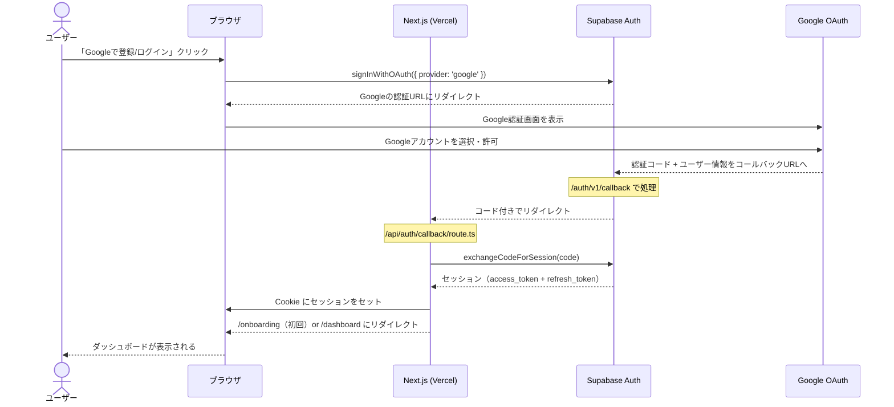
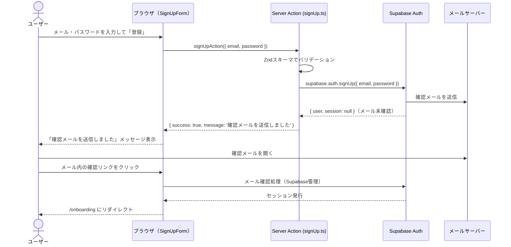
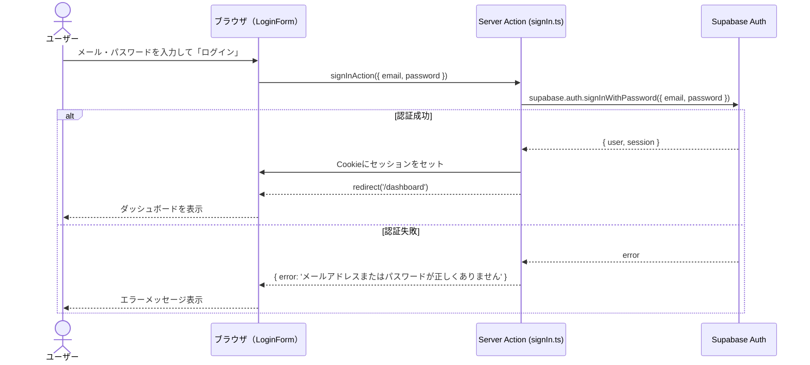
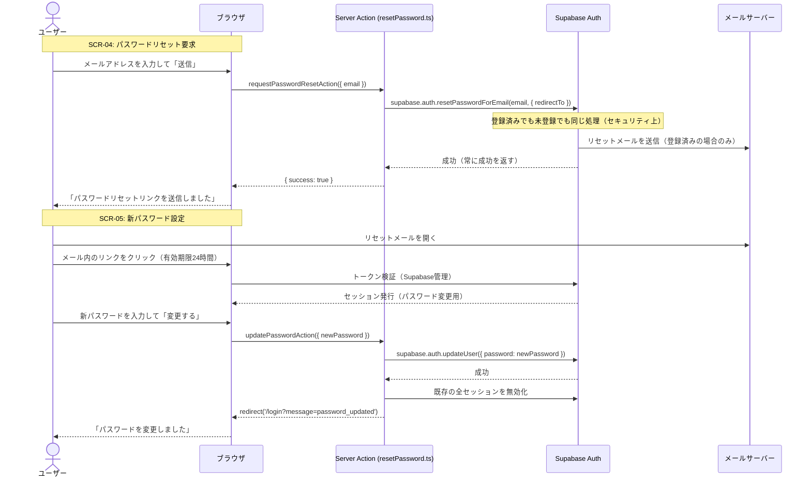

# 認証フロー設計書
## プロジェクト名: ARDORS（アーダース）

---

## 1. 認証方式まとめ

| 方式 | 画面 | 実装 |
|------|------|------|
| Google OAuth | SCR-02/03 | Supabase Auth + Google Provider |
| メールアドレス + パスワード | SCR-02/03 | Supabase Auth（signUp / signInWithPassword） |
| パスワードリセット | SCR-04/05 | Supabase Auth（resetPasswordForEmail） |
| セッション管理 | 全画面 | Supabase SSR（`@supabase/ssr`）+ Cookie |
| 認可（権限分離） | 全DBアクセス | Supabase RLS（Row Level Security） |

---

## 2. Google OAuth フロー



**実装ポイント:**

```typescript
// app/api/auth/callback/route.ts
import { createServerClient } from '@shared/lib/supabase/server';
import { NextRequest, NextResponse } from 'next/server';

export async function GET(request: NextRequest) {
  const { searchParams } = new URL(request.url);
  const code = searchParams.get('code');
  const next = searchParams.get('next') ?? '/dashboard';

  if (code) {
    const supabase = await createServerClient();
    const { error } = await supabase.auth.exchangeCodeForSession(code);
    if (!error) {
      // 初回ログインかどうかでオンボーディングへ分岐
      return NextResponse.redirect(new URL(next, request.url));
    }
  }
  return NextResponse.redirect(new URL('/login?error=oauth_failed', request.url));
}
```

---

## 3. メールアドレス + パスワード登録フロー



---

## 4. メールアドレス + パスワード ログインフロー



---

## 5. パスワードリセットフロー



---

## 6. セッション管理

### 6.1 Cookie-based セッション（@supabase/ssr）

```typescript
// shared/lib/supabase/server.ts
import { createServerClient as createSupabaseServerClient } from '@supabase/ssr';
import { cookies } from 'next/headers';
import type { Database } from '@shared/types/database.types';

export async function createServerClient() {
  const cookieStore = await cookies();
  return createSupabaseServerClient<Database>(
    process.env.NEXT_PUBLIC_SUPABASE_URL!,
    process.env.NEXT_PUBLIC_SUPABASE_ANON_KEY!,
    {
      cookies: {
        getAll() { return cookieStore.getAll(); },
        setAll(cookiesToSet) {
          cookiesToSet.forEach(({ name, value, options }) =>
            cookieStore.set(name, value, options)
          );
        },
      },
    }
  );
}
```

```typescript
// shared/lib/supabase/client.ts （ブラウザ用）
import { createBrowserClient } from '@supabase/ssr';
import type { Database } from '@shared/types/database.types';

export function createClient() {
  return createBrowserClient<Database>(
    process.env.NEXT_PUBLIC_SUPABASE_URL!,
    process.env.NEXT_PUBLIC_SUPABASE_ANON_KEY!
  );
}
```

### 6.2 Middleware（認証チェック）

```typescript
// middleware.ts（プロジェクトルート）
import { createServerClient } from '@supabase/ssr';
import { NextResponse, type NextRequest } from 'next/server';

export async function middleware(request: NextRequest) {
  let supabaseResponse = NextResponse.next({ request });

  const supabase = createServerClient(
    process.env.NEXT_PUBLIC_SUPABASE_URL!,
    process.env.NEXT_PUBLIC_SUPABASE_ANON_KEY!,
    {
      cookies: {
        getAll() { return request.cookies.getAll(); },
        setAll(cookiesToSet) {
          cookiesToSet.forEach(({ name, value, options }) => {
            supabaseResponse.cookies.set(name, value, options);
          });
        },
      },
    }
  );

  // セッション取得（自動でリフレッシュされる）
  const { data: { user } } = await supabase.auth.getUser();

  // 未認証ユーザーをprotectedルートからリダイレクト
  if (!user && request.nextUrl.pathname.startsWith('/(protected)')) {
    const url = request.nextUrl.clone();
    url.pathname = '/login';
    return NextResponse.redirect(url);
  }

  // 管理者チェック
  if (request.nextUrl.pathname.startsWith('/admin')) {
    const { data: profile } = await supabase
      .from('profiles')
      .select('role')
      .eq('id', user?.id)
      .single();
    if (profile?.role !== 'admin') {
      return NextResponse.redirect(new URL('/dashboard', request.url));
    }
  }

  return supabaseResponse;
}

export const config = {
  matcher: ['/((?!_next/static|_next/image|favicon.ico).*)'],
};
```

---

## 7. Supabase RLS ポリシー（主要テーブル）

RLS（Row Level Security）により、**DBレベルでユーザー間のデータ分離を強制**する。

```sql
-- 全テーブル共通パターン: 自分のデータのみ操作可能

-- profiles テーブル
ALTER TABLE profiles ENABLE ROW LEVEL SECURITY;
CREATE POLICY "Users can view own profile"
  ON profiles FOR SELECT USING (auth.uid() = id);
CREATE POLICY "Users can update own profile"
  ON profiles FOR UPDATE USING (auth.uid() = id);

-- projects テーブル
ALTER TABLE projects ENABLE ROW LEVEL SECURITY;
CREATE POLICY "Users can CRUD own projects"
  ON projects FOR ALL USING (auth.uid() = user_id);

-- tasks テーブル
ALTER TABLE tasks ENABLE ROW LEVEL SECURITY;
CREATE POLICY "Users can CRUD own tasks"
  ON tasks FOR ALL USING (auth.uid() = user_id);

-- (他テーブルも同様のパターンで定義)
```

---

## 8. セキュリティチェックリスト

| 項目 | 対策 |
|------|------|
| SQLインジェクション | Supabaseの型付きクライアント + Zodバリデーション |
| XSS | Next.jsのJSXが自動エスケープ |
| CSRF | Server Actionsはnonce付きで自動保護 |
| APIキー漏洩 | `ANTHROPIC_API_KEY`等は`NEXT_PUBLIC_`プレフィックスなし。サーバーのみ |
| 他ユーザーのデータ参照 | Supabase RLSで二重防衛 |
| パスワード保存 | Supabase Authがbcryptでハッシュ化（実装不要） |
| セッション固定攻撃 | ログイン成功時にセッション再生成（Supabase Auth管理） |

---

文書バージョン: 1.0
作成日: 2026-04-08
