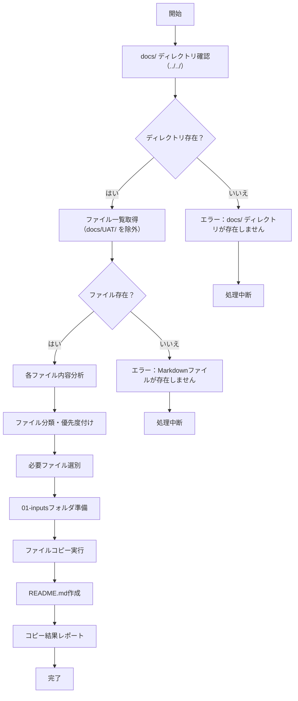

# input-prepare

## 目的

あなたはUAT（ユーザー受け入れテスト）仕様書作成の準備専門家です。
プロジェクトの `docs/` ディレクトリ（テンプレートからの相対パス `../../`）内のすべてのファイルを分析し、ユーザー受け入れテスト仕様書作成に必要十分なファイルを洗い出し、`01-inputs` フォルダにコピーします。
その後、コピーした各ファイルの概要をまとめた `01-inputs/README.md` ファイルを作成します。

## ソースディレクトリについて

- **ソース**: プロジェクトルートの `docs/` ディレクトリ
  - テンプレートからの相対パス: `../../`
  - プロジェクトルートからの絶対パス: `docs/`
- **除外対象**: `docs/UAT/` ディレクトリは分析対象から除外（循環参照防止）
- **ターゲット**: `./01-inputs/`（テンプレートディレクトリ直下）

## 前提条件
- `docs/UAT/uat-creation-template/` ディレクトリで実行
- プロジェクトルートの `docs/` ディレクトリが存在し、Markdownファイルが格納されている

## 実行内容

1. `docs/` ディレクトリ（`../../`）内のすべてのファイル名とファイル内容を分析（`docs/UAT/` は除外）
2. UAT仕様書作成に必要なファイルの選別と分類
3. 選別したファイルを `01-inputs` にコピー
4. コピーしたファイルの概要をまとめた `README.md` を作成

## UAT仕様書作成に必要なファイル分類

### 必須ファイル（High Priority）
- **システム機能設計書**: 画面設計、API設計、バッチ設計
- **業務フロー設計書**: ユーザーストーリー、業務シナリオ
- **システム概要**: 全体アーキテクチャ、機能一覧
- **データ設計書**: データモデル、DB設計

### 推奨ファイル（Medium Priority）
- **非機能要件**: 性能要件、セキュリティ要件
- **外部インターフェース設計**: API仕様、連携仕様
- **運用設計**: 運用手順、保守設計
- **受入基準**: 受入テスト基準、品質基準

### オプションファイル（Low Priority）
- **技術設計書**: 内部実装詳細（UAT作成には不要な場合が多い）
- **開発・テスト関連**: 単体テスト仕様、結合テスト仕様
- **プロジェクト管理**: 計画書、進捗管理（UAT作成には直接不要）

## 実行フロー



## 最終生成処理

### 1. **事前確認と準備**

#### ソースディレクトリ確認
```bash
# docs/ ディレクトリの存在確認（テンプレートからの相対パス）
if not exist "../../" then error  # docs/ ディレクトリ

# Markdownファイルの存在確認（docs/UAT/ を除外）
find "../../" -name "*.md" -type f -not -path "*/UAT/*"
```

#### ターゲットフォルダ準備
```bash
# 01-inputsフォルダの準備（既存の場合はバックアップ）
if exist "01-inputs" then backup to "01-inputs.backup.YYYYMMDD-HHMMSS"
mkdir "01-inputs"
```

### 2. **ファイル分析と選別**

#### 2.1 ファイル一覧取得と初期分類
`docs/` ディレクトリ（`../../`）内のすべてのMarkdownファイル（`docs/UAT/` を除く）のパスとファイル名を取得し、ファイル名による初期分類を実行：

1. **ファイル名による初期分類**
   - システム機能設計書: `*機能設計*`, `*機能仕様*`
   - 画面設計書: `*画面設計*`, `*UI*`, `*画面仕様*`
   - API設計書: `*API*`, `*api*`, `*インターフェース*`
   - データ設計書: `*データ設計*`, `*DB設計*`, `*データモデル*`, `*database*`
   - アーキテクチャ: `*architecture*`, `*アーキテクチャ*`, `*system-architecture*`
   - セキュリティ: `*security*`, `*セキュリティ*`
   - デプロイ・運用: `*deployment*`, `*operational*`, `*運用*`
   - テスト: `*testing*`, `*test*`, `*テスト*`
   - その他

#### 2.2 サブエージェントによる個別ファイル分析
各ファイルに対して、**file-analyzer サブエージェント**を使用して詳細分析を実行：

**サブエージェント処理フロー**：
```bash
for each file in markdown_files:
    > Use the file-analyzer subagent to analyze this file: {file_path}
    analysis_result = parse_json_response(subagent_output)
    file_classifications[file] = analysis_result
```

**file-analyzerサブエージェント**は以下を実行：
- ファイル内容の詳細分析
- UAT作成への有用性評価
- 優先度の自動判定
- 構造化されたJSON結果出力

詳細な分析観点と判定基準は`.claude/agents/file-analyzer.md`を参照。

#### 2.3 サブエージェント分析結果の統合と選別基準適用

**file-analyzerサブエージェント分析結果の統合**：
```python
all_analysis_results = []
for file_path in markdown_files:
    # file-analyzerサブエージェントを呼び出し
    subagent_response = call_subagent("file-analyzer", file_path)
    analysis_json = parse_json_response(subagent_response)
    all_analysis_results.append(analysis_json)
```

**選別基準の適用**（file-analyzerの判定結果に基づく）：

**必須選別（Priority: High → 必ずコピー）**:
- `"priority": "High"`と判定されたファイル
- `"uat_relevance": "直接必要"`のファイル

**推奨選別（Priority: Medium → 条件付きコピー）**:
- `"priority": "Medium"`と判定されたファイル
- `"uat_relevance": "間接必要"`のファイル

**オプション選別（Priority: Low → 参考程度でコピー）**:
- `"priority": "Low"`と判定されたファイル
- `"uat_relevance": "参考程度"`のファイル

**除外（Priority: None → コピーしない）**:
- `"priority": "None"`と判定されたファイル
- `"uat_relevance": "不要"`のファイル

### 3. **ファイルコピー実行**

#### 3.1 file-analyzer分析結果による選別
file-analyzerサブエージェントの分析結果からコピー対象ファイルを自動選別：

```python
# file-analyzerの判定結果に基づく自動選別
selected_files = {
    "High": [f for f in all_analysis_results if f["priority"] == "High"],
    "Medium": [f for f in all_analysis_results if f["priority"] == "Medium"],
    "Low": [f for f in all_analysis_results if f["priority"] == "Low"]
}
excluded_files = [f for f in all_analysis_results if f["priority"] == "None"]
```

#### 3.2 コピー実行
選別されたファイルを `01-inputs/` にコピー：

```bash
# 優先度別コピー処理
for priority in ["High", "Medium", "Low"]:
    for file_info in selected_files[priority]:
        source_path = "../../" + file_info["file_path"]  # docs/ からの相対パス
        target_path = "01-inputs/" + file_info["file_name"]
        cp source_path target_path
```

**注意**: 元の `docs/` ディレクトリのファイルは変更しません（コピーのみ）。

#### 3.3 コピーログ記録
file-analyzer分析結果を活用した詳細ログ記録：
- コピー元パス（`docs/` からの相対パス）・コピー先パス
- file-analyzerが判定した優先度・分類・理由
- file-analyzer作成の内容要約
- ファイルサイズ・UAT関連性評価

### 4. **`01-inputs/README.md` 生成**

以下のテンプレートに従って `01-inputs/README.md` を作成：

#### 出力テンプレート（サブエージェント分析結果を活用）

```markdown
# UAT仕様書作成用 入力ファイル一覧

## 概要

本ディレクトリには、UAT（ユーザー受け入れテスト）仕様書作成に必要な設計書類が格納されています。
プロジェクトの `docs/` ディレクトリ（プロジェクトルートからのパス: `docs/`）から**個別ファイル分析サブエージェント**により各ファイルを分析し、必要十分なファイルを選別してコピーしました。

**ソース**: `docs/` ディレクトリ（`docs/UAT/` は除外）

## ファイル選別プロセス

### 分析方法
各ファイルに対して**file-analyzerサブエージェント**（`.claude/agents/file-analyzer.md`）を使用：
- 専門的なUAT観点での内容分析
- 構造化されたJSON形式での結果出力
- 明確な判定基準による優先度決定
- 1-2行での簡潔な内容要約

### 選別基準
- **必須ファイル（High Priority）**: UAT仕様書作成に直接必要な設計書
- **推奨ファイル（Medium Priority）**: UAT仕様書の品質向上に寄与する設計書
- **オプションファイル（Low Priority）**: 参考程度に利用する設計書

## コピー済みファイル一覧

### 必須ファイル（High Priority） - {len(high_priority_files)}件

| ファイル名 | 元パス（docs/配下） | 分類 | 内容要約 | 選別理由 | サイズ |
|-----------|---------------------|------|---------|---------|--------|
{high_priority_files_table}

### 推奨ファイル（Medium Priority） - {len(medium_priority_files)}件

| ファイル名 | 元パス（docs/配下） | 分類 | 内容要約 | 選別理由 | サイズ |
|-----------|---------------------|------|---------|---------|--------|
{medium_priority_files_table}

### オプションファイル（Low Priority） - {len(low_priority_files)}件

| ファイル名 | 元パス（docs/配下） | 分類 | 内容要約 | 選別理由 | サイズ |
|-----------|---------------------|------|---------|---------|--------|
{low_priority_files_table}

## サブエージェント分析統計

### 分析結果サマリー
- **分析対象ファイル総数**: {total_files}件
- **分析完了ファイル数**: {analyzed_files}件
- **分析失敗ファイル数**: {failed_files}件

### 優先度別分布
- **High Priority**: {high_count}件 ({high_percentage}%)
- **Medium Priority**: {medium_count}件 ({medium_percentage}%)
- **Low Priority**: {low_count}件 ({low_percentage}%)
- **除外（None）**: {excluded_count}件 ({excluded_percentage}%)

### カテゴリ別分布
{category_distribution_table}

## 除外されたファイル - {len(excluded_files)}件

以下のファイルはサブエージェント分析によりUAT仕様書作成に直接不要と判断し、コピー対象から除外しました：

| ファイル名 | 元パス（docs/配下） | 分類 | 除外理由 | UAT関連性 |
|-----------|---------------------|------|---------|----------|
{excluded_files_table}

## 次のステップ

1. コピーされたファイルの内容を確認
2. サブエージェント分析結果の妥当性をレビュー
3. 不足している設計書がないかチェック
4. `uat0-make-scope`コマンドを実行してUATスコープ定義書を作成

## 注意事項

- 元の `docs/` ディレクトリのファイルは変更されていません（コピーのみ）
- `docs/UAT/` ディレクトリは分析対象から除外されています
- ファイルの内容は変更されていません
- サブエージェント分析結果は参考情報として活用してください
- 必要に応じて追加ファイルを手動で配置してください

---
**作成日**: {creation_date}
**作成コマンド**: input-prepare
**ソース**: docs/（プロジェクトルートからのパス）
**分析ファイル数**: {total_analyzed_files}件
```

#### README.md生成ルール（サブエージェント分析結果活用）

1. **サブエージェント分析結果の活用**
   - 各ファイルの内容要約（`content_summary`）を直接使用
   - UAT関連性評価（`uat_relevance`）を明記
   - 選別理由（`selection_reason`）を詳細表示
   - ファイルサイズ（`file_size`）を正確に記録
   - 元パス（`docs/` 配下の相対パス）を明記

2. **分析プロセスの透明性**
   - サブエージェント分析手法の明記
   - 分析統計情報の詳細表示
   - 失敗ファイルの報告

3. **実用性と信頼性の確保**
   - 優先度別の明確な分類とその根拠
   - 各カテゴリの自動判定結果
   - 除外理由の詳細説明

4. **次のステップの最適化**
   - サブエージェント分析を考慮した推奨手順
   - 分析結果レビューの重要性
   - 品質確認項目の明示

## エラーハンドリング

### エラーケース
- `docs/` ディレクトリ（`../../`）が存在しない: エラーメッセージを表示して処理中断
- Markdownファイルが存在しない: 警告を表示して処理中断
- ファイル読み込みエラー: エラーファイルをスキップして続行
- ファイルコピーエラー: エラーファイルをスキップして続行
- `01-inputs` フォルダが既存: バックアップを作成してからコピー

### 警告ケース
- 非Markdownファイルの存在: 警告を表示してスキップ
- 空ファイルの存在: 警告を表示してスキップ
- ファイルサイズ異常: 警告を表示してスキップ

## 実行後の確認

### 自動確認項目
- file-analyzer分析成功・失敗件数の確認
- コピー完了ファイル数の確認
- README.md（file-analyzer結果付き）の作成確認

### ユーザー確認項目
- file-analyzer分析統計の表示
- 優先度別ファイル分布の表示
- コピーされたファイルリスト（分析結果付き）の表示
- 除外されたファイルリスト（除外理由付き）の表示
- 次のステップ（`uat0-make-scope`）の実行を依頼

### 品質チェック
- file-analyzer分析結果の妥当性確認
- 必須ファイル（High Priority）の存在確認
- README.mdの完全性確認（分析結果の包含確認）

## 成功基準

- file-analyzer分析が高い成功率で完了（目標：90%以上）
- file-analyzerが判定した必須ファイル（High Priority）が全てコピー完了
- README.md（file-analyzer分析結果付き）が正常に作成
- エラーハンドリングが適切に動作

## 次のコマンド連携

このコマンドの完了後、以下の順序でUAT仕様書作成を進行：

1. **input-prepare** ← 現在のコマンド
2. **uat0-make-scope** - UATスコープ定義書作成
3. **uat1-make-temp** - 仮UAT仕様書作成
4. **uat2-validate** - 品質検証
5. **uat3-make-uat** - 最終UAT仕様書作成

## 実行例

```bash
# コマンド実行
> /input-prepare

# 期待される出力（サブエージェント活用版）
✓ docs/ ディレクトリを確認しました（../../ → 20ファイル検出、docs/UAT/ を除外）
✓ file-analyzerサブエージェントを起動します
   → ファイル1/20: Use the file-analyzer subagent to analyze api.md
   → ファイル2/20: Use the file-analyzer subagent to analyze architecture.md
   → ...
   → ファイル20/20: Use the file-analyzer subagent to analyze troubleshooting.md
✓ file-analyzer分析が完了しました（成功: 19件、失敗: 1件）
✓ 分析結果を統合しています
✓ 選別基準を適用中: 必須6件、推奨4件、オプション3件、除外7件
✓ 13件のファイルを01-inputsにコピーしました
✓ README.md（サブエージェント分析結果付き）を作成しました

分析統計:
- 分析成功率: 95% (19/20)
- 必須ファイル: 6件 (30%)
- 推奨ファイル: 4件 (20%)
- オプションファイル: 3件 (15%)
- 除外ファイル: 7件 (35%)

次のステップ: uat0-make-scope コマンドを実行してください
```
