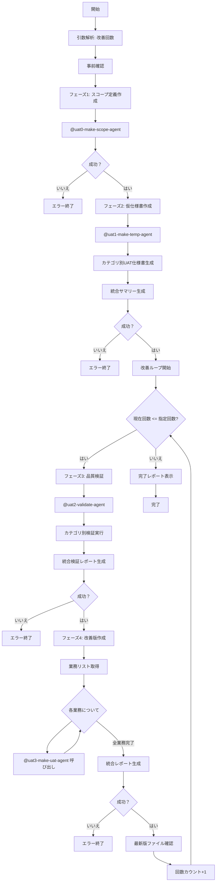

# make-uat-complete

## 引数処理

コマンドライン引数: `$ARGUMENTS`

**改善回数の指定**:
- 引数が空または"1"の場合: 改善処理を1回実行（デフォルト）
- 引数が"2"以上の場合: 検証→改善を指定回数繰り返し実行
- **最大10回まで実行可能**

**改善回数の決定ロジック**:
```
改善回数 = $ARGUMENTSが空 ? 1 : parseInt($ARGUMENTS)
改善回数 = 改善回数 < 1 ? 1 : 改善回数  // 最小値は1
改善回数 = 改善回数 > 10 ? 10 : 改善回数  // 最大値は10
```

## 目的

UAT（ユーザー受け入れテスト）仕様書の完全自動作成を行うメインコマンドです。

### アーキテクチャ構成

**エージェント構成**:
- `@uat0-make-scope-agent`: UATスコープ定義書を作成（業務網羅率100%保証）
- `@uat1-make-temp-agent`: カテゴリ別仮UAT仕様書を作成（動的カテゴリ分割方式）
- `@uat2-validate-agent`: カテゴリ別UAT仕様書を検証（品質・網羅性・実行可能性）
- `@uat3-make-uat-agent`: 1カテゴリのUAT仕様書を改善（単一カテゴリ処理）

**処理方式**:
- **フェーズ1**: `@uat0-make-scope-agent` が単独でスコープ定義書を作成
- **フェーズ2**: `@uat1-make-temp-agent` が単独でカテゴリ別UAT仕様書を作成
- **フェーズ3**: `@uat2-validate-agent` が単独でカテゴリ別UAT仕様書を検証
- **フェーズ4**: メインプロンプト（このコマンド）が業務リストを管理し、各カテゴリについて `@uat3-make-uat-agent` をループ呼び出し

改善回数を2回以上指定すると、検証→改善のサイクルを繰り返し、品質をさらに向上させることができます。

## 前提条件
- `docs/UAT/uat-creation-template/` ディレクトリで実行（ソース: プロジェクトルートの `docs/` ディレクトリ）
- `./01-inputs` フォルダ内にUAT作成に必要な設計書がMarkdown形式で格納されている（`/input-prepare` で自動選別可能）
- 業務カテゴリ別分割生成方式（推奨方式）を使用

## 実行フロー



## 実行例

### 例1: デフォルト実行（改善1回）

```bash
# 引数なしで実行（改善1回）
> /make-uat-complete

🚀 UAT仕様書 完全自動作成を開始します
📊 改善回数: 1回

📋 事前確認中...
✅ ./01-inputs フォルダ確認完了 (12ファイル検出)
✅ 必要ディレクトリ準備完了

🎯 【フェーズ1】UATスコープ定義作成 (@uat0-make-scope-agent)
   設計書分析中...
   ✅ UATスコープ定義書.md 作成完了

📝 【フェーズ2】仮UAT仕様書作成 (@uat1-make-temp-agent)
   スコープ情報復元中...
   カテゴリ構造分析中...
   カテゴリ別UAT仕様書生成中...
   ✅ カテゴリ別UAT仕様書生成完了 (4カテゴリ、45テストケース)
   ✅ 統合サマリー作成完了

🔄 【改善ループ 1/1】
🔍 【フェーズ3】品質検証 (@uat2-validate-agent)
   検証対象: uat_specs/ (4カテゴリ)
   カテゴリ別検証実行中...
   ✅ カテゴリ別検証結果生成完了 (4カテゴリ)
   ✅ 統合検証レポート作成完了 (平均スコア: 7.8/10.0)

🔧 【フェーズ4】UAT仕様書作成
   改善対象リスト取得中...
   各カテゴリの改善実行中（@uat3-make-uat-agent を各カテゴリに呼び出し）...
   ✅ カテゴリ別改善版生成完了 (4カテゴリ)
   ✅ 統合レポート作成完了 (平均スコア: 9.1/10.0)

🎉 UAT仕様書の完全自動作成が完了しました！
   📄 最終成果物: ./AI-generated/uat_specs/ (4カテゴリ)
   📄 統合レポート: ./AI-generated/UAT仕様書_統合レポート.md
   業務網羅率: 100.0%
```

### 例2: 改善2回実行

```bash
# 改善を2回実行
> /make-uat-complete 2

🚀 UAT仕様書 完全自動作成を開始します
📊 改善回数: 2回

📋 事前確認中...
✅ ./01-inputs フォルダ確認完了 (12ファイル検出)
✅ 必要ディレクトリ準備完了

🎯 【フェーズ1】UATスコープ定義作成 (@uat0-make-scope-agent)
   ✅ UATスコープ定義書.md 作成完了

📝 【フェーズ2】仮UAT仕様書作成 (@uat1-make-temp-agent)
   ✅ カテゴリ別UAT仕様書生成完了 (4カテゴリ、45テストケース)

🔄 【改善ループ 1/2】
🔍 【フェーズ3】品質検証 (@uat2-validate-agent)
   検証対象: uat_specs/ (4カテゴリ)
   ✅ カテゴリ別検証結果 + 統合検証レポート作成完了 (平均スコア: 7.8/10.0)

🔧 【フェーズ4】UAT仕様書作成
   ✅ 個別最新版 + 統合レポート作成完了 (平均スコア: 9.1/10.0)

🔄 【改善ループ 2/2】
🔍 【フェーズ3】品質検証 (@uat2-validate-agent)
   検証対象: uat_specs/ (4カテゴリ)
   ✅ カテゴリ別検証結果 + 統合検証レポート_02 作成完了 (平均スコア: 9.1/10.0)

🔧 【フェーズ4】UAT仕様書作成
   ✅ 個別最新版 + 統合_02 作成完了 (平均スコア: 9.5/10.0)

🎉 UAT仕様書の完全自動作成が完了しました！
   📄 最終成果物: ./AI-generated/uat_specs/ (4カテゴリ)
   📄 統合レポート: ./AI-generated/UAT仕様書_統合レポート_02.md
   改善による品質向上: 7.8 → 9.5 (+1.7ポイント)
   業務網羅率: 100.0%
```

### 例3: 改善3回実行

```bash
# 改善を3回実行
> /make-uat-complete 3

🚀 UAT仕様書 完全自動作成を開始します
📊 改善回数: 3回

[フェーズ1-2は同様]

🔄 【改善ループ 1/3】
   ✅ 個別検証結果 + 統合検証レポート作成完了 (平均スコア: 7.8/10.0)
   ✅ 個別最新版 + 統合レポート作成完了 (平均スコア: 9.1/10.0)

🔄 【改善ループ 2/3】
   検証対象: uat_specs/ (4カテゴリ)
   ✅ 個別検証結果 + 統合検証レポート_02 作成完了 (平均スコア: 9.1/10.0)
   ✅ 個別最新版 + 統合レポート_02 作成完了 (平均スコア: 9.4/10.0)

🔄 【改善ループ 3/3】
   検証対象: uat_specs/ (4カテゴリ)
   ✅ 個別検証結果 + 統合検証レポート_03 作成完了 (平均スコア: 9.4/10.0)
   ✅ 個別最新版 + 統合レポート_03 作成完了 (平均スコア: 9.6/10.0)

🎉 UAT仕様書の完全自動作成が完了しました！
   📄 最終成果物: ./AI-generated/uat_specs/ (4カテゴリ)
   📄 統合レポート: ./AI-generated/UAT仕様書_統合レポート_03.md
   改善による品質向上: 7.8 → 9.6 (+1.8ポイント)
   業務網羅率: 100.0%
```

## 生成ファイル一覧

### AI生成ファイル (`./AI-generated/`)

**基本ファイル（全実行で生成）**:
- `UATスコープ定義書.md` - プロジェクトのUATスコープ定義

**業務カテゴリ別UAT仕様書（フェーズ2で生成）**:
- `uat_specs/UAT仕様書_{業務ID}_{業務名}.md` - 各業務のUAT仕様書
- `仮UAT仕様書_統合サマリー.md` - 全業務の統合サマリー

**検証ファイル（改善ループごとに生成）**:
- 1回目:
  - `uat_reviews/UAT仕様書_{業務ID}_{業務名}_検証結果.md` - 各業務の検証結果
  - `UAT仕様書_統合検証レポート.md` - 統合検証レポート
- 2回目以降:
  - `uat_reviews_02/UAT仕様書_{業務ID}_{業務名}_検証結果.md`
  - `UAT仕様書_統合検証レポート_02.md`
  - `uat_reviews_03/...`, `UAT仕様書_統合検証レポート_03.md`, ...

**改善版ファイル（最終成果物）**:
- 全回共通:
  - `uat_specs/UAT仕様書_{業務ID}_{業務名}.md` - 各業務の改善版（元ファイル名で上書き）
  - `uat_specs/backup/UAT仕様書_{業務ID}_{業務名}_{timestamp}.md` - バックアップ
  - `UAT仕様書_統合レポート.md` - 統合レポート（1回目）
  - `UAT仕様書_統合レポート_02.md` - 統合レポート（2回目以降）
  - `UAT仕様書_統合レポート_03.md`, ... （3回目以降）

**最終成果物の場所**:
- 全改善回数共通: `./AI-generated/uat_specs/` （改善版は元ファイルに上書き）

### ディレクトリ構造例（改善1回の場合）

```
./AI-generated/
├── UATスコープ定義書.md
├── 仮UAT仕様書_統合サマリー.md
├── UAT仕様書_統合検証レポート.md
├── UAT仕様書_統合レポート.md
├── uat_reviews/
│   ├── UAT仕様書_A1_チャット_検証結果.md
│   ├── UAT仕様書_A2_画像添付_検証結果.md
│   ├── UAT仕様書_B1_認証_検証結果.md
│   └── ...
└── uat_specs/
    ├── UAT仕様書_A1_チャット.md
    ├── UAT仕様書_A2_画像添付.md
    ├── UAT仕様書_B1_認証.md
    ├── ...
    └── backup/
        ├── UAT仕様書_A1_チャット_20260310_120000.md
        └── ...

```

## エラーハンドリング

### 各フェーズのエラー対応
- **フェーズ1失敗**: 設計書不足またはヒアリング問題 → 設計書配置・再実行を促す
- **フェーズ2失敗**: スコープ定義書問題 → フェーズ1からの再実行を促す
- **フェーズ3失敗**: 仮仕様書問題 → フェーズ2からの再実行を促す  
- **フェーズ4失敗**: 検証結果問題 → フェーズ3からの再実行を促す

### 部分実行オプション
```bash
# 特定フェーズからの再開
> make-uat-complete --from-phase=2  # フェーズ2から再開
> make-uat-complete --phase-only=3  # フェーズ3のみ実行
```

## 品質保証

### 各フェーズの品質チェック
1. **フェーズ1**: 機能定義、業務フロー定義の網羅性
2. **フェーズ2**: テストケース完全性、操作手順の具体性
3. **フェーズ3**: 実行可能性評価、品質メトリクス算出
4. **フェーズ4**: 最終品質基準達成、実用性確保

### 最終成果物の品質基準
- ✅ 仕様書記載内容との100%整合性
- ✅ 第三者実行可能性90%以上
- ✅ 全テストケース実行可能性8.0点以上
- ✅ 重要度High項目は実行可能性9.0点以上
- ✅ エンドツーエンド業務シナリオの完全実装
- ✅ テストタイプ制約の厳格遵守
- ✅ 業務フロー網羅率95%以上（メインフロー100%）

## 使用上の注意

### 実行前の準備
1. `./01-inputs` フォルダに必要な設計書を配置（`/input-prepare` で `docs/` から自動選別可能）
2. `docs/UAT/uat-creation-template/` ディレクトリで実行
3. 十分なディスク容量の確保（目安: 50MB以上）

## 想定カテゴリ構成（marubo_ai プロジェクト）

本プロジェクトでは以下のカテゴリが想定されます：
- **チャット**: テキスト送受信、AIストリーミング応答、会話履歴
- **画像添付**: 署名URLアップロード、プレビュー、サムネイル表示、拡大表示
- **認証**: ユーザー認証、アカウント状態管理
- **管理機能**: スタッフ権限管理、レポート生成
- **セキュリティ**: RLS、レート制限

## サポート機能

### 進捗表示
- 各フェーズの進捗をリアルタイム表示
- エラー発生時の詳細情報提供
- 成功時の品質メトリクス表示

### ログ出力
- 実行ログの自動保存 (`./logs/make-uat-complete_YYYYMMDD_HHMMSS.log`)
- エラー詳細の記録
- パフォーマンス情報の記録

## 完了後の確認項目

- [ ] `./AI-generated/uat_specs/` の存在確認（最終成果物）
- [ ] 各カテゴリの改善版UAT仕様書の存在確認
- [ ] 統合レポート（`UAT仕様書_統合レポート.md` または `UAT仕様書_統合レポート_[N].md`）の確認
- [ ] バックアップファイル（`./AI-generated/uat_specs/backup/`）の存在確認
- [ ] 業務網羅率100%の達成確認
- [ ] 品質メトリクスの基準達成確認
- [ ] テストケース数と機能カバレッジの妥当性確認
- [ ] 実行可能性スコアの目標達成確認（8.0点以上）
- [ ] 改善回数が2回以上の場合、各回の品質向上の確認

UAT仕様書の完成により、効率的かつ高品質なユーザー受け入れテストの実施が可能になります。
動的カテゴリ分割方式により、最適な粒度での生成・レビュー・改善が容易になります。

---

## 実行プロンプト（実行手順）

以下の手順でUAT仕様書の完全自動作成を実行してください：

### ステップ1: 引数解析

```
改善回数 = "$ARGUMENTS" が空 ? 1 : parseInt("$ARGUMENTS")
改善回数 = 改善回数 < 1 ? 1 : 改善回数  // 最小値は1
改善回数 = 改善回数 > 10 ? 10 : 改善回数  // 最大値は10
```

引数が10を超えていた場合は警告を表示：
```
⚠️ 改善回数は最大10回です。10回に制限します。
```

ユーザーに以下を表示：
```
🚀 UAT仕様書 完全自動作成を開始します
📊 改善回数: [改善回数]回
```

### ステップ2: 事前確認

1. `./01-inputs` フォルダの存在確認
2. フォルダ内のMarkdownファイル数をカウント
3. `./AI-generated` フォルダが存在しない場合は作成

結果を表示：
```
📋 事前確認中...
✅ ./01-inputs フォルダ確認完了 ([ファイル数]ファイル検出)
✅ 必要ディレクトリ準備完了
```

### ステップ3: フェーズ1 - スコープ定義作成

```
🎯 【フェーズ1】UATスコープ定義作成 (@uat0-make-scope-agent)
```

`@uat0-make-scope-agent` を呼び出し、完了を待つ。

成功時:
```
✅ UATスコープ定義書.md 作成完了
```

失敗時: エラー終了し、理由を表示

### ステップ4: フェーズ2 - 仮UAT仕様書作成

```
📝 【フェーズ2】仮UAT仕様書作成 (@uat1-make-temp-agent)
```

`@uat1-make-temp-agent` を1回呼び出し、以下の処理を実行：

**重要**: このエージェントは1回の呼び出しで全カテゴリのUAT仕様書を生成します。

1. スコープ定義書を読み込み
2. カテゴリ構造を分析（全カテゴリを自動検出）
3. 動的カテゴリ分割方式で**全カテゴリ**のUAT仕様書を生成
4. 統合サマリーファイルを生成

成功時:
```
✅ カテゴリ別UAT仕様書生成完了 ([カテゴリ数]カテゴリ)
✅ 統合サマリー作成完了
```

失敗時: エラー終了し、理由を表示

**生成されるファイル**:
- `./AI-generated/uat_specs/UAT仕様書_{カテゴリID}_{カテゴリ名}.md` （検出された全カテゴリ分）
- `./AI-generated/仮UAT仕様書_統合サマリー.md`

### ステップ5: 改善ループ（指定回数繰り返す）

```
現在回数 = 1
while (現在回数 <= 改善回数):
```

#### ループ開始表示
```
🔄 【改善ループ [現在回数]/[改善回数]】
```

#### フェーズ3: 品質検証

**検証対象ディレクトリの決定**:
- 全回共通: `./AI-generated/uat_specs/`

**出力ディレクトリの決定**:
- 現在回数 == 1: `./AI-generated/uat_reviews/`
- 現在回数 >= 2: `./AI-generated/uat_reviews_[現在回数の0埋め2桁]/`

**統合検証レポートの決定**:
- 現在回数 == 1: `./AI-generated/UAT仕様書_統合検証レポート.md`
- 現在回数 >= 2: `./AI-generated/UAT仕様書_統合検証レポート_[現在回数の0埋め2桁].md`

```
🔍 【フェーズ3】品質検証 (@uat2-validate-agent)
   検証対象: [検証対象ディレクトリ] ([カテゴリ数]カテゴリ)
```

`@uat2-validate-agent` を1回呼び出し、以下を指示：

**重要**: このエージェントは1回の呼び出しで全カテゴリのUAT仕様書を検証します。

- 検証対象ディレクトリ: [検証対象ディレクトリパス]
- カテゴリ別検証結果出力先: [出力ディレクトリパス]
- 統合検証レポート出力先: [統合検証レポートパス]

エージェントは以下を実行：
1. 検証対象ディレクトリ内の**全カテゴリファイル**を検出
2. 各カテゴリについて品質・網羅性・実行可能性を検証
3. カテゴリ別検証結果ファイルを生成（全カテゴリ分）
4. 統合検証レポートを生成

成功時:
```
✅ カテゴリ別検証結果生成完了 ([カテゴリ数]カテゴリ)
✅ 統合検証レポート作成完了
```

**生成されるファイル**:
- `[出力ディレクトリ]/UAT仕様書_{カテゴリID}_{カテゴリ名}_検証結果.md` （全カテゴリ分）
- `[統合検証レポートパス]`

#### フェーズ4: UAT仕様書作成

**入力ディレクトリの決定**:
- 検証結果ディレクトリ: フェーズ3の出力ディレクトリ
- 改善対象ディレクトリ: `./AI-generated/uat_specs/`

**統合レポートの決定**:
- 現在回数 == 1: `./AI-generated/UAT仕様書_統合レポート.md`
- 現在回数 >= 2: `./AI-generated/UAT仕様書_統合レポート_[現在回数の0埋め2桁].md`

```
🔧 【フェーズ4】UAT仕様書作成
```

**4-1. 業務リストの取得**

改善対象ディレクトリから業務リストを取得：
```bash
ls ./AI-generated/uat_specs/*.md
```

各ファイル名から以下を抽出：
- カテゴリ識別子（例: `A1`, `A2`, `B1`）
- カテゴリ名（例: `チャット`, `画像添付`, `認証`）

**4-2. 各業務の改善処理**

まず、業務カテゴリファイルを確認して実際のカテゴリリストを取得：

```bash
ls ./AI-generated/uat_specs/UAT仕様書_*.md | grep -v "統合" | sed 's/.*UAT仕様書_//' | sed 's/\.md$//' | sort
```

各カテゴリについて、以下のように個別に@uat3-make-uat-agentを呼び出し：

**カテゴリ1の改善:**
最初のカテゴリファイルを特定し、対応する検証結果ファイルと併せて処理：

@uat3-make-uat-agent カテゴリ識別子: [1番目のカテゴリID] 検証結果ファイル: [対応する検証結果ファイルパス] UAT仕様書ファイル: ./AI-generated/uat_specs/UAT仕様書_[1番目のカテゴリ].md

**カテゴリ2の改善:**
2番目のカテゴリファイルを特定し、対応する検証結果ファイルと併せて処理：

@uat3-make-uat-agent カテゴリ識別子: [2番目のカテゴリID] 検証結果ファイル: [対応する検証結果ファイルパス] UAT仕様書ファイル: ./AI-generated/uat_specs/UAT仕様書_[2番目のカテゴリ].md

**カテゴリ3の改善:**
3番目のカテゴリファイルを特定し、対応する検証結果ファイルと併せて処理：

@uat3-make-uat-agent カテゴリ識別子: [3番目のカテゴリID] 検証結果ファイル: [対応する検証結果ファイルパス] UAT仕様書ファイル: ./AI-generated/uat_specs/UAT仕様書_[3番目のカテゴリ].md

**カテゴリ4の改善:**
4番目のカテゴリファイルを特定し、対応する検証結果ファイルと併せて処理：

@uat3-make-uat-agent カテゴリ識別子: [4番目のカテゴリID] 検証結果ファイル: [対応する検証結果ファイルパス] UAT仕様書ファイル: ./AI-generated/uat_specs/UAT仕様書_[4番目のカテゴリ].md

**カテゴリ5の改善:**
5番目のカテゴリファイルを特定し、対応する検証結果ファイルと併せて処理：

@uat3-make-uat-agent カテゴリ識別子: [5番目のカテゴリID] 検証結果ファイル: [対応する検証結果ファイルパス] UAT仕様書ファイル: ./AI-generated/uat_specs/UAT仕様書_[5番目のカテゴリ].md

**カテゴリ6の改善:**
6番目のカテゴリファイルを特定し、対応する検証結果ファイルと併せて処理：

@uat3-make-uat-agent カテゴリ識別子: [6番目のカテゴリID] 検証結果ファイル: [対応する検証結果ファイルパス] UAT仕様書ファイル: ./AI-generated/uat_specs/UAT仕様書_[6番目のカテゴリ].md

**追加カテゴリの改善:**
7番目以降のカテゴリが存在する場合、同様のパターンで個別に呼び出し続行

**進捗表示**
各エージェント呼び出し後に結果を表示：
```
✅ [カテゴリ識別子]_[カテゴリ名] 改善完了
```

**4-3. 統合レポートの生成**

全業務の改善完了後、統合レポートを作成：

ファイル名: `[統合レポートパス]`

内容:
```markdown
# UAT仕様書 最新版統合レポート

## 1. 改善結果サマリー

| 項目 | 値 |
|------|-----|
| 改善実施日 | [YYYY-MM-DD] |
| 対象カテゴリ数 | [総カテゴリ数]件 |
| 改善完了カテゴリ数 | [完了数]件 |
| 改善完了率 | [完了率]% |

## 2. カテゴリ別改善結果

| カテゴリ | 改善前判定 | バージョン | 主な改善内容 | バックアップ |
|---------|-----------|-----------|-------------|------------|
| [各カテゴリの結果を記載] |

## 3. 改善済みUAT仕様書リスト

- [UAT仕様書_[カテゴリ].md](./AI-generated/uat_specs/UAT仕様書_[カテゴリ].md)
- ...

## 4. バックアップファイルリスト

- [UAT仕様書_[カテゴリ]_[timestamp].md](./AI-generated/uat_specs/backup/UAT仕様書_[カテゴリ]_[timestamp].md)
- ...
```

成功時:
```
✅ カテゴリ別改善版生成完了 ([カテゴリ数]カテゴリ)
✅ 統合レポート作成完了
```

#### ループカウント増加
```
現在回数 = 現在回数 + 1
```

### ステップ6: 完了レポート

**最終成果物ディレクトリの決定**:
- 改善回数共通: `./AI-generated/uat_specs/`

**最終統合レポートの決定**:
- 改善回数 == 1: `./AI-generated/UAT仕様書_統合レポート.md`
- 改善回数 >= 2: `./AI-generated/UAT仕様書_統合レポート_[改善回数の0埋め2桁].md`

```
🎉 UAT仕様書の完全自動作成が完了しました！
📄 最終成果物: ./AI-generated/uat_specs/ ([カテゴリ数]カテゴリ)
📄 統合レポート: [最終統合レポート]
業務網羅率: [業務網羅率]%
```

改善回数が2回以上の場合、品質向上の表示を追加：
```
改善による品質向上: [初回スコア] → [最終スコア] (+[差分]ポイント)
```

### ディレクトリ名とファイル名のフォーマット

0埋め2桁の数値は以下のようにフォーマット：
- 1 → "01"
- 2 → "02"
- 10 → "10"

例：
- `uat_reviews_02/`
- `UAT仕様書_統合検証レポート_05.md`
- `UAT仕様書_統合レポート_10.md`

### エラー処理

各フェーズでエラーが発生した場合：
1. エラーメッセージを表示
2. 処理を中断
3. どのフェーズで失敗したかを明記
4. 再実行方法を案内
