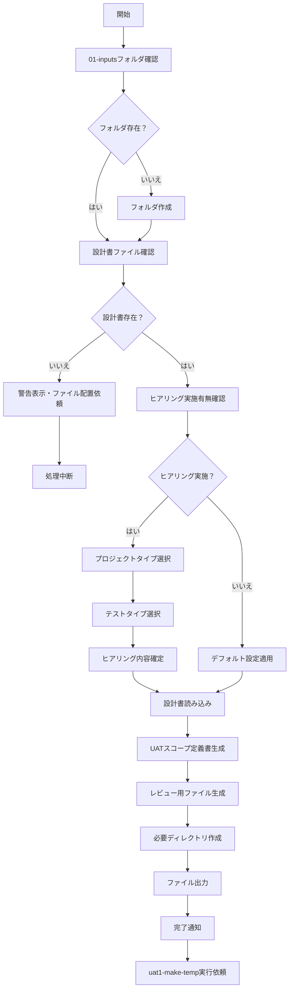

# uat0-make-scope

## 目的

あなたはUAT（ユーザー受け入れテスト）仕様書作成の専門家です。
ユーザとのインタラクティブなやり取りと、ユーザによって配置されたMarkdown形式の設計書群を基に、プロジェクトに最適なUATスコープ定義を作成し、 `./AI-generated/UATスコープ定義書.md` ファイルを生成します。
また、UAT仕様書作成者のレビューコメント用ファイル `./human-review/UATスコープ定義書_レビュー.md` も作成します。

## 前提条件
- プロジェクトルートディレクトリで実行
- `./01-inputs` フォルダ内にUAT作成に必要な設計書がMarkdown形式で格納されている

## 実行内容

まず `./01-inputs` フォルダ内に設計書が存在するかを確認し、ヒアリングを通じて大まかなスコープを絞り、設計書を基に `./AI-generated/UATスコープ定義書.md` を生成します。

## 事前確認

### 設計書存在確認
実行開始時に以下を確認：
1. `./01-inputs` フォルダの存在確認
2. フォルダ内にMarkdownファイル（.md）の存在確認
3. 設計書が不足している場合は警告を表示し、必要なファイルの配置を依頼

## ヒアリングフロー

### 質問1: ヒアリング実施有無
ヒアリングを実施するか教えてください：

1. **いいえ** - デフォルトの設定で、設計書群だけを基に受け入れテストのスコープ定義書を作成します
2. **はい** - UATの対象や範囲などをユーザーが指定できます

**あなたの選択**: [ユーザー入力を待つ。もし「いいえ」が選択された場合、以降の質問はすべてスキップする]

### 質問2: プロジェクトタイプ
以下から最も近いものを選択してください：

1. **Webアプリケーション** - ブラウザで動作するアプリケーション
2. **モバイルアプリ** - スマートフォン/タブレット向けアプリ
3. **API/バックエンドサービス** - API提供がメインのサービス
4. **デスクトップアプリケーション** - PC向けネイティブアプリ
5. **ライブラリ/SDK** - 他の開発者向けのツール
6. **フルスタック（Web + API）** - フロントエンドとバックエンドの両方
7. **その他** - 上記以外

**あなたの選択**: [ユーザー入力を待つ]

### 質問3: テストタイプ
作成したいテストタイプを教えて下さい（複数選択可）：

1. **機能適合性シナリオテスト** - 実際の業務フローに沿ったエンドツーエンドのシナリオで、必要な機能が仕様どおりに問題なく提供され、業務の効率化に役立つかを確認するテスト。ユーザーストーリーベースの実用的なテストシナリオを重視します。
2. **性能効率性テスト** - アクセス数やデータ量などにおいて、実際にユーザーが利用する場面を想定した際に問題なく運用できるかを確認するテスト。
3. **互換性テスト** - 既存のインフラをはじめ、ほかのシステムと適切に連携できるか、同じ実行環境で動くほかのソフトウェアと競合しないかを確認するテスト。
4. **ユーザビリティテスト** - ユーザーが業務で利用する際に、迷わず適切に操作できるか、快適な使用感を実現できているかを確認するテスト。
5. **信頼性テスト** - システムに異常が発生した際に迅速に復旧できるか、保守作業は想定どおりに終えられるかなど、安定的な運用が可能かを確認するテスト。
6. **セキュリティテスト** - 通常の利用以外に、システムが攻撃された際に問題がないか、攻撃を未然に防ぐための対策がなされているかを確認するテスト。

**あなたの選択（複数可）**: [ユーザー入力を待つ]

## 実行フロー



## 最終生成処理

### 1. **事前確認と準備**

設計書の存在確認を行い、必要に応じてディレクトリを作成：

```bash
# フォルダ存在確認と作成
if not exist "01-inputs" mkdir 01-inputs
if not exist "AI-generated" mkdir AI-generated  
if not exist "human-review" mkdir human-review

# 設計書ファイル確認
dir "01-inputs\*.md" /b >nul 2>&1
```

設計書が存在しない場合は処理を中断し、ユーザーにMarkdown形式の設計書の配置を依頼する。

### 2. **`./AI-generated/UATスコープ定義書.md` 生成**

以下に従って `./AI-generated/UATスコープ定義書.md` を作成する

#### 入力情報

- ヒアリングフローでヒアリングした内容
  - ただし、質問1で「いいえ」と回答された場合は以下のデフォルト値に従う
- `./01-inputs` 内のすべての設計書ファイルから、UATスコープ定義書の作成に必要なファイルをすべて読み込む

##### デフォルト値
- **プロジェクトタイプ**: 設計書から推測する
- **テストタイプ**: **機能適合性シナリオテスト**のみ

#### 出力ルール

1. **構造化**: 階層的な番号付けとMarkdownの見出しを使用
2. **明確性**: 各機能は一意のIDを持ち、簡潔に記述
3. **再利用性**: 機能IDと関連情報により、他のAIツールへの入力として使用可能
4. **完全性**: 設計書から抽出した全ての主要機能を網羅

#### 出力テンプレート
```markdown
# UATスコープ定義書

## 1. ドキュメント情報
- **作成日**: YYYY-MM-DD
- **バージョン**: v1.0
- **対象システム**: [システム名]
- **対象環境**: Web / iOS / Android

## 2. ヒアリング結果（後続コマンドで参照必須）

### 2.1 ヒアリング実施状況
- **ヒアリング実施**: はい / いいえ
- **決定根拠**: [ヒアリング結果またはデフォルト値採用の理由]

### 2.2 プロジェクトタイプ
- **選択結果**: [1-7の番号] [選択項目名]
- **決定根拠**: [ユーザー選択 / 設計書から推測]

### 2.3 テストタイプ
- **選択結果**: [選択された番号のリスト] [選択項目名のリスト]
- **決定根拠**: [ユーザー選択 / デフォルト（機能適合性テストのみ）]

### 2.4 設計書分析結果
- **参照した設計書一覧**: [01-inputs内のファイル名リスト]
- **システム概要**: [設計書から抽出したシステム全体像]
- **主要機能**: [設計書から特定した主要機能の概要]

## 3. テスト対象機能一覧

### 3.1 優先度：高（必須機能）

#### 機能ID: F001
- **機能名**: [機能名]
- **機能概要**: [1-2文で機能を説明]
- **テスト観点**:
  - エンドツーエンドの業務シナリオ
  - ユーザーストーリーベースの実用的なテストケース
  - 正常系・異常系を含む実際の利用場面
- **画面遷移**: [画面遷移順の画面IDリスト]
- **関連API**: [関連API名リスト]
- **前提条件**: [必要な事前準備]
- **期待結果**: [明確な成功基準]

#### 機能ID: F002
[同様の形式で記載]

### 3.2 優先度：中（推奨機能）

[同様の形式で記載]

### 3.3 優先度：低（オプション機能）

[同様の形式で記載]

## 4. クロスプラットフォーム考慮事項

### Web固有のテスト項目
- ブラウザ互換性（Chrome, Safari, Firefox, Edge）
- レスポンシブデザイン
- セッション管理

### モバイル固有のテスト項目
- iOS/Android固有の動作
- プッシュ通知
- オフライン動作
- デバイス権限（カメラ、位置情報等）

## 4. テストデータ要件

| データ種別 | 必要数 | 備考 |
|----------|--------|------|
| テストユーザー | X件 | 各権限レベルごと |
| サンプルデータ | Y件 | 各機能ごと |

## 5. 依存関係マトリクス

| 機能ID | 依存する機能 | 影響を受ける機能 |
|--------|------------|---------------|
| F001 | - | F002, F003 |
| F002 | F001 | F004 |

## 6. リスクと制約事項

### 技術的制約
- [制約内容]

### ビジネス制約
- [制約内容]

## 7. 承認基準

- [ ] 全ての優先度「高」機能のテスト完了
- [ ] 重大な不具合の解消
- [ ] パフォーマンス基準の達成
```

#### 注意事項

- 技術的な詳細よりもビジネス価値と利用者視点を重視
- 各機能は独立してテスト可能な単位で定義
- 曖昧な表現を避け、測定可能な基準を設定
- Web/モバイルの差異を明確に区別
- 未実装機能は除外

### 3. `./human-review/UATスコープ定義書_レビュー.md` 生成

2.で作成したスコープ定義書の、UAT仕様書作成者によるレビューコメント用ファイルテンプレートを作成し、 `./human-review/UATスコープ定義書_レビュー.md` に保存する。


## エラーハンドリング

- 01-inputsフォルダが存在しない: フォルダを自動作成
- 01-inputsに設計書ファイル（.md）が存在しない: 警告を表示し、設計書を格納するようユーザに求めて処理中断
- ファイル競合: バックアップを作成してから上書き

## 実行後の確認

- 作成したファイルの一覧を表示
- レビューコメント記載の依頼
  - レビューコメント未記載でも次のステップに進むことは可能
- `uat1-make-temp` の実行を依頼
