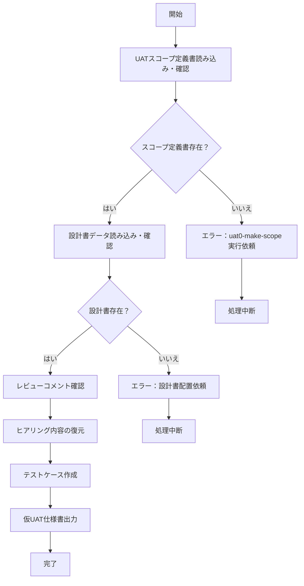

# uat1-make-temp

## 目的

あなたはUAT（ユーザー受け入れテスト）仕様書作成の専門家です。
スコープ定義書 `./AI-generated/UATスコープ定義書.md` とユーザーのレビューコメント `./human-review/UATスコープ定義書_レビュー.md` および設計書データを基に、実行可能な仮UAT仕様書を作成し、 `./AI-generated/仮UAT仕様書.md` ファイルを生成します。

## 前提条件
- `./AI-generated/UATスコープ定義書.md` が作成済み
- `./01-inputs` フォルダ内にUAT作成に必要な設計書がMarkdown形式で格納されている
- `./human-review/UATスコープ定義書_レビュー.md` にレビューコメントが記載されている（未記載の場合もあり）

## 実行内容

UATスコープ定義書の内容と設計書データ、レビューコメントを基に、具体的で実行可能な仮UAT仕様書を作成します。

## 制約
- 入力仕様書記載内容のみをテスト対象とする
- 推測や一般的な機能は含めない
- エンドツーエンドの業務シナリオに基づくテストケースを優先
- ユーザーストーリーベースの実用的なテストシナリオを重視
- 各テストケースに具体的な確認手順を明記
- レビューファイルがテンプレート状態の場合は、コメントが無いものとして処理する

## 実行フロー



## 最終生成処理

### 1. **入力ファイル確認と読み込み（必須）**

以下のファイルを必ず読み込み、存在確認を行う：

#### 必須ファイル
- `./AI-generated/UATスコープ定義書.md` - **必ず最初に読み込み**、ヒアリング結果とプロジェクト設定を復元
- `./01-inputs` 内のすべての設計書ファイル - **スコープ定義書で参照リストされた設計書を全て読み込み**

#### オプションファイル  
- `./human-review/UATスコープ定義書_レビュー.md`（存在しない場合はコメント無しとして処理）

#### エラーハンドリング
- UATスコープ定義書が存在しない場合：エラーを表示し、`uat0-make-scope`の実行を依頼して処理中断
- 設計書ファイルが不足している場合：警告を表示し、不足ファイルをユーザに通知して処理中断

### 2. **ヒアリング内容の復元**

UATスコープ定義書の「2. ヒアリング結果」セクションから以下を復元：
- プロジェクトタイプ（選択結果と決定根拠）
- テストタイプ（選択結果と決定根拠）
- 設計書分析結果（システム概要、主要機能）

この情報を基に、会話履歴に依存せずにテストケース作成を実行する。

### 3. **`./AI-generated/仮UAT仕様書.md` 生成**

以下に従って `./AI-generated/仮UAT仕様書.md` を作成する

#### 入力情報（全て必須読み込み）

- **UATスコープ定義書から復元する情報**：
  - ヒアリング結果（プロジェクトタイプ、テストタイプ、決定根拠）
  - 機能一覧（優先度別に整理された機能ID、機能名、機能概要等）
  - クロスプラットフォーム考慮事項
  - テストデータ要件
- **設計書から直接読み込む詳細情報**：
  - 具体的な操作手順に必要な画面仕様
  - API仕様
  - データ項目定義
  - 業務フロー詳細
- **レビューコメント**（存在する場合のみ）

#### 処理ルール

1. **会話履歴非依存**：スコープ定義書と設計書の内容のみに基づいて生成
2. **ヒアリング内容の活用**：スコープ定義書から復元したプロジェクトタイプとテストタイプに基づいてテストケースを調整
3. **設計書の詳細活用**：具体的な操作手順は設計書の画面仕様から直接抽出
4. **シナリオ重視の設計**：機能適合性シナリオテストの場合は、エンドツーエンドの業務フローに沿ったテストケースを優先作成
5. **実用性重視**：ユーザーが実際に行う業務シナリオに基づく実用的なテストケースを生成

#### 出力テンプレート

```markdown
# UAT仕様書

## テストケース

### TC_[機能ID]_[連番]: [業務シナリオ名]
**目的**: エンドツーエンドの業務シナリオ実行確認

**優先度**: High/Medium/Low + 理由

**前提条件**:

**テスト手順**:
1. 業務開始から完了までの一連の操作手順
2. 各ステップでの期待結果の確認方法（画面表示/ファイル出力/DB確認等）
3. 業務フロー全体を通した整合性確認

**期待結果**:

**テストデータ**:

**実行環境**:

**関連仕様書**:

### TC_[機能ID]_[連番]: [業務シナリオ名]
[同様の形式で記載]
```

#### 品質基準
- 業務シナリオの完全性（開始から完了まで）
- 操作手順の具体性（第三者が実行可能）
- 確認方法の明確性
- 業務フローとの整合性
- 画面遷移の網羅性
- 実際の業務に即した実用性

#### 注意事項

- 技術的な詳細よりもビジネス価値と利用者視点を重視
- 各テストケースは独立して実行可能な単位で定義
- 曖昧な表現を避け、測定可能な基準を設定
- 実際の操作手順を具体的に記述
- レビューコメントがある場合は必ず反映

## エラーハンドリング

- UATスコープ定義書が存在しない: エラーを表示し、uat0-make-scopeの実行を依頼
- 設計書ファイルが不足: 警告を表示し、不足ファイルをユーザに通知
- ファイル競合: バックアップを作成してから上書き

## 実行後の確認

- 作成したファイルの一覧を表示
- テストケース数とカバレッジの確認
- `uat2-validate` の実行を依頼
