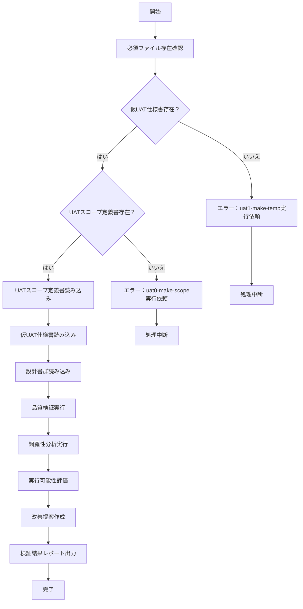

# uat2-validate

## 目的

あなたはUAT（ユーザー受け入れテスト）仕様書検証の専門家です。
生成された仮UAT仕様書 `./AI-generated/仮UAT仕様書.md` の品質、網羅性、実行可能性を自己検証し、 `./AI-generated/仮UAT仕様書_AIレビュー.md` ファイルを生成します。

## 前提条件
- `./AI-generated/仮UAT仕様書.md` が作成済み
- `./AI-generated/UATスコープ定義書.md` が作成済み
- `./01-inputs` フォルダ内に設計書がMarkdown形式で格納されている

## 実行内容

仮UAT仕様書を多角的に検証し、品質向上のための詳細な分析結果を作成します。

## 検証項目

### 品質検証
1. 仕様書との整合性
2. テスト手順の論理性
3. 確認方法の実行可能性
4. テストデータの妥当性
5. **制約事項**: 選択されていないテストタイプのテストケースは一切追加しない

### 網羅性検証
1. 画面遷移パターン一覧との照合
2. 業務シナリオとの整合性
3. 重要機能の漏れ確認
4. **シナリオ完全性**: エンドツーエンドの業務フローの網羅性確認

### 実行可能性検証
実行可能性スコアリング基準（10点満点）
- 手順の具体性（3点）
- 確認方法の明確性（3点）
- テストデータの準備容易性（2点）
- 環境要件の実現可能性（2点）

### テストタイプ制約チェック
**厳格な制約**: 以下のテストタイプが選択されていない場合、関連するテストケースは一切追加・提案してはならない
- 性能効率性テスト
- 互換性テスト  
- ユーザビリティテスト
- 信頼性テスト
- セキュリティテスト

## 実行フロー



## 最終生成処理

### 1. **入力ファイル確認と読み込み（全て必須）**

以下のファイルを必ず読み込み、存在確認を行う：

#### 必須ファイル（全て読み込み必須）
- `./AI-generated/仮UAT仕様書.md` - 検証対象の仮UAT仕様書
- `./AI-generated/UATスコープ定義書.md` - **必ず読み込み**、ヒアリング結果と機能定義を参照
- `./01-inputs` 内のすべての設計書ファイル - **スコープ定義書で参照リストされた設計書を全て読み込み**

#### エラーハンドリング
- 仮UAT仕様書が存在しない場合：エラーを表示し、`uat1-make-temp`の実行を依頼して処理中断
- UATスコープ定義書が存在しない場合：エラーを表示し、`uat0-make-scope`の実行を依頼して処理中断
- 設計書ファイルが不足している場合：警告を表示し、不足ファイルをユーザに通知

### 2. **検証処理の実行**

#### 2.1 ヒアリング内容の復元
UATスコープ定義書の「2. ヒアリング結果」セクションから：
- プロジェクトタイプと決定根拠
- テストタイプと決定根拠
- 設計書分析結果

#### 2.2 品質検証（設計書との整合性確認）
- **設計書を直接参照**して仕様書との整合性をチェック
- スコープ定義書で定義された機能との一致確認
- ヒアリング結果に基づくテスト観点の適切性確認
- **テストタイプ制約の確認**: 選択されていないテストタイプのテストケースが含まれていないかチェック

#### 2.3 網羅性検証（スコープ定義書との照合）
- スコープ定義書で定義された全機能の包含確認
- 優先度に応じた適切なテストケース配分
- クロスプラットフォーム考慮事項の反映確認
- **シナリオ重視の確認**: 機能適合性シナリオテストの場合、エンドツーエンドの業務フローに沿ったテストケースになっているかチェック

### 3. **`./AI-generated/仮UAT仕様書_AIレビュー.md` 生成**

以下に従って `./AI-generated/仮UAT仕様書_AIレビュー.md` を作成する

#### 検証観点（全て必須読み込みデータに基づく）

1. **スコープ定義書との整合性**
   - 定義された機能IDとの一致確認
   - ヒアリング結果（プロジェクトタイプ、テストタイプ）との整合性
   - 優先度設定の妥当性
   - **テストタイプ制約チェック**: 選択されていないテストタイプのテストケースが含まれていないか

2. **設計書との整合性**  
   - 画面仕様との一致確認
   - API仕様との整合性
   - データ項目定義との一致確認

3. **実行可能性**
   - 操作手順の具体性と実行可能性
   - テストデータの入手可能性
   - 環境要件の実現可能性

4. **シナリオ重視の確認**（機能適合性シナリオテストの場合）
   - エンドツーエンドの業務フロー完全性
   - ユーザーストーリーベースの実用性
   - 業務シナリオの現実性

#### 出力テンプレート

```markdown
# 検証結果

## 品質検証結果
- 検証項目数: X件
- 合格: Y件
- 要修正: Z件

## テストタイプ制約チェック結果
- 選択されたテストタイプ: [リスト]
- 制約違反項目: [選択されていないテストタイプのテストケースがある場合リスト]

## 網羅性分析結果
- 画面遷移網羅率: X%
- 業務シナリオ網羅率: Y%

### 不足項目
#### 画面遷移
- 不足パターン1: 理由
#### 業務シナリオ
- 不足シナリオ1: 理由

## シナリオ重視の評価結果（機能適合性シナリオテストの場合）
- エンドツーエンド業務フロー完全性: X%
- ユーザーストーリーベースの実用性: Y%
- 業務シナリオの現実性: Z%

## 実行可能性検証結果
### スコアリング結果
| テストケースID | 総合スコア | 手順 | 確認方法 | データ | 環境 | 改善提案 |

### 低スコア項目改善案

## 要修正・追加項目詳細
| テストケースID | 問題内容 | 修正提案 | 影響度 |

```

#### 合格基準
- 仕様書記載内容との100%整合
- 第三者実行可能性
- 明確な判定基準
- 全テストケース実行可能性8点以上
- 重要度High項目は実行可能性9点以上

#### 検証ポイント

1. **品質検証の詳細**
   - 設計書との整合性チェック
   - テスト手順の論理的妥当性
   - 期待結果の明確性
   - テストデータの適切性
   - **厳格な制約チェック**: 選択されていないテストタイプのテストケースが含まれていないか

2. **網羅性の評価**
   - スコープ定義書で定義された機能の漏れ確認
   - 画面遷移パターンの網羅性
   - 業務シナリオの完全性
   - **シナリオ重視の評価**: エンドツーエンドの業務フローの完全性

3. **実行可能性の評価**
   - 各テストケースの実行可能性を10点満点で評価
   - 具体的な改善提案を含む
   - 環境依存性の評価

4. **テストタイプ制約の遵守**
   - 選択されたテストタイプのみのテストケースが含まれているかチェック
   - 不適切なテストケースが含まれている場合は要修正として指摘

## エラーハンドリング

- 仮UAT仕様書が存在しない: エラーを表示し、uat1-make-tempの実行を依頼
- スコープ定義書が存在しない: エラーを表示し、uat0-make-scopeの実行を依頼
- ファイル競合: バックアップを作成してから上書き

## 実行後の確認

- 作成したファイルの一覧を表示
- 検証結果のサマリー表示
- 重要な問題がある場合は警告表示
- `uat3-make-uat` の実行を依頼
