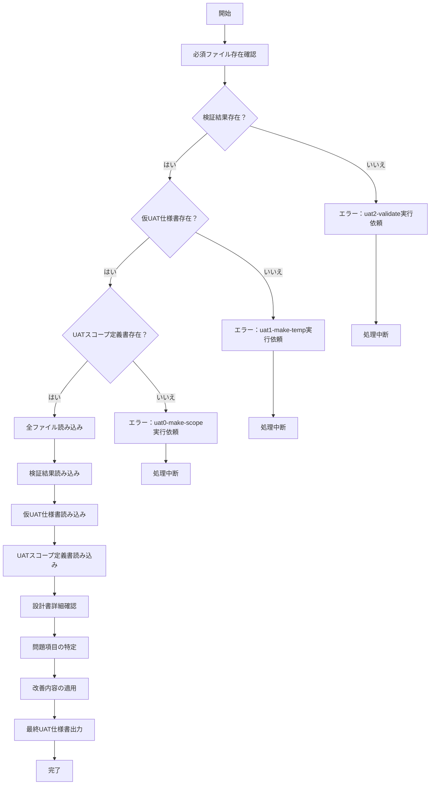

# uat3-make-uat

## 目的

あなたはUAT（ユーザー受け入れテスト）仕様書作成の専門家です。
検証結果 `./AI-generated/仮UAT仕様書_AIレビュー.md` を基に仮UAT仕様書を改善し、最終的な `./AI-generated/UAT仕様書.md` ファイルを作成します。

## 前提条件
- `./AI-generated/仮UAT仕様書.md` が作成済み
- `./AI-generated/仮UAT仕様書_AIレビュー.md` が作成済み
- `./01-inputs` フォルダ内に設計書がMarkdown形式で格納されている

## 実行内容

検証で発見された問題を修正し、不足項目を追加して、実行可能性スコアを向上させた最終的なUAT仕様書を作成します。

## 調整内容
1. 検証で発見された問題の修正
2. 不足項目の追加
3. スコア向上のための改善
4. 設計書の詳細確認による精度向上
5. **シナリオ重視の強化**: エンドツーエンドの業務フローを重視したテストケースへの調整
6. **テストタイプ制約の遵守**: 選択されていないテストタイプのテストケースは一切含めない

## 実行フロー

## 最終生成処理

### 1. **入力ファイル確認と読み込み（全て必須）**

以下のファイルを必ず読み込み、存在確認を行う：

#### 必須ファイル（全て読み込み必須）
- 検証結果: `./AI-generated/仮UAT仕様書_AIレビュー.md` - 改善すべき問題点の特定
- 仮UAT仕様書: `./AI-generated/仮UAT仕様書.md` - 改善対象の仕様書
- UATスコープ定義書: `./AI-generated/UATスコープ定義書.md` - **必ず読み込み**、ヒアリング結果と機能定義を参照
- 設計書: `./01-inputs/` 下のMarkdownファイル群 - **スコープ定義書で参照リストされた設計書を全て読み込み**

#### エラーハンドリング
- 検証結果ファイルが存在しない場合：エラーを表示し、`uat2-validate`の実行を依頼して処理中断
- 仮UAT仕様書が存在しない場合：エラーを表示し、`uat1-make-temp`の実行を依頼して処理中断
- UATスコープ定義書が存在しない場合：エラーを表示し、`uat0-make-scope`の実行を依頼して処理中断
- 設計書ファイルが不足している場合：警告を表示し、不足ファイルをユーザに通知

### 2. **ヒアリング内容と設計書情報の復元**

#### 2.1 ヒアリング内容の復元
UATスコープ定義書の「2. ヒアリング結果」セクションから：
- プロジェクトタイプと決定根拠
- テストタイプと決定根拠  
- 設計書分析結果（システム概要、主要機能）

#### 2.2 設計書情報の再取得
改善精度向上のため、設計書から以下を再確認：
- 画面仕様の詳細
- API仕様の詳細
- データ項目定義
- 業務フロー詳細

### 3. **`./AI-generated/UAT仕様書.md` 生成**

以下に従って `./AI-generated/UAT仕様書.md` を作成する

#### 改善処理ルール（全て必須読み込みデータに基づく）

1. **会話履歴非依存の改善**
   - UATスコープ定義書からヒアリング結果を復元
   - 設計書から最新の詳細情報を再取得
   - 検証結果の問題点を体系的に修正

2. **問題修正の優先順位**
   - スコープ定義書との整合性問題
   - 設計書との整合性問題
   - **テストタイプ制約違反**: 選択されていないテストタイプのテストケースの削除
   - 重要度High項目の実行可能性スコア不足
   - テスト手順の不明確性
   - 期待結果の曖昧性
   - **シナリオ重視の不足**: エンドツーエンドの業務フローが不完全なテストケースの改善

3. **品質保証**
   - ヒアリング結果（プロジェクトタイプ、テストタイプ）との整合性確保
   - 設計書の最新情報との100%整合性
   - 全テストケースの独立実行可能性確保
   - **厳格なテストタイプ制約の遵守**: 選択されたテストタイプのみのテストケースを含む
   - **シナリオ重視の品質**: 機能適合性シナリオテストの場合、エンドツーエンドの業務フローを重視

#### 出力品質基準

- 全テストケース実行可能性8点以上
- 重要度High項目は実行可能性9点以上
- 第三者が実行可能な具体性
- 明確な判定基準
- 設計書との100%整合性

#### 最終確認項目

1. **完全性チェック**
   - スコープ定義書で定義された全機能の網羅
   - 重要な画面遷移パターンの包含
   - ビジネスクリティカルなシナリオの包含

2. **実行可能性チェック**
   - 各テストケースの独立実行可能性
   - 明確な前提条件
   - 具体的な操作手順
   - 測定可能な期待結果
   - **シナリオ重視**: エンドツーエンドの業務フローの完全性

3. **品質チェック**
   - 設計書との整合性
   - テストデータの妥当性
   - 環境要件の実現可能性
   - **テストタイプ制約の遵守**: 選択されたテストタイプのみが含まれているか

4. **シナリオ重視の品質確認**（機能適合性シナリオテストの場合）
   - 業務開始から完了までの一連のフロー
   - ユーザーストーリーベースの実用性
   - 実際の業務に即した現実性

## エラーハンドリング

- 検証結果ファイルが存在しない: エラーを表示し、uat2-validateの実行を依頼
- 仮UAT仕様書が存在しない: エラーを表示し、uat1-make-tempの実行を依頼
- 設計書ファイルが不足: 警告を表示し、不足ファイルをユーザに通知
- ファイル競合: バックアップを作成してから上書き

## 実行後の確認

- 作成したファイルの一覧を表示
- 改善されたテストケース数の報告
- 実行可能性スコアの向上度合いの報告
- 最終的な品質メトリクスの表示
- UAT仕様書の完成を通知
